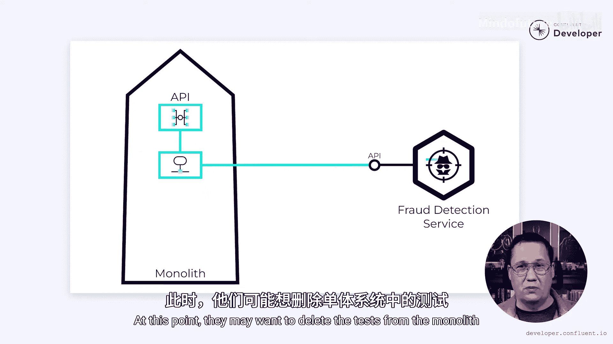

# 011：从银行系统中提取欺诈检测微服务

在本节课中，我们将学习如何将一个单体应用中的功能模块（以欺诈检测系统为例）安全、平滑地提取并重构为一个独立的微服务。我们将遵循一个在生产环境中逐步演进的策略，确保功能完整性和用户体验不受影响。

## 概述

支流银行花费了数周时间梳理其单体应用中的依赖关系，以便开始将其分解为微服务。他们确信所有对欺诈检测系统的访问都通过一个清晰的API进行，现在是时候开始构建欺诈检测微服务了。然而，他们担心在此过程中可能引入问题。他们需要确保新系统在检测欺诈方面至少与旧系统一样好。他们如何在保持现有功能的同时，有效地分解单体应用的这一部分？

## 第一步：部署“Hello World”版本到生产环境 🚀

现在，有趣的部分来了。这可能存在争议，但在我看来，构建微服务的第一步是将其部署到生产环境。我不喜欢将生产部署留到最后的开发周期。从生产应用程序中，你将学到远比在其他环境中更多的东西。

请记住，在生产环境中运行并不一定意味着用户会与之交互。功能可以部署在生产环境，但通过功能开关禁用，或仅对一部分用户开放。但如果用户可以访问该功能，其价值远高于他们无法访问的情况。

那么支流银行如何应用这一点呢？首先，他们将创建一个欺诈检测微服务的“Hello World”版本。这可以是一个只有一个“Hello World”端点的REST服务。一旦准备就绪，就将其部署到生产环境。将服务投入生产环境有很多东西需要学习。他们必须弄清楚部署是什么样子。他们需要设置日志记录和监控，并且需要将其与他们的编排框架集成。尽早解决这些问题可以让他们避免意外。最后，没有什么比花六个月开发一个应用程序，却在生产环境中出现问题更糟糕的了。最好在六个月前就了解到这一点。

## 第二步：定义API端点

上一节我们介绍了将基础服务部署到生产环境。本节中我们来看看如何定义服务接口。

假设支流银行已经完成了这个过程，一个“Hello World”版本的服务正在他们的生产环境中运行。他们已经搞定了日志记录、监控和编排。接下来是什么？

旧系统有一个定义良好的API，他们为此付出了很多努力。新的微服务将需要支持该API。因此，支流银行应该在微服务中创建相应的REST端点。这将迫使他们定义输入和输出。这也允许其他团队开始思考如何与欺诈检测服务集成。

然而，他们不必实现这些端点背后的逻辑，定义它们就足够了，即使它们返回空值或虚拟值。这一点尤其有价值，因为下一步，甚至在实现逻辑之前，就是与单体应用集成。

## 第三步：与单体应用集成（绞杀者模式）

上一节我们定义了微服务的接口，现在我们需要将其与现有系统连接起来。

本质上，他们使用**绞杀者无花果模式**或**通过抽象进行分支**来引入一个适配器。这个适配器将请求同时发送到旧系统和新系统。由于新系统返回虚拟值，适配器将始终返回旧系统的结果。但随着微服务开始成形，这种情况将会改变。

现在，请记住，在这一点上，所有东西都在生产环境中运行。真实用户正在与微服务交互，尽管它目前还什么都不做。这让我们可以持续了解系统将如何处理诸如流量峰值、潜在错误状态等情况。同时，因为适配器总是返回旧系统的结果，用户与潜在问题隔离开来。如果微服务出现问题，适配器可以记录错误，同时继续为用户提供服务，没有任何中断。

当然，与两个独立的系统通信可能会增加延迟。为了缓解这个问题，支流银行可以选择只在某些时候与两个系统通信。例如，他们可以每10个请求发送一个到新系统。然而，这不会让他们很好地了解微服务如何处理负载。或者，他们可以使对新系统的请求异步化。每次交易进来时，他们与旧系统通信并立即返回结果，但在一个单独的线程或进程中，他们也与微服务通信。这使用户的延迟保持在较低水平，但仍然允许他们查看每一笔交易。

## 第四步：新旧系统对比与验证

上一节我们通过适配器连接了新旧系统，本节我们来看看如何确保新系统的行为与旧系统一致。

目标是持续进行新旧系统之间的比较。每次分析交易时，他们可以收集两个系统的结果并记录任何差异。最初，当微服务是新的时，每笔交易都会不同。然而，随着微服务开始成形，这些差异将开始消失。如果他们在监控平台的图表上绘制差异数量，他们可以实时了解新系统是否与旧系统匹配。

这些生产指标非常有价值，但它们不应该是衡量准确性的唯一方式。支流银行很可能围绕他们的旧API有一套健壮的自动化测试。如果没有，那么现在可能是一个构建的好时机。但假设已经存在，他们可以利用这些测试来验证他们的新微服务。请记住，API有一个与新旧系统通信的适配器。目前，我们只返回旧结果，所以所有测试都应该通过。然而，在系统中设置一个标志来将适配器切换到新系统是微不足道的。这将允许相同的测试来验证新系统的行为。很可能，一旦它通过了所有这些测试，它就应该接近生产就绪状态了。

这些测试比单元测试更复杂，因为它们需要一个正在运行的微服务实例。但在验证行为方面，它们可能非常有价值。这并不是说微服务内部不应该有测试。绝对应该有。单体应用中的测试是为了启发我们在微服务中构建什么。

## 第五步：实现功能与数据迁移

上一节我们讨论了如何验证系统，现在我们来关注功能的实际构建。

支流银行正在积极地向微服务中实现新功能，同时，他们可能有一个流程或脚本将历史数据迁移到新系统中。最终，他们将达到所有测试都通过的程度。查看日志，他们会发现微服务的结果与单体应用足够接近，可以认为它已经完成。

## 第六步：切换与清理 🧹

上一节我们完成了功能的实现和验证，本节是最后一步：切换流量并清理旧代码。

此时，他们可以切换适配器，以便所有请求都使用微服务来满足。如果他们做得对，这应该是一个无感事件。不应该有人注意到他们切换了开关。他们可以让它这样运行一段时间，以验证没有任何意外情况发生，但最终，他们应该对新系统正在做所有需要做的事情充满信心。说实话，在切换开关之前，他们就应该对此充满信心，因为它一直在使用生产数据。不应该有任何意外。然而，谨慎一点总是没有坏处的。

一旦他们确信一切运行顺利，就可以开始移除旧系统。我必须说，没有什么比删除代码感觉更好了。一旦旧代码被删除，他们就可以移除适配器，直接与微服务对话。此时，他们可能希望从单体应用中删除测试，因为它们中的大多数可能在微服务中已经重复了。

现在他们完成了。他们已经成功地将欺诈检测系统分解为一个微服务。他们完全是在生产环境中针对一个实时系统完成的，并且整个过程没有对用户造成任何中断或重大影响。

当然，您的情况可能不同。您可能会发现必须跳过我在这里概述的一些步骤。或者可能需要添加更多步骤。无论如何，这只是旅程的开始。这样做的全部意义在于转向一个更加解耦的架构，使他们能够发展欺诈检测系统。而这正是我们接下来要做的——在接下来的视频中，我们将看到支流银行如何通过采用事件驱动架构来发展微服务，使其更可靠、更可扩展。

## 总结

本节课中我们一起学习了从单体应用中提取微服务的完整流程。我们从一个简单的“Hello World”生产部署开始，逐步定义API、通过适配器集成、持续对比验证、实现功能并最终平滑切换。这种方法的核心是**在生产环境中渐进式演进**，通过**绞杀者模式**和**功能开关**等技术最大限度地降低风险，确保重构过程对用户透明无感。最终目标是获得一个独立、可独立演进的微服务，为后续引入事件驱动等更先进的架构奠定基础。