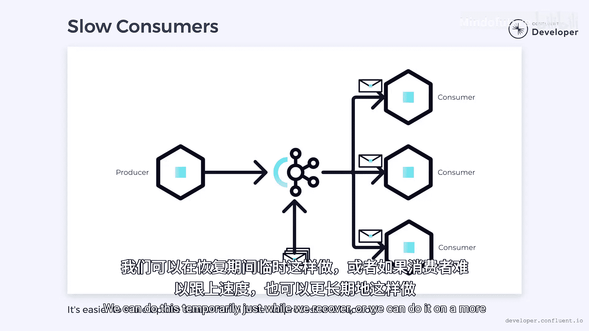

# 012：异步事件

## 概述
在本节课中，我们将要学习为什么在微服务架构中，传统的同步调用方式会带来问题，以及如何通过采用异步事件来构建更健壮、可扩展的系统。

## 从同步调用到异步事件的转变

上一节我们介绍了微服务架构的基本概念，本节中我们来看看传统同步通信方式在微服务环境下面临的挑战。

传统系统建立在同步调用的基础之上，这种方式在大多数情况下是有效的。然而，微服务世界引入了网络连接形式的新挑战。

当我们试图在这些新系统中使用旧方法时，问题开始出现。

在单体架构中，系统内的通信通常采用函数调用的形式。我们假设所有函数调用都是本地的，单体的所有部分都可用，并且所有调用都花费合理的时间。

然而，对于微服务，这些假设并不成立。微服务通过网络进行通信，而不是本地通信。并且无法保证所有服务在任何时候都处于运行状态，系统的一部分可能会暂时离线。

网络的存在和可能发生的故障会引入意外的延迟。如果我们不注意，这些延迟会导致更大的问题。

当我们对外部微服务进行同步调用时，我们正在等待响应。但如果响应时间过长或从未到达会发生什么？在这种情况下，原始调用方很可能将不得不使其尝试的任何操作失败。

但如果它只是一个更大调用链中的一个环节呢？在这种情况下，故障可能会向上游传播并导致级联故障。最终结果可能是严重的服务中断。即使一切正常，只是延迟，这些延迟也可能向上游传播。每个等待的调用都将迫使任何上游调用也进行等待。

突然之间，我们有了跨越多个微服务边界的一整串操作，它们都在互相等待。系统很快会变得像蜗牛一样慢。

问题在于我们的期望存在不匹配。当我们进行函数调用时，我们期望接收方是可用的，在单体系统中，这当然是正确的。如果系统可以进行调用，那么它也可以响应调用。

然而，当调用方和接收方是不同的微服务时，这并不能得到保证。此外，我们一直假设函数调用会及时返回。这从来都不是一个有效的假设，即使在单体架构中也是如此。每当我们进行调用时，都可能有一些因素会减慢其速度，包括数据库访问、CPU密集型操作和资源争用。如果你熟悉Java，你可能经历过可怕的垃圾收集暂停。

这些问题可能发生在任何系统中。因此，假设调用总是瞬时完成是没有意义的。

## 异步事件：一种替代方案

上一节我们探讨了同步调用的问题，本节中我们来看看异步事件如何作为一种解决方案。

让我们考虑一种替代方法：每当微服务中发生重要事情时，我们可以将其视为一个事件。事件是过去发生的某事，例如添加了客户或订单已发货。

与其依赖同步调用来传递这些事实，我们可以改为产生一个异步事件。我们将事件的详细信息打包成一条消息，可以发送给任何感兴趣的消费者。

消息以“发射后不管”的方式发送，通常通过诸如Apache Kafka之类的消息平台。

事件生产者可能会等待消息已被接收的确认，但我们不等待它被处理。这允许消费者按照自己的节奏处理事件，而不用担心拖慢生产者。

生产者可以观察可能因此发生的其他事件，而不是期望立即得到响应。

如果我们同步等待响应，它会在生产者和消费者之间创建时间耦合。本质上，在消费者完成之前，生产者无法继续。这会占用线程、网络连接、CPU等资源，通常是不希望的。

通过依赖异步事件，我们打破了时间耦合，这允许生产者尽可能快地发送消息。生产者也可以更快地释放资源，这可以带来更高效的系统。

最终结果是一个在规模上表现更好的微服务。

打破时间耦合的另一个好处是，我们可以更灵活地安排事件的传递时间。

## 异步事件的优势与实施

上一节我们介绍了异步事件的基本概念，本节中我们来看看它的具体优势以及如何实施。

如果消费者不可用或不堪重负，消息可以被排队并在以后传递。与此同时，生产者可以继续产生新消息，而不用担心消费者。一旦消费者可用，它可以从上次中断的地方继续。

因此，尽管存在一段不可用期，生产者没有理由失败，消费者也不会错过任何消息。从外部角度看，一切工作都完全正常。

当然，即使消费者可以从上次中断的地方继续，消息处理也会被延迟。当消费者恢复时，它可能有相当多的积压工作需要处理。然而，使用异步事件构建的系统往往更容易扩展。

这意味着我们可以添加新的消费者来帮助减少积压。我们可以在恢复期间临时这样做，或者如果消费者难以跟上节奏，我们可以更永久地这样做。

为了使这有效，我们需要接受事件的异步性质。我们必须认识到它们需要时间来处理，并将这一点构建到系统中。

如果我们试图应用我们期望即时结果的旧思维模式，那么我们就会回到期望不匹配的问题。最终结果可能会令人失望。

但如果我们能学会接受异步事件，那么就有可能构建出比采用更同步方法显著更健壮和可扩展的系统。

## 总结
本节课中我们一起学习了微服务架构中同步通信的局限性，以及异步事件驱动的优势。我们了解到，通过将重要状态变化封装为事件并通过消息队列（如Apache Kafka）异步传递，可以打破服务间的时间耦合，提高系统的整体韧性、可扩展性和性能。关键在于转变思维，接受并设计系统的异步处理能力。