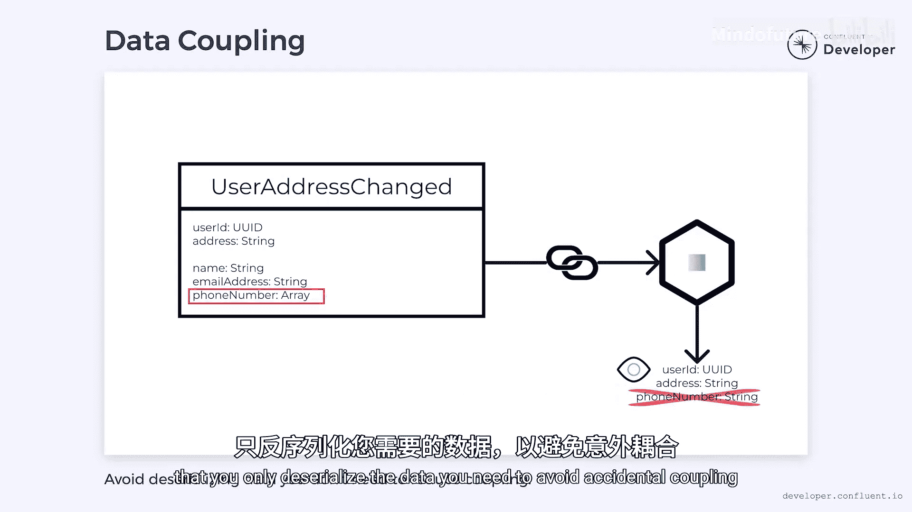

# 013：命令、查询与事件 🧩

在本节课中，我们将要学习微服务间通信的三种核心消息类型：命令、查询和事件。理解它们各自的特点、用途以及如何选择，对于构建松耦合、可扩展的事件驱动微服务架构至关重要。

上一节我们介绍了事件驱动架构的基本概念，本节中我们来看看微服务间通信的具体消息类型。

## 命令：请求改变状态

在界面设计中，有一个“最小意外原则”，它指出用户不应因与界面的交互而感到意外。例如，在应用程序中选择打开文件，用户期望的是加载文件。如果这个操作还修改或删除了文件，就会令人意外。遵循此原则能使软件更可预测、更清晰、更易用。

这个原则如何应用于微服务呢？**命令**是请求改变微服务状态的指令。遵循最小意外原则，状态的改变应准确反映命令的意图。例如，向用户服务发送一个“添加用户”的命令，它就应该添加该用户，而不应执行任何意外操作，比如删除用户。

然而，命令可能失败或被拒绝。发送方通常会等待响应，以确认命令是否成功。这些响应可能包含结果的详细信息，例如“添加用户”命令返回的用户信息。但它们也可以是简单的确认或ACK，本质上就是一条“我已收到”的消息。

关于应包含多少数据存在一些争论。一些开发者倾向于返回详细消息，另一些则倾向于发送ACK。ACK的一个优势是它隐藏了实现细节，允许微服务自行选择如何处理命令。它可能不是同步处理命令，而是先记录命令、回复ACK，稍后再进行处理。这有助于解耦两个服务，使它们不必互相等待。

## 查询：请求获取状态

一旦系统状态发生改变，我们需要一种方式来访问它，尤其是在命令被异步处理的情况下。

**查询**是请求获取系统当前状态的指令。它们通常是同步的，并且总是期望得到详细的响应。例如，我们可以发出一个“获取用户”查询，来获取之前通过“添加用户”命令创建的用户信息。

继续遵循最小意外原则，查询**从不**改变状态。发出“获取用户”查询时，如果用户信息以某种方式被修改了，那将是令人意外的。与命令一样，查询也应清晰地反映其意图。

不幸的是，查询的同步特性意味着我们可能被迫等待。但如果我们不想等待呢？

## 事件：通知状态变化

**事件**是命令执行的结果，用于向系统通信已发生的变化。它们是对过去已发生事情的反映。事件通常通过Apache Kafka等工具发送。遵循最小意外原则，事件的名称应揭示其意图，通常以触发该事件的动作的过去式来命名。例如，对于“添加用户”命令，产生的事件可能是“用户已添加”。

同样重要的是要认识到，事件不是命令。下游应用程序可以监听事件并据此做出响应性更改，但它们并非必须这样做。它们可以选择忽略任何不感兴趣的事件。即使它们处理了事件，也可以选择不执行任何操作。然而，事件已经发生，因此监听应用程序无法拒绝它，它们必须确认它，即使选择忽略它。

我们或许可以选择忽视历史的教训，但无法否认历史已经发生。事件应被异步处理。我们在关于异步事件的视频中对此有更详细的探讨。关键点在于，等待事件会产生耦合，而我们通常希望避免这种情况。

事件也可以使命令和查询更加异步化。发出命令时，与其等待响应，不如监听产生的事件。这允许命令以完全异步的方式工作。类似地，与其执行同步查询，我们可以监听记录状态变化的事件，并使用这些事件来创建数据的本地副本，而无需执行外部查询。

以下是事件的两种主要类型：

*   **增量事件**：仅记录系统中发生变化的细节。例如，“更改用户地址”命令可能导致“用户地址已更改”事件。它包含用户的标识符以及地址变更的细节。然而，它不包含其他信息，如姓名、电子邮件地址或电话号码。增量事件是轻量级的，体积小意味着它们占用更少的网络带宽和存储空间，这使得它们通过Apache Kafka等平台发送时效率很高。但它们可能缺乏足够的信息来发挥作用。如果我们想知道更改了地址的人的姓名，事件中可能没有这些信息，我们就必须向用户服务发出查询以获取缺失的细节，这会增加额外的流量并可能加剧耦合。
*   **事实事件**：包含被修改对象的丰富细节。“用户地址已更改”事件可以被增强，包含用户的所有详细信息，包括姓名、电子邮件地址和电话号码。事实事件中包含的丰富数据意味着我们可能不再需要单独的查询。更大的体积需要更多的带宽、磁盘空间和处理时间，但作为回报，它在使用事实事件时减少了耦合。使用事实事件时，我们需要小心避免数据耦合。想象一下，“用户地址已更改”事件包含一个用户电话号码字段。如果下游消费者反序列化了电话号码，那么我们就引入了数据耦合。对该数据的更改（例如将电话号码转换为电话号码数组）将意味着需要更新反序列化器。一个好的做法是确保只反序列化你需要的数据，以避免意外的耦合。

## 总结与最佳实践

本节课中我们一起学习了微服务通信的三种核心消息类型：命令、查询和事件。

当我们设计一个系统时，关键在于注意我们正在使用的消息类型，并理解每一种所扮演的角色。作为一个最佳实践，倾向于将**异步事件**作为大部分通信的主要方式，以减少耦合。这并不意味着我们不能使用命令和查询，但我们应该将它们限制在真正需要的地方，并尽可能尝试保持它们的异步性。使事物同步是有代价的，我们应该尽可能避免支付这个代价。