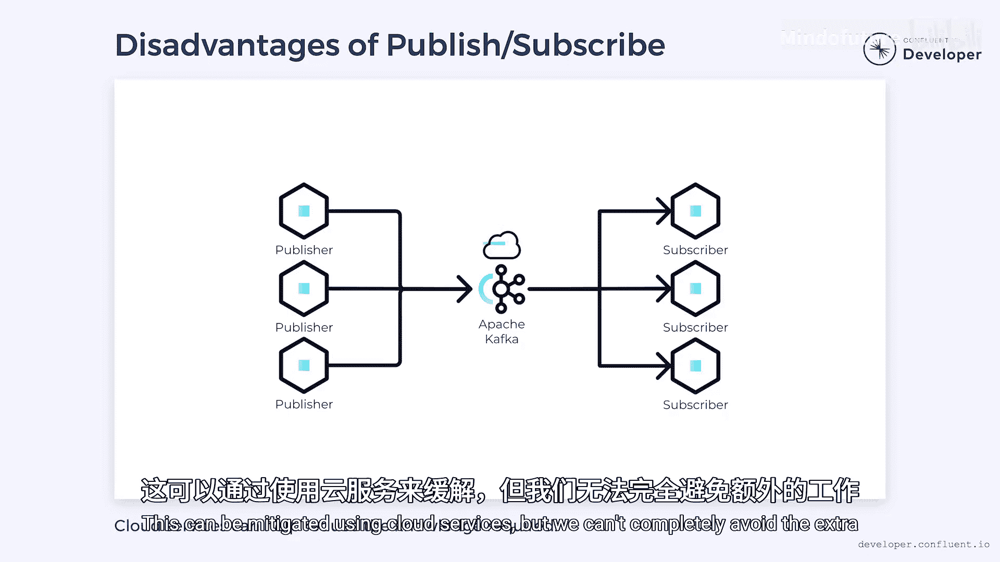

**事件驱动微服务设计：P14：点对点通信与发布订阅模式对比**

在本节课中，我们将学习微服务间两种核心通信模式：点对点通信与发布订阅模式。我们将探讨它们各自的原理、优缺点以及适用场景，帮助你为系统设计选择合适的通信方式。

---

### **现实世界的类比**

为了更好地理解这两种模式，我们先看一个现实世界的类比。

数字通信主导了我们的日常生活，电子邮件和短信是典型的点对点通信。它们有明确的发送方和接收方，接收方通过唯一的地址（如邮箱或电话号码）来标识。

社交媒体则更接近发布订阅模式。当我们在社交媒体上发布内容时，我们无法精确控制谁会看到它。任何订阅了该频道（如关注了某个账号、话题或标签）的人都能接收到发布的内容。订阅者可能很多，也可能没有，发布者失去了对对话的直接控制。

---

### **微服务中的点对点通信**

现在，让我们看看这个类比如何应用于微服务架构。

在微服务中，点对点通信通常采用 **HTTP** 或 **gRPC** 调用。一个微服务通过这些协议向另一个微服务发送消息。发送消息需要知道接收者的地址。接收者处理消息后，通常会同步地发送一个回复。

点对点通信在软件中具有优势，正如在现实世界中一样：
*   **明确的链接**：它在发送方和接收方之间建立了具体的链接，允许双向对话，发送方可以合理地期望得到响应。
*   **错误处理**：如果出现问题，双向链接允许发送方采取行动来缓解问题。
*   **依赖清晰**：通过查看进行了哪些点对点调用，可以立即了解服务间的依赖关系。

当系统规模较小时，点对点通信表现出色。但随着系统增长，所有直接链接会带来压力。每个链接都代表一种耦合：
*   **物理耦合**：发送方耦合于接收方，因为它需要知道接收方存在以及如何找到它。
*   **时间耦合**：由于这些系统本质上是同步的，因此产生了时间耦合。

物理和时间耦合会在系统中引发问题：
*   **故障传播**：一个微服务中的故障可能传播到其他服务，导致小问题演变成大问题。
*   **系统演进困难**：每个依赖都给系统带来了刚性。修改一个微服务变得困难，因为必须考虑依赖它的服务。
*   **单点故障**：某些服务可能成为依赖网络的枢纽。如果它们失败，依赖它们的一切都可能失败。点对点依赖会创建瓶颈和单点故障，这是构建分布式系统时需要避免的。

---

### **微服务中的发布订阅模式**

接下来，我们对比一下发布订阅模式。

当系统中发生重要事件时，微服务可以将事件详情打包成消息，发布到如 **Apache Kafka** 这类工具的主题中。下游的微服务可以订阅它们感兴趣的主题。每个订阅的微服务都会接收到该主题中的每一个事件（通常按发送顺序）。然而，这些事件的处理与触发它们的原始动作是异步进行的。

就像社交媒体一样，我们不知道消息发布后到被订阅者看到之间会经过多长时间。此外，我们不知道谁将订阅它，订阅者也不知道是谁发布了它。在这个模型中没有直接的链接。

这降低了耦合度，并在服务之间创建了隔离。服务耦合于消息平台和消息格式，但彼此不直接耦合。只要遵守消息格式，微服务就可以自由更改和演进，其他实现细节是灵活的。

这种模式也使系统更具可扩展性：
*   **消费者扩展**：我们可以让单个服务的多个实例订阅同一个主题，从而快速扩缩容该微服务。
*   **生产者扩展**：同样，我们也可以有多个发布者实例。因为生产者和消费者不直接连接，增加一方的实例不会立即对另一方产生影响。

尽管降低耦合带来了好处，但也可能使理解系统中的依赖关系变得更加困难。服务间的间接层意味着追踪受变更影响的所有系统可能比较棘手。通常，查看下游（订阅者列表）相对容易，但查看上游（消息来源）则较难，因为消息平台可能不跟踪消息的起源。在消息中包含指示来源的元数据有助于缓解此问题，但要确保下游系统不依赖该元数据，否则又会引入耦合。

此外，为了实现这种交互，我们通常需要依赖像 **Apache Kafka** 这样的外部系统。这些系统有自己的学习曲线，需要专业知识来部署和管理。使用云服务可以缓解这个问题，但无法完全避免额外的工作。

---

### **总结与建议**

本节课中，我们一起学习了微服务通信的两种核心模式。

构建微服务时，可扩展性和弹性通常是高优先级需求。发布订阅模式非常适合提供这些特性。因此，对于大多数微服务系统，**发布订阅应构成通信的骨干**。

然而，点对点通信也有其用武之地。我们只需确保仅在必要时依赖它，并且确保它最多只涉及两个微服务。创建长的点对点调用链会引入大量耦合，并可能导致级联故障。

在实际设计中，应根据具体场景灵活选择和组合这两种模式，以构建健壮、可扩展的微服务系统。