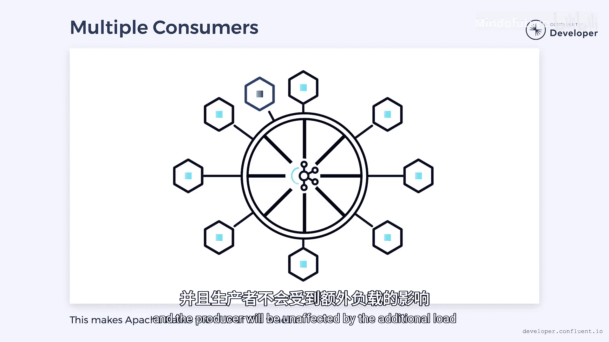

# 015：如何构建可扩展且高可用的微服务 🏗️


在本节课中，我们将学习如何构建可扩展且高可用的微服务架构。核心在于理解如何避免将微服务设计成“特殊”或不可替代的组件，并利用异步消息传递机制来提升系统的弹性和扩展能力。

## 从玩具到架构：两种设计哲学 🧸

让我们通过一个比喻来理解微服务设计的核心思想。这里有两个童年玩具：一个是我独一无二的泰迪熊Boo，另一个是一桶乐高积木。

Boo非常特殊，它承载着记忆和历史，是**不可替代**的。这也意味着它**不具备弹性**：如果丢失或损坏，就彻底失去了。同时，它也无法**扩展**，因为无法复制出更多个Boo。

相比之下，乐高积木中的任何一块单砖都不特殊。它们的优势在于**廉价且易于替换**。如果损坏或丢失一块，可以轻松补充。这使得用乐高构建的系统**既具弹性又可扩展**。

那么，对于微服务，你希望它们像Boo一样独一无二、不可失败，还是像乐高积木一样易于替换和扩展？理想情况下，我们希望微服务更像乐高。这要求我们**去除服务的“个性化”**，不再将它们视为特殊的、不允许失败的存在。

## 拥抱失败：设计容错系统 ⚡

构建弹性系统的第一步是承认失败是不可避免的。如果我们假设服务永远可用，那么当它们不可用时，系统将面临全面崩溃的风险。

相反，我们应该认识到失败是可能甚至可预期的，并据此设计系统来处理它。实现这一点的一种方法是使用 **Apache Kafka** 进行服务间通信。

以下是其工作原理：
*   **生产者**将消息发送到Kafka的**主题（Topic）**中，消息可以按需持久化存储。
*   **消费者**订阅这些主题以接收消息。
*   如果某个消费者离线，消息会**缓冲在主题中**。一旦消费者恢复，它可以从断点继续消费。
*   如果生产者失败，消息流可能会停止，但下游消费者可以继续处理其他任务或等待。

这种模式使得微服务可以更加**临时性（Ephemeral）**：有时运行，有时不运行。但整个系统在服务暂时不可用期间仍能继续运作。Apache Kafka的这一特性还允许我们实现**缩容至零（Scale to Zero）**的策略：如果某个微服务一段时间内没有收到消息，我们可以将其关闭。当消息恢复时，再重新启动服务。由于消息是持久化的，服务不会错过任何信息，我们只需准备好应对唤醒休眠服务可能所需的时间。

## 打破瓶颈：实现并行处理 🔗

微服务变得“特殊”的另一种方式，是对其存在的实例数量做出假设。我们很容易陷入只能运行单个微服务实例的境地。

例如，如果要求**严格按线性顺序**消费事件，就会将我们限制在单个微服务的单线程进程中。这类瓶颈会严重限制可扩展性，是我们需要避免的。

这正是 **Kafka分区（Partitions）** 的优势所在。我们不必按线性顺序消费所有消息，而是可以根据某个**键（Key）** 对消息进行分区。例如，可以按用户ID进行分区。每个分区可以被并行消费，从而实现横向扩展。

同时，在**单个分区内部，消息的顺序仍然得到保证**。这让我们鱼与熊掌兼得：既保证了分区内事件的有序性，又能并行处理不同键对应的数据流。

**代码示例：分区与并行消费**
```python
# 伪代码示例：生产者按用户ID将消息发送到不同分区
producer.send(topic='user_actions', key=user_id, value=action_data)

# 消费者组可以启动多个实例，每个实例消费主题的一部分分区，实现并行处理
consumer = KafkaConsumer('user_actions', group_id='action_processors')
for message in consumer:
    process_message(message.key, message.value) # 相同user_id的消息由同一个消费者顺序处理
```

## 反转依赖：消除中心枢纽 🎡

我们需要解决的最大问题之一是避免单点竞争。即使你运行了服务的多个实例，有时某个服务也会变得对系统运行至关重要，以至于其他所有服务都依赖于它。它本质上成为了“轮毂”，而其他服务就像指向它的“辐条”。

这是一个问题，因为该服务可能因其所有依赖项而承受重负载。我们可以通过**反转依赖关系**来解决这个问题：将那个“轮毂”变成另一个“辐条”。

具体做法是让该服务将消息发布到Apache Kafka。依赖它的服务可以订阅这些消息并做出相应行为。本质上，**Kafka成为了“轮毂”或中枢神经系统**，而这正是它被设计用来扮演的角色。

采用这种模型，我们消除了另一个特殊情况：我们可以拥有任意多的下游消费者，而**生产者不会受到额外负载的影响**，从而消除了瓶颈。

## 总结与最佳实践 📝



本节课我们一起学习了构建可扩展、高可用微服务的关键策略。

构建分布式系统的一部分工作就是寻找这些“特殊”案例，它们通常指示着瓶颈或单点故障，我们的目标应该是消除它们。当然，我们可能无法消除所有特殊组件，有些组件过于关键以至于不允许失败。但如果我们能最小化特殊服务的数量，将有助于我们构建一个更健壮、更可扩展的系统。

核心要点总结：
1.  **设计服务像乐高**：追求服务的可替换性和无状态性，而非独特性。
2.  **预期并处理失败**：利用如Apache Kafka的持久化消息队列，使服务可以临时性下线而不影响系统整体。
3.  **利用分区实现扩展**：通过消息分区在保证局部顺序的同时，实现并行处理和高吞吐量。
4.  **使用消息总线反转依赖**：让Kafka作为中枢，使服务间通过发布/订阅模式解耦，避免创建中心化的单点瓶颈。

通过遵循这些原则，你可以构建出能够优雅应对故障、轻松应对负载变化、并随时间推移不断扩展的微服务架构。


