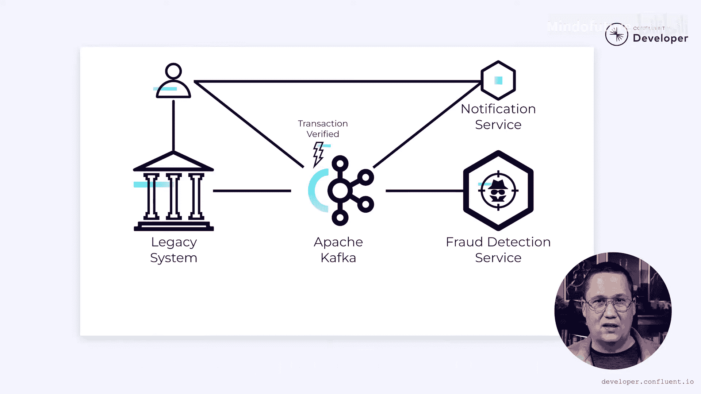

# 016：使用异步事件增强欺诈检测 🚀

在本节课中，我们将学习如何利用异步事件来解决微服务架构中的同步依赖问题，特别是在欺诈检测场景下，如何确保系统在部分服务不可用时仍能正常运行。

---

## 概述

欺诈检测是一个复杂的过程，涉及机器学习算法、复杂规则甚至人工分析的应用。我们一直在关注 Tributary 银行如何将一个遗留的单体系统分解，并将欺诈检测提取到自己的微服务中。然而，这里存在一个问题。

---

## 同步通信的问题

在单体架构中，所有功能要么全部正常运行，要么全部失效。这有其缺点，因为孤立子系统的故障可能导致整个单体系统崩溃。但在微服务设计中，如果某个微服务变得不可用，它仍然可能对系统的其余部分产生影响。

让我们看一个简单的例子。想象一下，银行的一位客户决定购买音乐会门票。这会在银行系统中创建一笔新交易。如果一切按预期运行，系统会在欺诈检测服务中记录该交易，并启动分析流程。

但如果欺诈检测服务离线了呢？理想情况下它不会离线，但最好假设故障是可能发生的。如果欺诈检测服务不可用，我们有两种可能的解决方案。技术上不止两种，但让我们暂时简化为最明显的两种。

系统可以使原始交易失败，但如果这是一笔合法购买，这将带来糟糕的体验，客户会感到不满。为了防止这种情况，系统可以允许交易，只是无法在欺诈检测服务中注册它。但如果这是一系列欺诈交易的一部分，欺诈检测服务现在将缺少关键信息。这可能会妨碍它识别欺诈，同样，客户也会感到不满。

问题的根源在于遗留系统和微服务之间的 REST 调用是同步操作的。对微服务的调用必须在遗留系统继续之前完成。即使实际处理是异步完成的，仍然存在一个同步组件阻碍进程。

---

## 转向异步事件

我们可以通过放弃 REST 调用，转而使用异步事件来解决这个问题。当处理一笔交易时，系统可以发出一个 **`transaction_recorded`** 事件。它包含交易的详细信息，例如账户 ID、金额以及其他重要细节。该事件被发送到消息平台，例如 **Apache Kafka**。一旦事件到达 Kafka，原始交易就完成了。客户无需等待欺诈检测服务接收或处理该事件。

等一下。我们是不是只是转移了问题？以前，如果微服务宕机，我们就无法继续。现在，如果 Kafka 宕机，我们面临同样的问题。确实如此，但又不完全是这样。Kafka 应被视为架构中不可或缺的一部分，就像数据库一样。如果数据库宕机，很可能整个系统都无法工作。因此，我们会投入大量精力确保这种情况永远不会发生。同样的严谨性也应应用于 Kafka 的部署，以确保其持续可用。

但更重要的是，使用 Kafka，我们可以集中精力。想象一个拥有 300 个微服务的系统，你必须确保其中每个服务在任何时候都可靠。这很困难。相比之下，使单个 Kafka 部署可靠则更容易，特别是如果你使用像 **Confluent Cloud** 这样的云托管服务。因此，尽管从技术上讲问题仍然存在，但在使用 Apache Kafka 这样的平台时，更容易避免它。这并不是说这很容易，但你只需要做一次，而不是 300 次。此外，正如我们将在未来的视频中看到的，即使 Kafka 不可用，也有方法确保系统保持运行。

---

## 事件的处理流程

好的，假设事件已成功进入 Kafka，接下来会发生什么？

欺诈检测服务将订阅 **`transaction_recorded`** 事件。每当它收到一个事件，就会在其数据库中记录相关细节，并启动欺诈检测流程。这可能需要一些时间，因为它会运行各种场景，但幸运的是，这对原始交易没有影响。更重要的是，如果欺诈检测服务因任何原因离线，事件仍然可以写入 Kafka。这意味着服务一旦恢复可用，就可以从它中断的地方继续，并且永远不会错过任何交易。

但我们还没有完成。我们已经解决了如何确保即使微服务不可用交易也能继续进行的问题。我们还没有弄清楚的是，如果检测到欺诈该怎么办。银行可能希望锁定账户以确保问题不会恶化。但如果交易不等待响应，我们如何做到这一点？

---

## 处理检测结果：账户锁定

一个简单的方法是向微服务发起 REST 调用来检查账户是否已被锁定。但这只有在微服务运行时才有效。我们这次练习的全部目的是找到允许系统在微服务不可用时仍能运行的方法。我们之前的解决方案是转向使用异步事件进行通信，也许我们在这里也可以这样做。

如果欺诈检测服务发出一个 **`account_locked`** 事件会怎样？此事件将包含有关账户的详细信息以及被锁定的原因。遗留系统可以订阅这些事件，每当它看到一个 **`account_locked`** 事件，它就可以更新自己数据库中的一个标志。下次交易到达时，无需调用微服务来检查账户是否被锁定。这消除了遗留系统和微服务之间的同步依赖。事实上，遗留系统不需要知道微服务的存在。它只知道它向一个主题发送事件，并从另一个主题接收事件。中间发生的事情无关紧要。

---

## 事件驱动架构的额外优势

这种方法还有一个额外的好处。假设如果用户的账户被锁定，我们希望向他们发送电子邮件或推送通知。现在想象一下，我们构建了另一个监听 **`account_locked`** 事件的微服务。当它收到一个事件时，它会发送适当的通知。再次强调，通知服务不要求遗留系统或欺诈检测服务处于运行状态。它不需要关心它们是否存在。只要事件在流动，它们如何到达那里就无关紧要，即使事件暂时停止流动，也没关系。一旦它们恢复，通知服务将继续运行，就像从未有过中断一样。

这是事件驱动架构的好处之一。对于同步操作，每次添加新功能时，都会增加原始操作的延迟并引入潜在的故障点。然而，异步事件可以被重用，而不会引入同步依赖。如果发生故障，它会被隔离到消费者。你可以有成千上万个微服务都在消费相同的事件，而原始生产者完全不知情。

---

## 扩展事件类型

由于这种方式非常强大，Tributary 银行不会止步于两个事件。除了 **`account_locked`** 事件，他们还可以做类似 **`fraud_suspected`** 事件的事情。想象一下，如果用户可以收到推送通知，警告他们存在可疑欺诈。他们可以立即查看交易，确认是自己操作的，从而避免锁定账户的需要。同时，这可能会发出一个 **`transaction_verified`** 事件或类似效果的事件。

这就是 Tributary 踏上这条道路的原因。他们想要一个可以轻松演进的系统，以提供不断增长的商业价值，而不受遗留系统互联性质的束缚。异步事件允许他们构建新功能，而不会增加额外的复杂性。这些功能可以存在于独立的微服务中，这些微服务自主运行，仅依赖于事件流。

---

## 同步与异步的平衡

这并不是说整个系统都将以这种方式运行。有时 REST 调用比异步事件更有意义。但这应该是例外，而不是规则。他们的大部分通信应依赖于异步事件，仅在必要时才回退到 REST。

显然，为了这个视频，我取了一个非常复杂的领域并进行了极大的简化。现实情况不会这么容易。但希望它能让你了解如何使用异步事件来丰富你的领域并保护其免受故障影响。

---

## 总结

在本节课中，我们一起学习了如何利用异步事件来解耦微服务间的同步依赖，从而构建更具弹性和可扩展的系统。我们探讨了从同步 REST 调用转向基于 Apache Kafka 的异步事件通信的优势，包括提高系统可用性、允许服务独立故障和恢复，以及支持轻松添加新功能而不增加原始操作的复杂性。事件驱动架构的核心在于通过事件流连接服务，使它们能够自主、异步地工作。

然而，事情并未就此结束。尽管 Tributary 在构建更自主的系统方面取得了巨大进步，但架构中仍隐藏着一些相当隐蔽的问题。在未来的视频中，我们将看到他们如何解决诸如双重写入问题和模式演化等问题。

