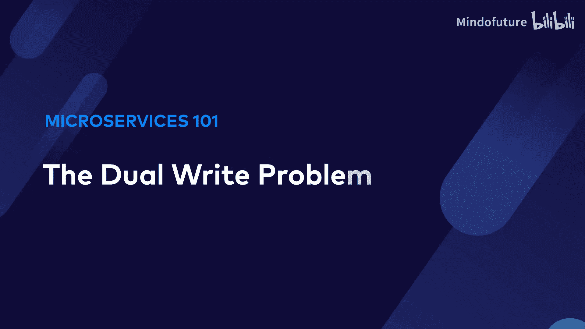
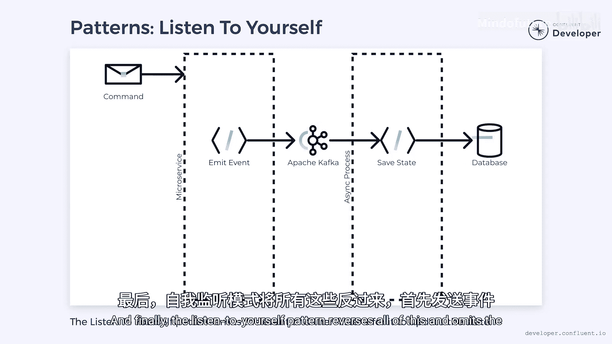

# 017：什么是双写问题？💥

在本节课中，我们将要学习事件驱动微服务架构中一个常见的陷阱——双写问题。我们将了解它的定义、成因、潜在风险以及几种有效的解决方案。

## 什么是双写问题？

我是来自 Confluent 的 Wade。在我刚开始构建事件驱动微服务时，我犯过错误。其中最大的错误之一，就是掉入了一个常被称为“双写问题”的陷阱。

那么，什么是双写问题呢？请继续观看，我将为你解释。

## 问题的根源

上一节我们介绍了双写问题的概念，本节中我们来看看它是如何产生的。

当我们从一个微服务发出事件时，这通常是由一个命令触发的。这些命令旨在以某种方式改变微服务的状态。在处理命令时，我们会进行一些更改，然后在完成后保存它们。在事件驱动系统中，我们希望以事件的形式发出这个变更。

表面上看，这很简单。然而，你能发现其中隐藏的问题吗？我给你一个提示：问题出在 `save`（保存）和 `emit`（发出）语句之间。

`save` 语句与我们的数据库交互，这可能是某种关系型或 NoSQL 数据库。同时，`emit` 语句将事件发送到外部消息系统，例如 Apache Kafka。这些系统是分离的，无法以事务方式同时更新。

那么，如果我们的应用程序在 `save` 完成后、`emit` 完成前失败了，会发生什么？在这种情况下，我们的数据库已经更新，但事件从未发出。现在，我们的状态和事件之间就出现了不一致，并且没有明确的方法来解决它。

## 不一致的后果

这些不一致的后果可能很轻微，但也可能相当严重，具体取决于你的用例。例如，如果更新的状态是你支付账单时的银行余额，而事件是触发账单支付的信号。当故障发生时，钱已经从你的账户中扣除，但实际支付从未发生。显然，这是我们想要避免的情况。

当然，双写问题不仅限于发出事件。任何需要更新两个独立系统的时候都会发生。例如，如果我们想发送电子邮件而不是发出事件，也会遇到同样的问题。

我很好奇，你在自己的软件中见过这类不一致吗？你能够追踪到根源吗？请在下方评论中告诉我。

## 为什么简单的解决方案无效？

现在，你可能会问，为什么我们不能先发出事件？不幸的是，这样做只是颠倒了问题。我们最终发出了事件，但状态从未更新。系统仍然不一致，所以我们没有任何改进。

那么，如果我们把整个过程包装在一个事务中呢？这个想法是，如果发生故障，事务就不会提交，状态会回滚。不幸的是，这只是转移了问题。请记住，没有跨越数据库和消息平台的事务。如果在事件发布后、事务提交前发生故障，我们仍然会遇到问题。事件已经发出，但状态被回滚，我们又产生了另一种不一致。

## 如何解决双写问题？

关键是将两个写操作分开，使其中一个依赖于另一个。一个常见的方法是先将数据写入数据库，然后由一个单独的进程扫描变更并发出相应的事件。如果数据库从未更新，那么事件就不会发出。一旦数据库更新，那个独立的进程最终会发现变更并发出相应的事件，不受任何故障的影响。

唯一的风险是，如果进程在发出事件后失败。那么它必须重新启动，并可能创建一个重复的事件。然而，事件去重是下游消费者的常见做法。如果已经实施了去重，这不会造成任何问题。

以下是几种有助于此过程的模式：

*   **变更数据捕获**：CDC 系统旨在监控数据库，并在发生变更时执行操作，例如写入 Kafka。我们可以使用 CDC 作为触发事件的独立进程。
*   **事务性发件箱模式**：使用一个事务同时更新状态和一个发件箱表。发件箱是需要发出的事件日志。一个单独的进程可以扫描发件箱并发出任何待处理的事件。
*   **事件溯源**：消除状态的存储，只存储事件。然后，我们针对事件日志运行一个进程，并发出任何新事件。同时，当需要时，可以使用事件来重建状态。
*   **监听自身模式**：反转所有流程，首先发出事件。然后，一个单独的进程监听这些事件来更新状态。

## 总结与最佳实践

本节课中我们一起学习了双写问题及其解决方案。上述每种方案都可以有效消除双写问题。

现实情况是，许多团队忽略了这个问题，并假设数据库和消息平台都会成功更新。他们可能声称这没问题，因为他们没有看到它引起任何问题。不幸的是，由这个问题引起的问题极难发现。你不会得到任何表明某些东西已经不一致的红色警报。即使你发现了不一致，追溯其根源也可能极其困难。

更重要的是，软件不应该建立在假设一切都会完美运行的基础上。我们应该学会接受故障，并计划相应地处理它。对于双写问题，这意味着在它发生之前就构建解决方案。这样，我们就可以避免它可能导致的任何不一致。

如果你喜欢这个视频，并想获得更多关于构建可扩展微服务的信息，请查看我们在 Confluent Developer 上的课程。请点赞、分享和订阅以支持本内容，并留意下一个视频。

