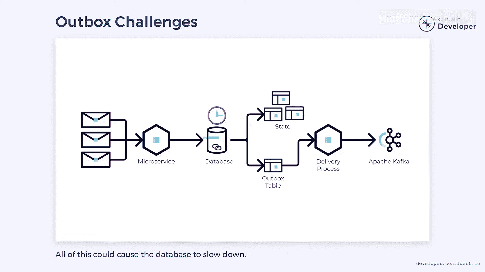

# 018：什么是事务性发件箱模式


在本节课中，我们将学习事务性发件箱模式。这是一种解决微服务中更新数据库和发送事件时“双写问题”的常用方法。我们将了解其工作原理、优势、潜在挑战以及适用场景。

## 概述：双写问题

当我们从微服务发出事件时，必须解决如何以事务方式更新数据库和发出事件的问题。

双写问题发生在需要更新两个独立系统时。例如，我们想更新数据库，同时将事件写入另一个独立的系统，如 Apache Kafka。由于这两个系统没有关联，我们无法以事务方式同时更新两者。我们需要找到另一种方法来确保要么两者都更新，要么都不更新。

## 解决方案：事务性发件箱模式

事务性发件箱模式可以帮助解决这个问题。如果我们使用的数据库支持事务性更新，就可以利用它来克服双写问题。

其核心思想不是尝试同时更新数据库和 Kafka，而是将事务逻辑推入数据库。每当我们在数据库中执行更新时，可以在同一事务中更新一个发件箱表。可以把发件箱想象成一个邮箱，我们把需要投递的“信件”（即事件）放入其中。

以下是该模式的基本工作流程：

1.  **写入数据库与发件箱**：在同一个数据库事务中，应用程序同时更新业务数据表和发件箱表。发件箱表记录需要发送到 Kafka 的事件。
    ```sql
    BEGIN TRANSACTION;
    UPDATE orders SET status = 'SHIPPED' WHERE id = 123;
    INSERT INTO outbox_table (id, event_type, payload) VALUES (uuid(), 'OrderShipped', '{"orderId": 123}');
    COMMIT;
    ```
2.  **异步发送事件**：一个独立的进程（发件箱处理器）异步地监控发件箱表。当它发现新事件时，会将其发送到 Kafka。
3.  **清理已发送事件**：一旦事件被成功发送到 Kafka，就可以从发件箱表中删除该记录。

这个发件箱处理器通常作为原始微服务内的另一个线程编写，也可以作为一个完全独立的应用程序运行。根据所使用的数据库，甚至可以使用 Kafka 连接器或变更数据捕获系统来监控表并发出事件。

## 优势与保证

事务性发件箱模式的主要优势是它避免了双写问题。业务状态和发件箱表总是在同一个事务中更新。如果由于某种原因状态更新失败，事件也不会被写入发件箱。这保证了发件箱中的数据与数据库中的数据完全同步。

从那里开始，将事件传递给 Kafka 的独立进程确保了发件箱表和 Kafka 保持同步。这使我们能够保证每个数据库操作都会在 Kafka 中有一个对应的事件，尽管会有一些延迟。

## 挑战与注意事项

然而，该模式也存在一些需要注意的挑战。

**至少一次投递保证**

当进程向 Kafka 发送事件时，可能会遇到故障或超时。为了保证 Kafka 收到数据，必须进行重试。这些重试可能导致重复消息。因此，我们对 Kafka 的投递保证是 **至少一次**。我们保证发件箱中的每条消息都会到达 Kafka，但它可能到达不止一次。因此，我们需要确保下游系统准备好处理任何重复项。

至少一次保证在分布式系统中很常见，因此，实现去重逻辑来处理它们是一个好的实践，即使在不涉及双写问题时也是如此。例如，接收方在处理 Kafka 消息时可能会失败，当它重新启动时，可能会再次收到同一条消息。我们必须准备好处理这些情况。

**性能与资源考量**

频繁的更新和删除可能会产生大量流量。数据库可能需要始终将表保留在内存中，占用大量资源。同时，有些数据库处理删除的效率不高，它们可能在底层使用逻辑删除标记。随着插入和删除不断发生，这些逻辑删除标记可能会累积起来，导致表的重度资源使用和争用。

如果数据库没有为这种流量做好准备，它可能会减慢我们的应用程序速度，因为请记住，每次写入都会触及那个发件箱表。



为了解决这些问题，我们可能需要进行调整，例如标记记录而不是删除它们，或者调整数据库管理逻辑删除标记的方式。保留事件可能带来长期好处，因此删除可能不是绝对必要的。有些数据库甚至可能有专门为此类流量设计的特殊表。

## 总结与对比

本节课我们一起学习了事务性发件箱模式。它是一种通过将事件写入数据库内的发件箱表，然后由独立进程异步发送到消息系统（如 Kafka）来解决双写问题的有效方法。它提供了数据一致性保证，但引入了至少一次投递和潜在的性能考量。

如果您的系统满足事务性发件箱模式的要求（主要是拥有支持事务的数据库），它可以是一种直接有效的克服双写问题的方法。它通常比其他选项（如事件溯源或“监听自身”模式）更容易管理。


然而，如果您没有使用事务性数据库，或者有其他原因要避免使用发件箱，那么这些其他模式可能是值得考虑的好选择。