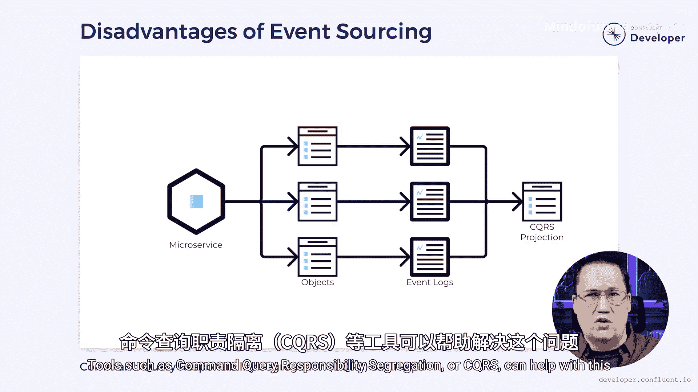

# 019：什么是事件溯源模式


在本节课中，我们将要学习事件溯源模式。这是一种与传统数据库架构不同的数据存储方式，它不直接存储对象的当前状态，而是存储导致该状态的所有事件历史。我们将探讨其工作原理、优势、挑战以及适用场景。

## 传统数据库架构的局限

上一节我们介绍了事件驱动架构的基本概念，本节中我们来看看传统数据库在处理数据历史时面临的挑战。

传统的数据库架构可以被想象成一次公路旅行。旅途中你可能会有许多曲折和转弯，但只有你当前的位置才被认为是重要的。然而，这并不总是正确的。旅程本身往往和目的地一样重要，甚至更重要。

在技术层面，当我们以传统方式将数据存储在数据库中时，我们采用的是破坏性的方式。每次更新一条记录时，我们都会销毁之前存在的任何数据。这意味着我们丢失了导致当前状态的事件历史。

## 事件溯源的核心思想

那么，如果我们不想丢失历史记录呢？如果我们不仅对当前状态感兴趣，还对如何达到这个状态的过程感兴趣呢？事件溯源模式正是为了解决这个问题而生的。

事件溯源的基本原理是：每次更新微服务中的一个对象时，我们不在数据库中存储该对象的当前状态。相反，我们存储导致该状态的事件，本质上就是审计条目。如果需要重建对象，我们可以重放所有事件，并用它们来计算当前状态。

以下是事件溯源的核心公式：
```
当前状态 = 初始状态 + Σ(所有事件)
```

## 事件溯源的优势

事件溯源模式带来了几个关键优势，使其在某些场景下极具价值。

### 1. 完整的历史记录
事件溯源保留了完整的事件历史。这在需要审计追踪的行业（如银行或医疗保健）中至关重要。如果需要调查错误，你可以追溯导致当前状态的每一个具体变更。

### 2. 解决“双重写入”问题
在构建事件驱动系统时，我们经常需要在数据库中记录数据，同时将事件发送到像 Apache Kafka 这样的二级系统。由于 Kafka 和数据库没有连接，无法以事务方式同时更新两者，这可能导致一个更新失败而另一个成功，数据因此不同步。

使用事件溯源，我们可以解决这个问题。我们不再试图同时更新数据库和 Kafka，而只关注事件日志。只要事件成功写入日志，我们就认为它是正确的。然后，我们可以有一个单独的进程扫描事件日志，并将任何新事件发送到 Kafka。

以下是解决双重写入问题的简化流程：
```python
# 伪代码示例：基于事件日志同步到Kafka
def process_event_log(event_log):
    for event in event_log.get_new_events():
        try:
            # 1. 将事件持久化到本地事件存储（单一事实来源）
            event_log.persist(event)
            # 2. 异步将事件发送到Kafka
            kafka_producer.send('topic', event)
        except Exception as e:
            # 处理失败，但事件日志是可靠的
            handle_error(e)
```

### 3. 状态的时间点重建
因为存储了所有事件，我们可以重建过去任何时间点的状态。例如，如果我们想知道上周二下午3点的账户余额，所需的所有信息都随时可用。如果只存储余额而不存储交易历史，这是不可能实现的。

## 事件溯源的挑战

尽管事件溯源功能强大，但它并非适用于所有情况的完美解决方案。

它可能引入复杂性，尤其是在处理跨多个数据对象的查询时。像**命令查询职责分离**这样的工具可以帮助解决这个问题，但它们本身也会带来成本。



因此，虽然事件溯源看起来是一个非常强大的工具，但我们可能不会在所有情况下都使用它。当我们在构建能带来竞争优势或需要审计的系统部分时，它是一个很好的选择。但对于没有这些要求的系统，其增加的复杂性可能会超过任何优势。

## 总结

本节课中我们一起学习了事件溯源模式。我们了解到，它是一种通过存储导致状态变化的所有事件（而非最终状态）来持久化数据的方法。其核心优势在于提供完整的历史审计追踪、解决事件驱动系统中的双重写入问题，以及允许对过去任意时间点的状态进行重建。然而，它也带来了查询复杂性和系统设计上的挑战，因此需要根据实际需求（如强审计要求或竞争优势）来权衡是否采用。


