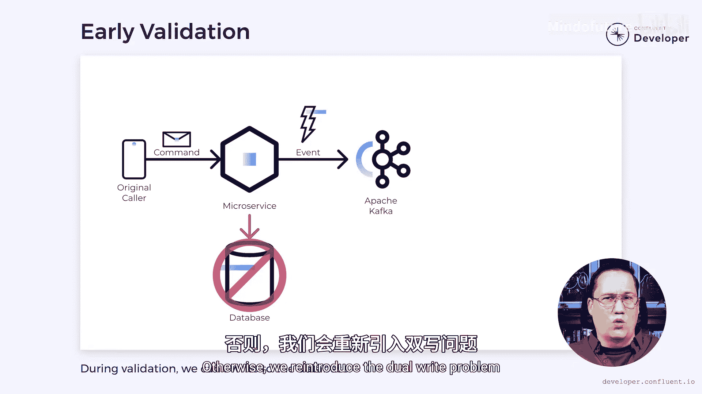

# 020：什么是“自监听”模式 🎧

在本节课中，我们将要学习一种名为“自监听”的微服务设计模式。这种模式旨在解决处理耗时命令时遇到的“双重写入”问题，并提升系统的响应速度。

---

## 概述

构建微服务时，有时需要响应一个命令并执行一系列复杂的步骤。这些步骤可能涉及跨多个系统的事务，并且耗时可能超出我们愿意等待的范围。在这些情况下，“自监听”模式可以作为一种潜在的解决方案。

## 一个简单的例子

让我们考虑一个简单的例子。想象一个用户拥有一个健身追踪器。这个追踪器会收集步数、心率等数据。数据会定期同步到用户的手机上，然后被推送到云端的某个微服务。随后，这些数据可以被处理，以构建用户健康的复杂模型。

然而，这带来了潜在的问题。在整个过程中，我们可能需要多次访问数据库进行读写操作。同时，我们还需要处理所有这些数据来构建必要的用户健康模型。与此同时，我们不希望用户在我们执行所有这些逻辑时被卡住等待。我们希望尽可能快地响应用户，以便他们可以断开连接并继续其他操作。

与此同时，我们可能希望创建一些事件并将它们发送到 Apache Kafka。这可能意味着我们需要以事务性的方式同时更新数据库和 Kafka。这就使我们直接面对了“双重写入”问题。我们必须更新两个没有事务性关联的系统。如果你不熟悉“双重写入”问题，可以查看描述中链接的视频。

## “自监听”模式如何提供帮助

“自监听”模式正是在这里可以提供帮助。与其在用户等待时执行所有更新逻辑，我们可以推迟它。相反，当我们从用户那里收到命令时，我们将其转换为一个事件，然后将该事件发送到 Kafka。一旦事件进入 Kafka，它就是安全的，我们就可以响应用户。

因此，在我们的健身追踪器示例中，用户的设备可能会发送一个“同步设备”命令。我们会将其转换为一个“设备已同步”事件并发送到 Kafka。然后，我们立即回复设备，无需任何进一步处理。这允许快速响应，无需过度等待。

与此同时，原始命令只向 Apache Kafka 写入事件。它不向数据库写入任何内容，这意味着我们不会遇到“双重写入”问题。毕竟，这里只发生了一次写入。

## 异步处理与数据一致性

然而，我们的处理和数据库写入必须在某个时刻完成。因此，下一步是在我们的微服务中设置一个单独的进程来监听该事件。这就是“自监听”这个名字的由来。当它收到事件时，它可以启动所有复杂的处理并相应地更新数据库。再次强调，这里我们只更新数据库，而不是 Apache Kafka，因此我们继续避免了“双重写入”问题。

然而，这种方法确实带来了一些挑战。因为我们写入事件并异步更新数据库，所以引入了潜在的竞态条件。一旦原始调用者收到回复，它可能会认为数据库已经更新。如果它在事件被处理之前就去查找数据，那么它将找不到它想要的东西。同时，如果下游系统消费了这些事件并调用微服务以获取更多详细信息，同样，数据可能还不存在。这是因为微服务是最终一致的。在任何给定时刻，由于未处理的事件，数据中可能存在不一致。最终，一旦所有事件都被处理，微服务会进入一致状态，但这可能需要时间。

## 应对挑战的策略

在某种程度上，我们可以通过仔细命名事件来缓解这个问题。一个“设备已同步”事件只表明数据已同步，而不是已处理。我们可以在完成后发出一个“数据已处理”事件，但这会与我们的数据库更新一起发生，这将重新引入“双重写入”问题。总的来说，仔细命名只能帮你到这里。如果你发现自己遇到了这个问题，考虑“自监听”模式之外的其他方案可能更好。

那么，如果在调用者断开连接后我们遇到错误怎么办？例如，我们可能需要对事件中包含的数据执行验证。如果验证失败，调用者已经继续执行其他操作，将不会知道失败。这会在我们的系统中造成额外的不一致性。

我们可以尝试通过移动验证逻辑来解决这个问题。如果我们在发出事件之前对命令执行验证，那么我们可以在调用者仍然连接时捕获错误。然后我们可以确保被发出的事件是有效的。这会减慢速度，但这可能是一个可以接受的权衡。然而，我们确实需要小心，在不要求数据库写入的情况下完成所有这些验证。否则，我们会重新引入“双重写入”问题。

## 总结

本节课中，我们一起学习了“自监听”模式。“自监听”模式可以是解决“双重写入”问题的有用工具。然而，它并不完美。在我们希望最小化前期处理时间的情况下，它是一个很好的选择。在我们不必担心其他消费者在我们发出事件后立即尝试读取数据的情况下，它也很有用。然而，在其他情况下，我们可能会考虑查看替代解决方案，例如事务性发件箱或事件溯源。