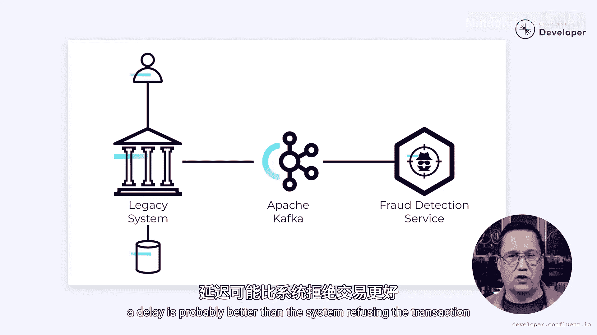

# 021：解决双写问题 🎯

在本节课中，我们将学习微服务架构中一个常见但棘手的问题——双写问题。我们将通过一个银行系统的具体例子，深入探讨其成因，并介绍两种有效的解决方案：事务性发件箱模式和事件溯源模式。

## 问题概述：什么是双写问题？

我曾参与过多个大型系统的开发，并多次遇到双写问题。最糟糕的是，在很长一段时间里，我甚至没有意识到这是一个问题。但现在我明白了，我想与大家分享如何解决它。

我们将通过一个具体的银行系统例子来探讨。这家银行构建了一个事件驱动的微服务，但正面临着双写问题。

## 理想流程与问题浮现

首先，让我们看看系统原本应该如何工作。

尽管欺诈检测系统已被提取为一个独立的微服务，但大部分银行业务逻辑仍然存在于一个遗留的单体应用中。当用户发起一笔交易时，无论是支付、存款、购物还是其他操作，该交易的记录都会被存储在单体应用的数据库中。同时，系统应该向 Apache Kafka 发送一个“交易已记录”事件。

欺诈检测服务会监听这些“交易已记录”事件，并异步处理它们。

至少，这是它应该工作的方式。大多数时候，这似乎运行良好。然而，偶尔会出现这些“交易已记录”事件被丢弃的情况。交易被正确地记录在数据库中，但事件从未到达 Apache Kafka。

## 问题根源：双写操作

这种情况的发生是由于代码中的一个缺陷。当一笔交易发生时，系统需要执行两个独立的写操作：一个写入数据库，另一个写入 Kafka。问题出现在当一个写操作成功，而另一个失败时。换句话说，写入数据库的操作正常完成，但写入 Kafka 的操作失败了。

这可能是由多种原因造成的，包括网络或硬件故障、软件异常以及系统升级等。当这种情况发生时，事件就丢失了，这就是所谓的双写问题。

只要您向多个没有事务性关联的系统写入数据，就可能发生这个问题。

## 传统事务的局限性

现在，第一个想法可能是用数据库事务之类的方法来解决这个问题。不幸的是，没有办法创建一个同时涵盖数据库和 Apache Kafka 的事务。

无论我们如何安排代码，总存在一种可能性，即一个操作成功而另一个失败，这将使我们处于不一致的状态。

## 解决方案一：事务性发件箱模式

然而，实际上有一种方法可以使用事务来解决这个问题，只不过这个事务不跨越数据库和 Kafka。事务性发件箱模式正是为这种情况设计的。

要使用它，银行可以首先创建一个发件箱表。这是一个简单的数据库表，包含要发送到 Kafka 的事件，包括事件ID和其他相关元数据。

以下是实现步骤：

1.  **写入数据库与发件箱**：当发生新的金融交易时，它被写入数据库，并在同一个数据库事务中，一个事件被写入发件箱表。因为这发生在数据库事务中，所以它保证是原子的。要么两个写操作都成功，要么都失败。
2.  **响应用户**：一旦数据库事务完成，系统就可以响应用户，指示成功。无需等待事件被发送到 Kafka。
3.  **异步发送事件**：接下来，一个单独的进程可以扫描发件箱表，并将其找到的事件发送到 Kafka。这个进程可以由团队编写，但如果数据库支持，他们也可以利用变更数据捕获系统。
4.  **保证至少一次送达**：这个进程必须以至少一次送达保证来运行。如果一个事件无法发送，则需要重试直到成功。在某些情况下，重试可能会导致重复消息。因此，下游消费者进行幂等操作非常重要。不过，这通常是 Kafka 消费者的最佳实践。像事件ID这样的元数据在这里很有帮助，因为它允许消费者去重。
5.  **标记完成**：一旦事件成功发送到 Kafka，它可以被标记为完成。或者，事件可以从发件箱表中删除。然而，银行通常不喜欢删除数据，所以他们可能会保留它。

## 解决方案二：利用事件溯源简化

事务性发件箱模式功能强大，可以完成任务。然而，让我们花点时间思考一下银行的运作方式。

每笔金融交易都作为数据库中的一个独立条目被记录。银行不仅仅存储您账户的余额，他们还存储导致该余额的所有交易。从本质上讲，银行是事件溯源的。

因为数据是以事件溯源的方式存储的，他们有可能简化流程并消除发件箱表。

以下是简化的步骤：

1.  **扫描数据库记录**：每当新的金融交易被写入数据库时，一个单独的进程可以扫描这些交易并将其发送到 Kafka。
2.  **构建事件**：构建事件所需的所有信息都希望能在单个数据库记录中找到。这使得这成为一个简单的扫描、转换和发送过程。
3.  **无需额外表**：无需创建单独的发件箱表，因为数据库记录本身就是事件。

## 两种方案的共同优势

实现事务性发件箱或事件溯源还有一个额外的好处。

每当我们向外部系统写入数据时，都有可能失败。无论我们处理的是数据库、Apache Kafka、单独的微服务还是其他任何东西，都是如此。通过存储数据并异步执行写操作，我们将系统与潜在的故障隔离开来。如果在尝试将事件写入 Kafka 时发生故障，那也没关系。一旦系统恢复，进程就可以继续。由于所有事件都存储在数据库中，没有数据丢失的风险。

然而，这些故障会导致延迟。从最终用户的角度来看，延迟可能比系统拒绝交易要好。

## 总结与重要性

双写问题很棘手，但如果我们花点时间问对问题，解决它并不一定困难。但我们不应该忽视它，因为这样做会导致数据丢失，而这通常是不可接受的。我们需要考虑丢失数据的后果。

对于像银行这样的金融机构来说，这是不可接受的。它可能导致相当严重的后果，不仅来自客户，还可能来自监管机构。

银行业务的事务性本质使得这比其他领域更容易解决。然而，无论您在哪个领域工作，都可以应用事务性发件箱和事件溯源等技术。

在本节课中，我们一起学习了双写问题的成因及其在微服务架构中的影响。我们深入探讨了两种核心解决方案：事务性发件箱模式和事件溯源模式。这两种模式都通过将核心数据持久化与事件发布解耦，并利用数据库事务的原子性，确保了数据的一致性，从而优雅地解决了双写问题。理解并应用这些模式，对于构建健壮、可靠的事件驱动系统至关重要。