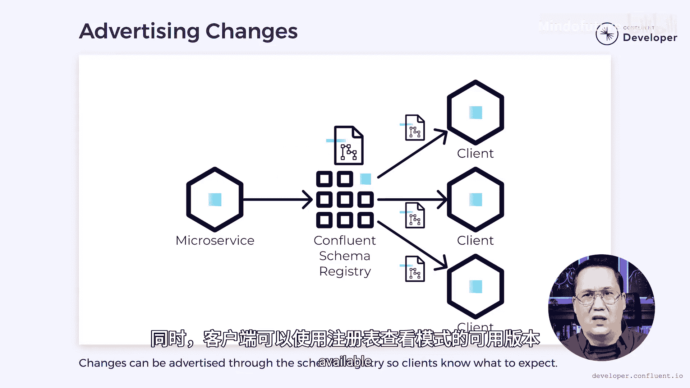

# 022：如何演进微服务模式 🧩

在本节课中，我们将要学习微服务架构中一个核心且复杂的问题：模式演进。我们将探讨什么是模式、为何需要演进模式，以及如何以非破坏性的方式管理模式变更，确保系统的稳定性和兼容性。

## 什么是模式？📝

当微服务之间进行通信时，它们需要就通信格式达成一致。本质上，我们需要定义一个API。这个API充当了微服务与其客户端之间的**契约**，确保服务履行其承诺的义务。

许多数据格式将这些细节编码在一个明确的**模式**中。这些模式包含了诸如存在哪些字段、它们采用何种结构以及包含什么数据类型等细节。

## 隐式模式与演进需求 🔄

但是，如果我们的数据格式不包含模式呢？例如，JSON默认被认为是无模式的，许多人也是这样使用它。如果我们的API利用了无模式格式，那么我们是否还需要担心模式和模式演进呢？

即使我们没有明确定义一个模式，一个**隐式的模式**仍然存在。通过定义API，微服务就承诺以特定格式提供数据。即使没有明确的模式，客户端也会期望API遵循这些规则。

随着时间的推移，内部和外部的压力，例如竞争和法规，会迫使模式发生改变。我们都见证过现代隐私立法如何迫使公司调整其系统。这些变更可能很简单，比如添加或删除一个数据字段，但也可能很复杂。我们可能为了提升性能而决定从JSON格式切换到Protobuf，或者为了满足法规要求而被迫加密数据。

请记住，模式是一份契约，如果我们破坏了契约，客户端可能会对系统失去信任。因此，**以非破坏性的方式演进模式至关重要**。

## 选择合适的数据格式 🛠️

我们应该做的第一件事是选择一种灵活且易于演进的数据格式。有些格式比其他格式更严格。例如，对于JSON，我们或许能够添加或删除一个数据字段，但重命名字段很可能是一个破坏性变更。与此同时，Protobuf允许以非破坏性的方式添加、删除和重命名字段，但它不像JSON那样是人类可读的。

我们还需要考虑这些变更将是向前兼容还是向后兼容。

*   **向前兼容**的变更允许旧客户端读取使用新模式版本写入的数据。在JSON文档中，添加一个新字段被认为是向前兼容的变更。针对新模式版本编写的客户端可以读取新字段，而为旧模式编写的客户端可以简单地忽略该字段。
*   **向后兼容**的变更允许新客户端读取使用旧模式版本写入的数据。事件流通常更倾向于向后兼容的模式，因为它们包含使用不同模式版本写入的事件。当客户端尝试读取事件流时，它们需要准备好处理使用旧模式版本写入的消息。在JSON文档中，删除一个字段是向后兼容的变更。当前版本的文档将不包含该字段，如果客户端收到包含该字段的旧版本，它可以忽略它。

## 处理破坏性变更 🚧

不幸的是，尽管我们尽了最大努力来保持兼容性，但有时我们被迫进行破坏性变更。当这种情况发生时，我们希望将对客户端的影响降到最低。

以下是处理破坏性变更的常见方法：

*   **创建新的API版本**：一种常见的方式是创建API的新版本。对于REST API，这可能意味着创建一个新的V2端点。对于Kafka数据流，我们可能会创建一个V2主题。当我们创建新的API时，我们可能需要在一段时间内支持旧版本，以便给客户端迁移的时间。

## 客户端的最佳实践 🧑‍💻

在客户端，我们应该小心避免数据耦合。每次客户端从API读取一段数据时，它就与那段数据耦合了。如果数据发生变化，那么客户端也必须随之改变。因此，客户端应谨慎地**只读取它关心的数据**，以最小化变更的影响。

以下是两种客户端实现方式的对比：

*   **共享客户端库**：为微服务API编写共享客户端库是很常见的做法。API的客户端可以利用共享库，而不是重新实现逻辑。然而，要使这有效，库必须读取API暴露的所有数据。如果数据的任何部分发生变化，那么客户端库就需要更新，这反过来又会迫使使用该库的任何客户端进行更改。
*   **无共享方法**：另一种方法是采用无共享方法，即每个客户端实现自己读取API的逻辑。在这种情况下，它们可以确保只读取对自己重要的数据。这样，如果API以客户端不关心的方式演进，它或许能够避免不必要的更新。

## 广播模式变更 📢

当我们演进模式时，最后一个考虑因素是如何广播这些变更。一个**模式注册中心**，例如Confluent模式注册中心，可以成为广播模式变更和执行兼容性的有用工具。

*   **验证消息**：根据注册中心存储的模式验证消息，可以确保这些消息与客户端兼容。
*   **查看模式**：同时，客户端可以使用注册中心来查看有哪些模式版本可用，以及其中包含什么数据。

## 总结 📚

本节课中我们一起学习了微服务模式演进的核心概念。正如你所见，处理模式演进没有单一的策略，它最终是不同方法的组合。请记住，你独特的需求可能会影响我提出的任何建议。

选择灵活的数据格式、理解向前与向后兼容性、妥善处理必要的破坏性变更、在客户端避免不必要的数据耦合，并利用模式注册中心等工具来管理变更，这些都是构建健壮、可演进微服务系统的关键步骤。