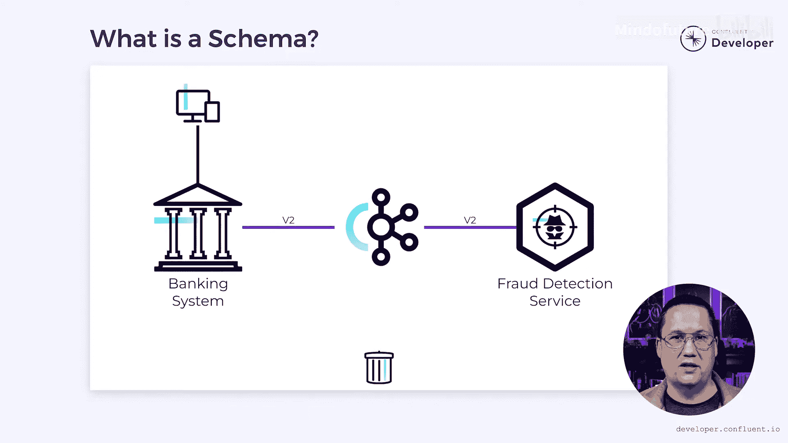

# 023：实现零停机时间的模式演进

## 概述

在本节课中，我们将要学习如何在事件驱动系统中演进数据模式，同时确保服务零停机。我们将通过一个银行系统的具体案例，探讨不同的技术方案，例如兼容性保证、灵活的数据格式和事件版本控制。

构建事件驱动系统时，我遇到的一个更有趣的挑战是如何演进数据模式。

我使用过不同的技术来更新生产环境的数据流，而无需系统停机。

我想通过探索一个银行系统的具体示例来分享其中一些技术，该系统需要演进其生产事件。

我们将特别关注为什么他们应该使用兼容性保证、灵活数据格式和事件版本控制等技术。

由于我们处理的是银行系统，因此必须克服一些特定领域的挑战。

请继续阅读，我们将了解这些挑战是什么以及如何解决它们。

## 案例背景：Tributary银行的欺诈检测服务

Tributary银行创建了一个欺诈检测微服务，其中包含识别欺诈交易的逻辑。

该欺诈检测的一个重要部分是设备指纹识别，旨在识别可信设备。

当发生金融交易时，交易详情会被打包成一个 `TransactionRecorded` 事件。

这包括账户ID和交易金额，但也包括指纹信息，如设备ID、IP地址、地理位置等。

这些事件被发送到Apache Kafka，并传递给像欺诈检测服务这样的消费者。

该服务可以检查交易并确定其是否来自可信设备和位置。

然而，新技术使得伪造设备变得更加容易，这允许犯罪分子假装交易来自您的设备，即使它来自其他地方。

为了应对这种情况，Tributary不断演进他们包含的信息以辅助指纹识别。

最近，他们决定添加设备电池电量信息。

设备电量快速消耗可能表明后台运行了恶意代码，但它也可用于更高级的指纹识别。

如果在短时间内从同一设备进行两笔交易，但电池电量差异巨大，这可能意味着其中一笔交易来自伪造设备。

但是，将电池电量信息添加到 `TransactionRecorded` 事件中将需要对系统进行更新。

他们需要同时更新消息的生产者和消费者，但执行的顺序会影响解决方案。

## 方案一：先更新消费者

假设他们从更新消费者开始。

他们将在消息中添加适当的电池电量字段。

该字段必须是可选的，因为生产者尚未更新。否则，当消费者尝试读取数据时，数据将不存在，这可能导致失败。

如果可选字段是可接受的，他们可以继续此解决方案并随后更新生产者。

然而，如果他们希望避免使用可选字段，可以考虑使用默认值。

例如，我们可以说如果没有电池电量信息，就将其设置为100%。

但是，一个永不变化的电池电量值看起来可疑，可能表明是伪造设备。

因此，默认值可能导致误报，并且不适用于这种特定情况。

## 方案二：先更新生产者

让我们从另一个方向来看这个问题。如果他们先更新生产者会怎样？

Tributary使用Protocol Buffers作为其消息格式，因为它们体积小且灵活。

其好处之一是，添加性质的变更往往很容易处理。

如果他们在消息中添加电池电量字段，下游消费者应该仍然能够读取它。

它们会简单地忽略任何未预期的字段。

这允许先更新生产者，而无需担心消费者是否已准备就绪。

然后可以单独更新消费者以读取新数据。

他们可以假设所有未来的消息都包含电池电量字段，并将其设为必需字段。

但是，他们必须考虑另一种可能性。

通常，在构建事件驱动系统时，事件会被永久保存，以备将来可能被重放。

如果 `TransactionRecorded` 事件也按此方式处理，消费者必须准备好接收旧消息。

旧消息将不包含电池电量字段。

这迫使消费者将该字段设为可选，以便能够同时处理新旧消息。

需要认识到的重要一点是，Tributary所做的选择取决于领域的具体要求。

在这种情况下，他们希望保留事件并可能在以后重放，因此需要将电池电量字段设为可选。

由于该字段是可选的，先更新生产者还是消费者就无关紧要了。

## 处理非添加性变更：加密算法升级

在上一个例子中，变更是添加性质的，通常更容易处理。但如果现有字段发生了变化呢？

最近，Tributary了解到他们正在使用的加密算法存在可利用的漏洞。

因此，他们被迫将加密方式更新为新协议。

但如果他们先更新生产者，消费者将无法解密数据；如果他们先更新消费者，消息将不会以预期的加密方式产生。

他们可以同时更新两者，但同步部署将很困难，并可能导致停机。

那么他们能做什么呢？

一种解决方案是更新消费者，使其在记录中查找一个额外的字段。

与电池电量字段不同，在这里，默认值可能有效。

他们可以将默认值设置为使用旧的加密方案。

但如果该字段被设置为使用新加密，那么代码就可以准备好处理它。

在此基础上，生产者可以被更新为开始使用新算法发出消息。

他们只需要确保适当地设置标志。

这种方法不需要同步部署，也避免了停机的需要。

然而，尽管这可行，但Tributary不想使用此解决方案。

加密对其业务安全至关重要，而让使用旧的、已被攻破算法的事件留存下来存在明确风险。

他们不想清除这些事件，因为他们希望以后能够重放它们。

但他们确实需要修补这个安全漏洞。

为此，他们可以编写一个进程，读取所有事件，对每个事件重新加密，并将其发送到一个新的 `version_2` 主题上。

然后，他们可以更新消费者以读取 `version_2` 并使用新加密。

这消除了对标志的需求，因为新主题中的所有数据都将使用新算法。

数据迁移完成后，他们可以更新原始生产者，使其使用新加密发出事件。

然后，他们可以移除迁移进程并删除任何旧事件，以消除安全风险。

## 总结

正如我们在这些例子中看到的，通常有不止一种方法来解决模式演进问题。

您选择哪一种取决于您领域的具体关切。

没有一个放之四海而皆准的解决方案可以应用于所有情况。

但是，如果您足够谨慎，可以在不要求任何停机时间的情况下，在运行中的系统中演进模式。

在本节课中，我们一起学习了通过添加可选字段、使用默认值、添加版本标志以及创建新主题迁移数据等多种策略，来实现事件驱动微服务中数据模式的零停机演进。关键在于根据数据的敏感性、消费者的兼容性要求以及是否需要保留历史事件等因素，选择最适合您业务场景的方案。