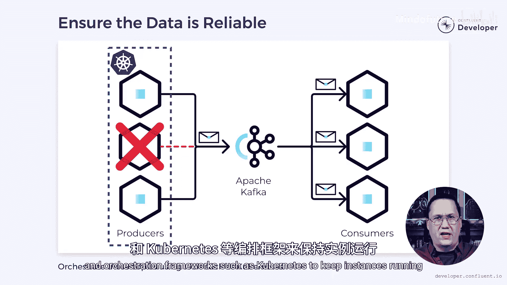
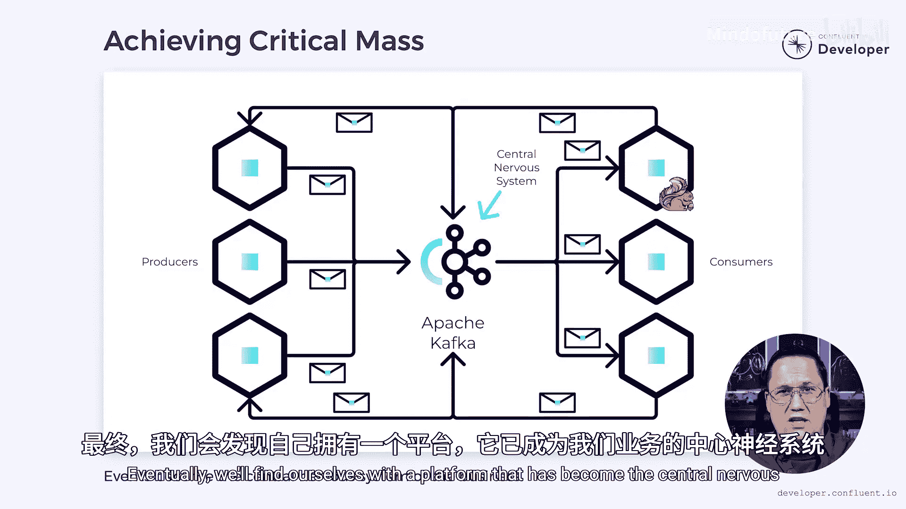

# 024：如何释放事件驱动架构的力量 🚀

在本教程中，我们将学习如何将一组孤立的微服务扩展为一个完整的事件驱动系统，并最终构建起业务的“中枢神经系统”。我们将探讨事件作为一等公民的重要性、设计可靠且可消费的事件产品、以及如何克服技术和组织层面的挑战。

---

## 从微服务到中枢神经系统 🧠

上一节我们介绍了构建事件驱动系统的目标。本节中我们来看看实现这一飞跃的起点。

事件驱动架构不会凭空形成，它需要精心设计和构建。我见过最大的挑战之一，就是从一小部分孤立的微服务扩展到完整的事件驱动系统。目标可能是为业务构建一个中枢神经系统，但许多项目在达成目标之前就停滞了。

那么，如何实现从小型微服务集合到中枢神经系统的跨越？我们首先要认识到，**事件是我们系统中的一等产品，而非副产品**。微服务的职责是生产数据，而它产生的事件与任何其他部分一样，都是该产品的重要组成部分。在某种程度上，我们可以通过订阅其事件的消费者数量来衡量微服务的成功。

---

## 打造成功的事件产品 📦

上一节我们确立了事件作为产品的核心地位。本节中我们来看看一个成功的事件产品需要克服哪些障碍。

对于一个产品要成功，它必须克服某些障碍。它必须满足消费者的需求。它应该是可靠的。并且它需要是可访问或易于使用的。还有一个我们必须克服的障碍，而且是一个大障碍，但我稍后会再谈。

任何好的产品都会努力满足其消费者对事件的需求。这意味着确保事件包含所需的数据。

以下是设计事件内容时的考量：

*   **数据丰富度**：限制事件中包含的数据量可以减少我们使用的带宽和存储。然而，这也会限制它们的适用范围。当我们为复用而设计时，**倾向于包含丰富细节的事实事件**，而不是更单薄的增量事件，可能会更好。事件中更多的细节意味着其他人有更多机会利用它们。如果某些数据未被使用，我们以后总可以优化。
*   **数据格式**：数据还需要以可消费的格式呈现。像 **Protobuf** 和 **Avro** 这样的二进制格式是高效、轻量级消息的绝佳选择。然而，它们不像 **JSON** 那样是人类可读的。当开发者需要调试生产问题时，能够以人类可读的格式访问数据可能很重要。当另一个团队决定是否消费事件时，能够访问人类可读的格式会有所帮助。

这并不意味着我们不应该使用 Protobuf 或 Avro，因为两者都是很好的选择。然而，我们可能需要工具将消息转换为人类可读的形式。如果你使用 Confluent Cloud，有内置功能可以查看 Protobuf 和 Avro 消息。否则，你可能需要考虑如何通过日志、工具或管理界面使这些数据可读。

---

## 建立可靠性与信任 🤝

上一节我们讨论了事件的内容和格式。本节中我们来看看如何建立和维护消费者对事件流的信任。

一旦我们确定了消息的内容和格式，将其视为合同就很重要。如果我们未经警告就更改格式，客户端将失去对数据的信任。一旦失去这种信任，就很难重新获得。

改变数据格式并不是唯一侵蚀信任的事情。服务中断会摧毁我们超越小型服务集合进行扩展的任何希望。

使用事件驱动架构部分解决了这个问题。因为事件是从像 **Apache Kafka** 这样的可靠平台异步消费的，所以系统可以容忍短暂的中断。消息可能会延迟，但总体上系统会继续运行。不幸的是，长时间的中断仍然构成风险。

为了缓解这种情况，每个服务应该有多个副本，以便在其他副本失败时接管。我们应该依赖监控和编排框架，例如 **Kubernetes**，来保持实例运行，甚至在需要时部署新的实例。

---

## 发布与发现事件流 📢

上一节我们确保了事件的可靠性。本节中我们来看看如何让世界知道并使用我们的事件。

如果消费者不知道事件的存在，就无法监听它们。这意味着我们需要宣传它们的存在。

像 **Confluent Schema Registry** 这样的工具允许我们注册事件模式和元数据。这让我们可以与其他团队共享事件流的详细信息，并使它们更容易被发现。如果我们在 Confluent Cloud 之外托管 Kafka，则必须考虑部署替代解决方案或构建文档来提供这些功能。目标是创建一个可发现的目录，以便任何人都能找到并消费我们提供的流。

---

## 构建正向循环与达到临界质量 🔄

上一节我们让事件变得可被发现。本节中我们来看看如何通过事件流构建系统动力。

最终，我们希望为事件吸引更多的消费者。这使我们能够在系统中建立动力。如果这些消费者中的每一个都发出事件，就会创造一个强大的循环。想象一系列微服务或 Apache Flink 作业，它们监听事件流，用额外的数据丰富它们，并发出新的事件来替代。这些新事件然后可以反馈到系统中，创造更多的丰富机会。最棒的部分是，每次我们发出一个事件，我们不仅为当前事件，也为之前任何事件增加了价值。

如果我们这样做足够久，就会达到一个临界质量。在这一点上，我们有如此多的数据通过事件流动，以至于实现新功能变得比以往更容易。这将其变成一个自我强化的过程，因为请记住，每个新功能都可能发出事件，从而进一步增加动力。最终，我们会发现自己拥有一个已成为业务中枢神经系统的平台。

---

## 克服最后的障碍：人的因素 👥

上一节我们探讨了技术上的成功路径。但正如之前提到的，还有一个大障碍需要克服。本节中我们来看看这个最具挑战性的部分。

最后一个障碍最具挑战性，因为它涉及人的因素。现实是，人们害怕改变。事件驱动架构对你我来说听起来很棒，但当我们试图扩展到团队其他成员时，它会被接受吗？其他人可能将其视为对他们职业生涯所构建内容的威胁。他们可能不想学习新的技能和技术来适应这种范式。

我们如何克服这最后一个障碍？我们通过与这些其他团队建立信任来做到这一点。我们需要向他们展示，我们正在努力构建我们能构建的最好系统，并且我们希望他们一起参与这段旅程。所以我们从慢开始。与其告诉人们这是新方法并期望他们适应，不如从一个单一事件开始，并提供帮助构建第一个集成。在此过程中，我们解释为什么这种新方法有价值，以及它将给他们带来什么好处。也许这意味着更少的深夜电话，或者它将帮助系统扩展到新的高度。无论如何，我们需要准备好倾听他们的担忧，并帮助找到克服的方法。记住，我们希望他们觉得这是一个团队努力，并且我们希望他们成功。此时的失败将是灾难性的，所以我们尽一切努力确保这种情况不会发生。

一旦我们让一个团队加入，我们就可以利用第一个例子作为灵感来扩展其他团队。当我们踏上这条道路时，没有保证。就像任何软件项目一样，失败总是潜伏在角落。然而，如果我们细心、彻底并对他人的需求有同理心，我们可以缓解过渡并为成功做好准备。

---

## 总结与行动 🎯

在本教程中，我们一起学习了如何将事件驱动架构从概念转化为现实。我们从确立事件作为一等产品开始，探讨了设计**内容丰富、格式可读**的事件，并强调了通过**可靠平台（如Kafka）** 和**服务冗余**来建立信任的重要性。接着，我们了解了使用**模式注册表**等工具发布和发现事件流的关键性，以及如何通过构建消费者和事件的**正向循环**来达到系统动力的临界质量。最后，我们直面了最大的挑战——**人的因素**，强调了通过建立信任、从小处着手并展示价值来引导团队适应变革的重要性。

还记得我之前说过，我们事件的成功可以通过订阅它们的客户端数量来衡量吗？现在轮到你了。就像你希望你的事件能触达尽可能多的人一样，我也希望这个视频能做到同样的事。如果你已经看到这里，并觉得我为你提供了真正的价值，请给我点赞，在社交媒体上分享视频，当然，点击订阅按钮。请在评论区留言，让我知道你对视频的看法或如果你有任何问题。我会尽力回复每一条收到的评论。

感谢你加入我的这段旅程，我们下次再见。