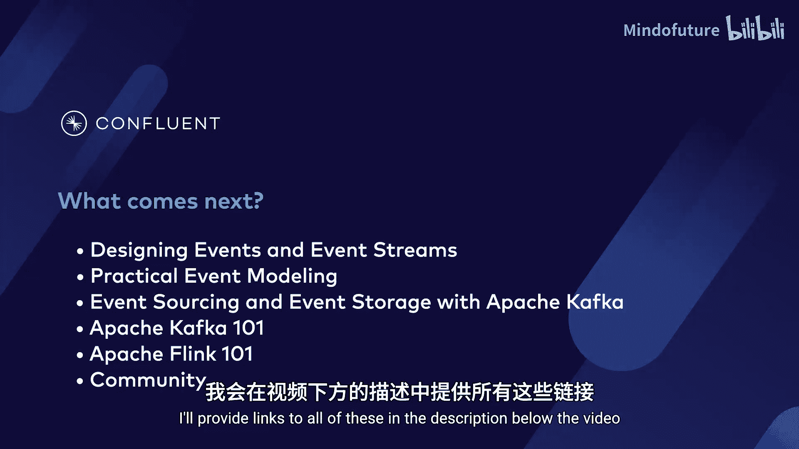
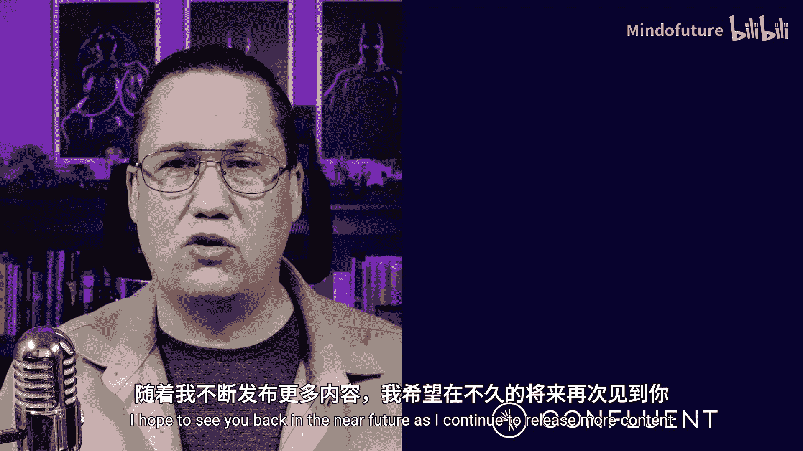

# 025：课程总结与后续步骤 🎯

在本节课中，我们将回顾“设计事件驱动微服务”课程的核心内容，并为你提供一些潜在的学习路径建议。

---

## 课程内容回顾

上一节我们介绍了课程的主体内容，本节中我们来总结一下所学到的关键知识。

在整个课程中，你学习了以下内容：

*   **微服务的特性**：了解了微服务的功能，以及它与单体架构的区别。
*   **分解单体架构的方法**：学习了使用**绞杀者无花果模式**或**抽象分支模式**等模式来分解单体应用。
*   **微服务的优势**：理解了微服务如何为系统提供**隔离性**、**弹性**和**可扩展性**。
*   **双写问题**：探讨了分布式系统中为何会出现双写问题，以及一些可用于避免该问题的解决方案。
*   **事件模式演进**：掌握了如何在不导致停机的情况下演进事件模式。
*   **构建业务中枢神经系统**：了解了将微服务扩展为业务中枢神经系统所需的工作。

---

## 后续学习路径

然而，学习之旅并未就此结束。如果你发现自己处于不再学习新知识的状态，那可能是时候继续前进了。我们显然还没到那一步，这意味着我们还有更多需要学习。

以下是Confluent开发者平台上可供你继续探索的课程：

*   **深入学习事件驱动微服务**：可以查看《设计事件与事件流》课程，或学习《实用事件建模》课程。
*   **深入学习事件溯源**：《使用Apache Kafka进行事件溯源与事件存储》课程是一个很好的下一步选择。
*   **动手实践**：如果你还没准备好深入这些概念，想先通过代码实践入门，那么可以看看 **`Kafka 101`** 或 **`Flink 101`** 课程。这两门课程都能让你以易于理解的方式学习数据流的基础知识。

你还可以考虑加入我们的社区，参与未来围绕这些主题的讨论。视频描述区提供了所有这些资源的链接。

---

## 总结与致谢

本节课中我们一起回顾了事件驱动微服务设计的核心要点，并规划了未来的学习方向。

无论你决定从这里选择哪条路径，我都希望你喜欢这段学习旅程。如果你喜欢，请考虑与周围的人分享。这有助于我扩大受众，从而为你带来更多内容。你也可以在YouTube上点赞、分享和订阅我们的内容，以帮助频道成长。

如果你不喜欢这门课程，我其实不太确定你为什么坚持到了最后，但我仍然很乐意听到你的反馈。请在评论区留下任何你想提供的建议，这将帮助我在下次制作课程时改进。

再次感谢你坚持到最后。我希望在不久的将来，随着我发布更多内容，能再次见到你。

**不要忘记持续学习。**