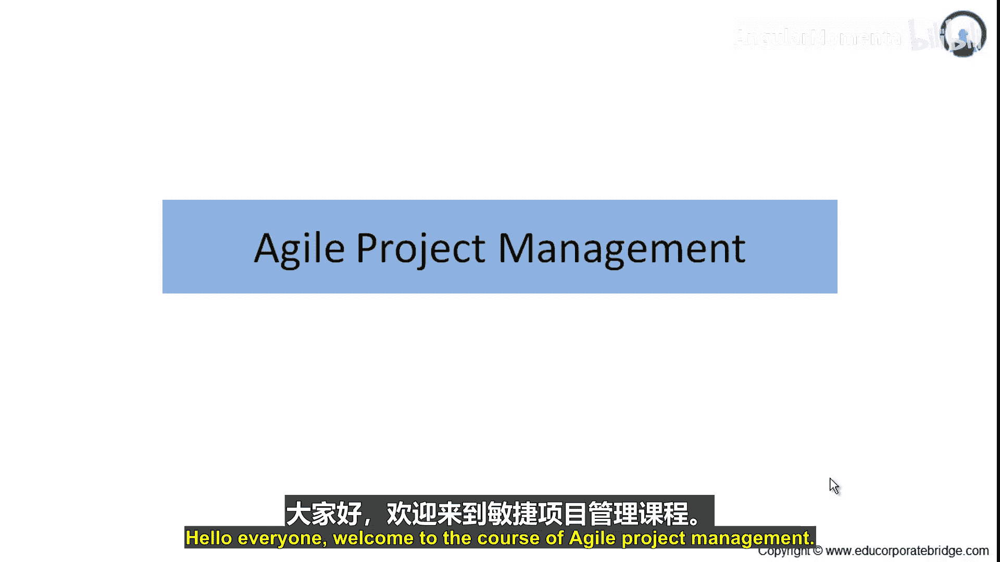
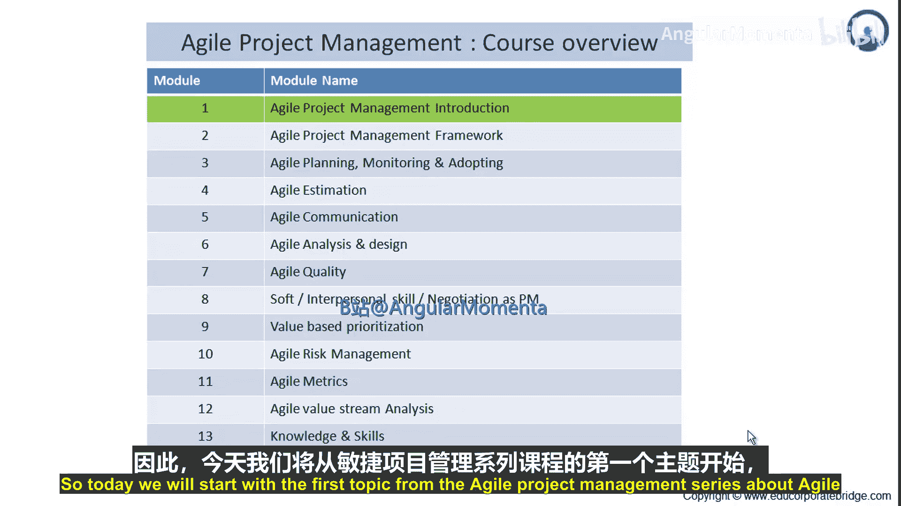
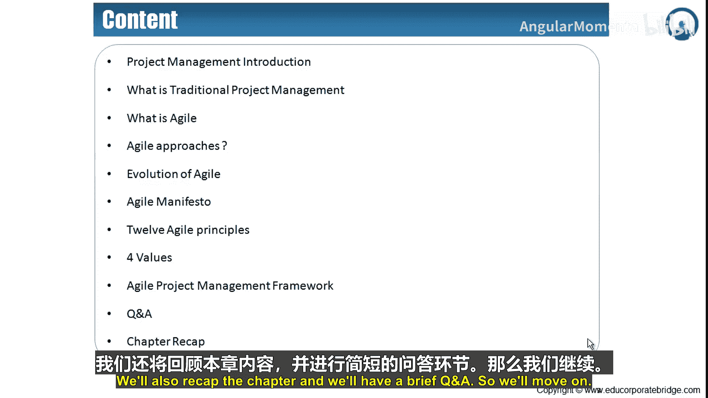
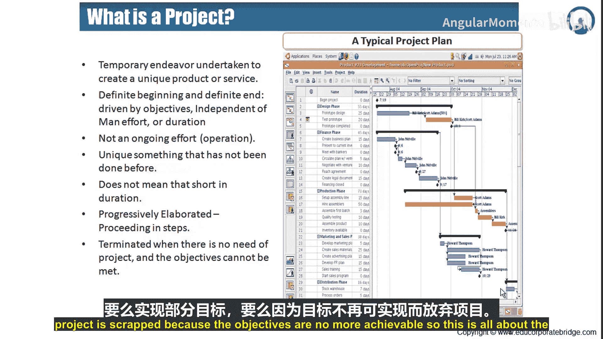
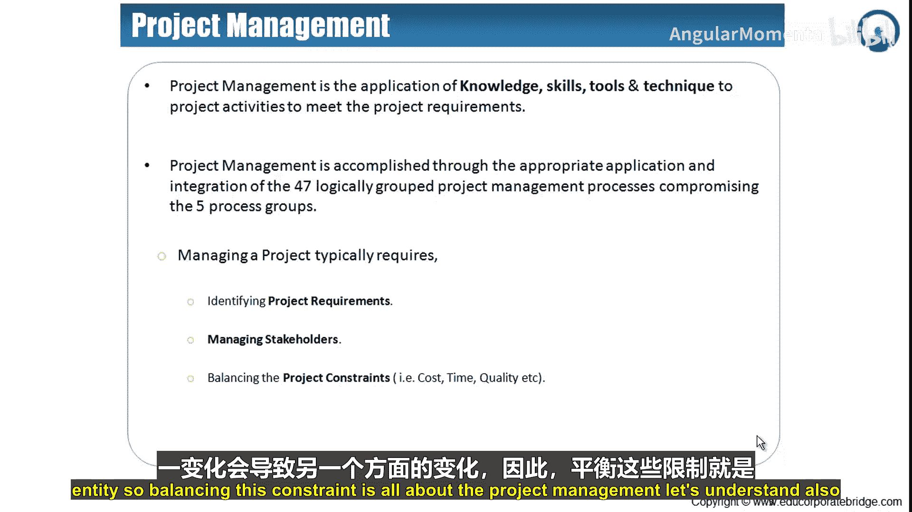
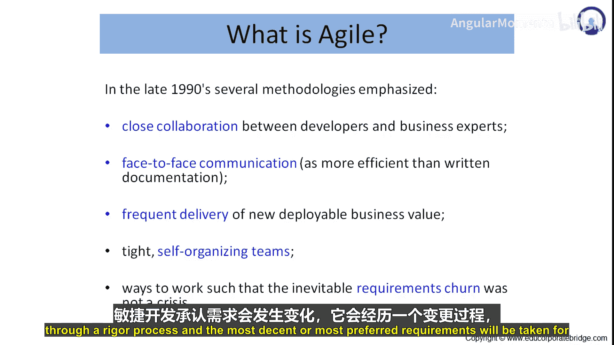

# 001：简介 🚀

在本节课中，我们将学习敏捷项目管理的基础知识。我们将从理解什么是项目和项目管理开始，然后探讨传统项目管理的局限性，并介绍敏捷方法的核心概念、价值观和原则。最后，我们将对本章内容进行总结。

---

## 什么是项目？

项目是为创造独特的产品或服务而进行的临时性努力。

需要理解的是，项目的交付成果是独特的，这与重复性的运营工作不同。项目有明确的开始和明确的结束。项目由目标驱动，启动时总是着眼于特定的最终成果。它独立于人力投入和持续时间，不是持续性的活动（例如提供24/7的移动支持服务或电力供应，这些属于运营工作）。

“独特”意味着过去未曾做过的事情。“明确的结束”并不意味着持续时间短。项目是渐进明细的，从顶层到底层逐步细化。当项目不再需要或目标无法达成时，项目就会终止。项目启动后，可能达成全部目标、部分目标，也可能因为目标无法实现而废弃。

---

## 什么是项目管理？

项目管理是将知识、技能、工具和技术应用于项目活动，以满足项目要求的过程。

项目是团队成员跨越业务社区、IT社区及其他利益相关者的共同努力。要管理如此多的人员，需要特定的知识、技能、工具和技术来实现目标。项目管理是通过适当应用和整合47个逻辑上分组的项目管理过程（包含过程组）来完成的。

管理项目通常需要：
*   **识别项目需求**：需求应被充分理解、详细阐述，并获得所有相关方同意，以便项目交付特定目标。
*   **管理利益相关者**：项目涉及发起人、执行委员会、项目经理、业务部门、领域专家、测试团队等众多利益相关者。管理他们的利益、保持他们的高参与度和士气，是获取项目价值的关键。
*   **平衡项目约束**：项目在时间、成本和质量方面存在约束。单一约束的变化会导致其他约束的变化，平衡这些约束是项目管理的核心。

---

## 项目集与项目组合

在项目管理领域，还有两个常用术语：项目集和项目组合。

*   **项目集**：作为一组进行管理的项目群。它能降低风险、实现规模经济并改进管理。
*   **项目组合**：项目或项目集的集合。将它们组合在一起是为了促进有效管理，以实现战略业务目标。

将类似的项目分组为项目集或项目组合，可以带来规模经济、效率提升以及协同与协作。例如，开发iPhone系列的项目可以归入“iPhone开发项目组合”；而为手机或平板开发屏幕的项目，可以归入“移动屏幕项目集”。

---

## 什么是敏捷？

传统的项目管理方法存在一些局限性。在90年代末期，出现了几种强调克服传统方法短板的方法论，它们促进了开发人员和业务专家之间的紧密协作。

以下是敏捷方法的核心特点：

*   **开发与业务的紧密协作**：传统项目管理中，业务方将需求文档交给开发人员，开发人员阅读文档，如有疑问再回头咨询业务方，然后进行开发、测试。在项目90%的时间消耗后，他们向业务方展示成果。通常，业务方会说：“这不是我们想要的。”为了避免这种情况，敏捷建议开发人员和业务专家紧密协作，从而在需求和项目开发之间实现敏捷性和紧密协调。
*   **面对面沟通**：编写文档并提交给开发团队会耗费大量时间。而面对面沟通可以捕捉言语和非言语线索，解答疑问，寻求澄清，从而使开发团队对业务需求有深刻理解，开发成果更贴近业务所需。
*   **频繁交付可部署的业务价值**：传统项目管理需要大量时间才能将成果交付给业务方。而敏捷强调频繁交付可部署的业务价值，业务方可以尽早使用和测试，从而避免返工、废弃等非增值活动。
*   **紧密、自组织的团队**：敏捷项目管理方法的设计旨在形成有凝聚力的团队。团队在协调良好的环境中工作，项目团队内部没有隔阂，其框架有助于实现团队的自组织。
*   **适应需求变更**：敏捷承认需求会发生变更，会经历反复讨论和筛选过程，最终将最合适或最受青睐的需求纳入开发。这使得不可避免的需求变更不会成为危机。

---

## 本章总结

本节课我们一起学习了敏捷项目管理的基础。我们首先定义了**项目**（为创造独特产品或服务的临时性努力）和**项目管理**（应用知识、技能以满足项目要求的过程）。接着，我们区分了**项目集**和**项目组合**的概念。然后，我们探讨了**传统项目管理**的局限性，并引出了**敏捷方法**。我们了解到，敏捷通过**紧密协作**、**面对面沟通**、**频繁交付**、**自组织团队**和**拥抱变更**等方式，旨在更高效、更灵活地交付价值。在接下来的章节中，我们将深入探讨敏捷宣言、原则和具体框架。