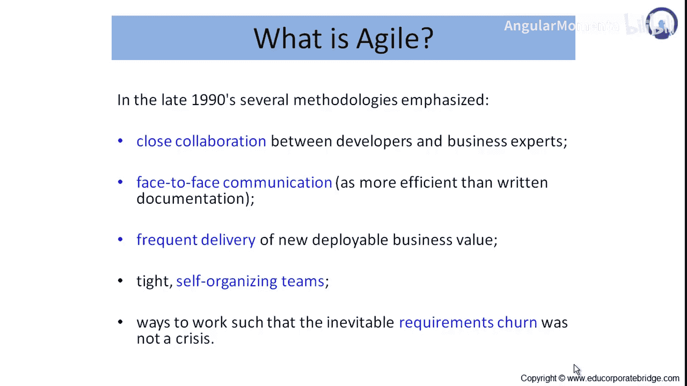
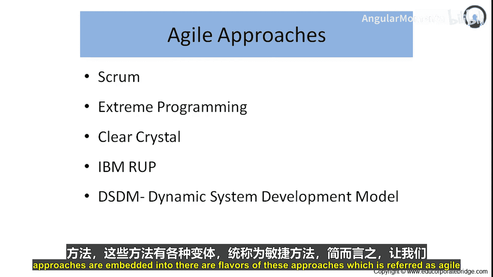
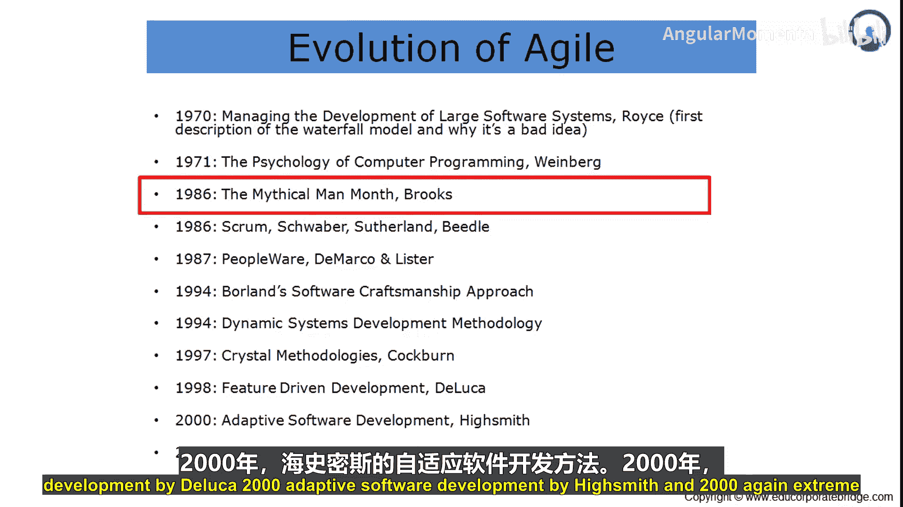
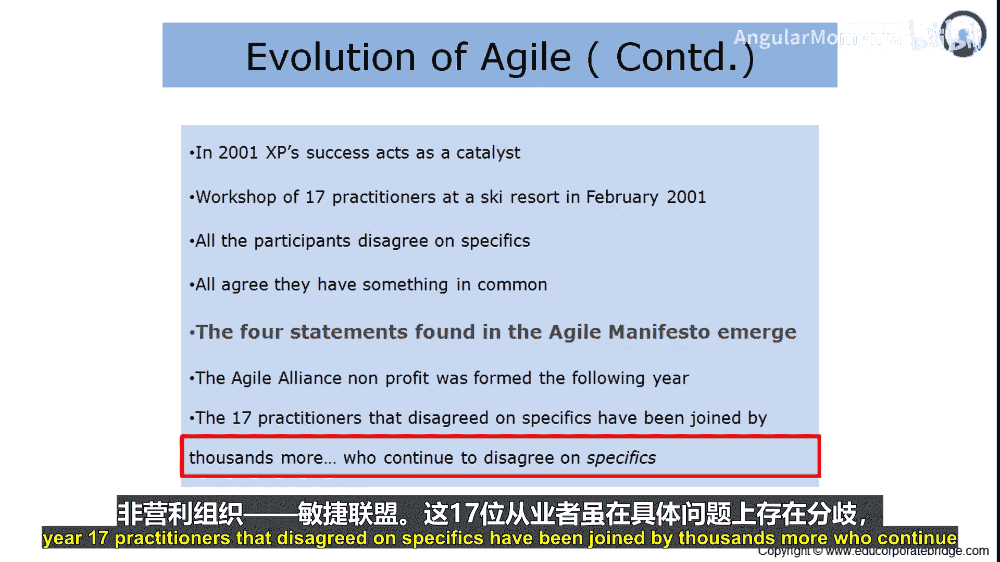
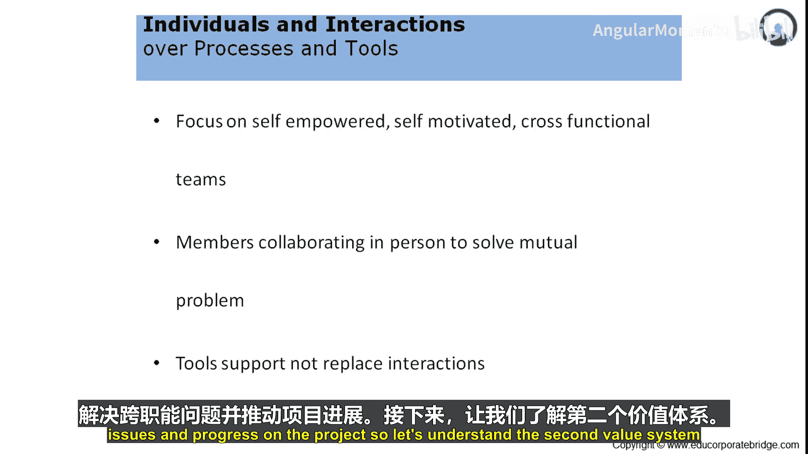

# 002：敏捷方法

在本节课程中，我们将学习敏捷方法的核心概念、历史演变及其价值体系。我们将了解敏捷包含哪些具体方法，以及这些方法背后的基本原则。

## 什么是敏捷方法？🤔

现在，我们来理解什么是敏捷方法。

敏捷方法包含五种主要方法，它们共同构成了敏捷体系。这五种方法是：Scrum、极限编程、Crystal、IBM RUP（Rational Unified Process）以及动态系统开发模型。

在后续章节中，我们将深入探讨这些方法。目前只需记住，当我们谈论敏捷时，这五种方法都包含在内。这些方法的不同变体都被统称为敏捷方法。

## 敏捷方法的演进历程 📜

上一节我们介绍了敏捷方法的构成，本节中我们来看看敏捷方法是如何发展演变的。

简而言之，我们来理解敏捷的演进过程。

*   1970年：在管理大型系统开发时，Royce首次描述了瀑布模型，并指出了它是一个糟糕的想法。
*   1970年代初：人们开始认识到瀑布模型存在缺陷，需要一些新的方法来帮助项目团队更好地进行开发并满足客户期望。
*   1971年：Weinberg发表了《计算机编程心理学》，探讨了如何以更好、更有效的方式进行计算机编程。
*   1986年：Brooks在《人月神话》中提出了一个学说，倡导如何通过调整某些项目管理方法来更好地利用团队的努力或可用性。
*   1986年：Sutherland和Schwaber提出了最初的Scrum方法。
*   1987年：DeMarco和Lister提出了敏捷方法。
*   1994年：Bland Software的Kamship App提出了如何加速或以更好方式进行软件开发。
*   1994年：动态系统开发方法问世。
*   1997年：Cockburn提出了Crystal方法论。
*   1998年：DeLuca提出了特性驱动开发。
*   2000年：Highsmith提出了自适应软件开发。
*   2000年：Beck提出了极限编程。

## 敏捷宣言的诞生 🎯

了解了敏捷的演进后，我们来到其发展历程中的一个关键节点。

2001年，极限编程的成功开始起到催化作用。

2001年2月，17位实践者组织了一次研讨会。所有参与者虽然在具体细节上存在分歧，但都认同他们有一些共同点。

因此，完整的敏捷宣言声明在2001年诞生。次年，成立了非营利性的敏捷联盟。

最初那17位在具体细节上意见不一的实践者，后来加入了成千上万同样在细节上持不同意见的同行。

## 敏捷的四大价值支柱 💎

这些实践者共同提出了一份宣言，称为价值体系。这份宣言经过讨论并发布，旨在释放项目管理领域的价值。

以下是敏捷框架下的声明：

> 我们正在通过实践和帮助他人实践，揭示更好的软件开发方法。通过这项工作，我们开始重视：
> 
> **个体和互动** 高于 流程和工具
> **可工作的软件** 高于 详尽的文档
> **客户合作** 高于 合同谈判
> **响应变化** 高于 遵循计划
> 
> 也就是说，尽管右项（流程和工具、详尽文档、合同谈判、遵循计划）具有价值，但我们更重视左项（个体和互动、可工作的软件、客户合作、响应变化）。

整个项目管理的范式因此发生了转变。过去强调拥有完善的流程和工具、编写详尽的需求文档、进行供应商与客户之间的合同编写与谈判、制定前期计划来启动项目。而现在，重点更多地转向了个体与互动、产出可部署到业务中的可工作软件（让客户尽早体验并反馈所需变更）、与客户协作以带来满意度和价值（确定最相关的功能），以及预先假设项目启动时感知的需求将会发生变化，并在此变化出现时积极主动地响应。

这些就是敏捷宣言提出的四大支柱或价值体系。现在让我们深入理解敏捷宣言中发布的每一个价值体系。

### 1. 个体和互动高于流程和工具

敏捷专注于**自我赋能**、**自我激励**的**跨职能团队**。

*   **自我赋能**：意味着团队成员了解自己的角色，知道对他们的期望，并且他们的思维方式都倾向于创造价值。他们被赋能去为项目创造价值。
*   **自我激励**：核心理念是，与其管理员工，不如向他们展示更大的蓝图，从而激励他们主动创造价值。因此，重点更多地放在激励团队成员而非管理他们。
*   **跨职能团队**：意味着业务专家、领域专家、技术开发人员、测试人员共同协作，以产出最佳的项目可交付软件功能。敏捷方法中嵌入了这种跨职能的同步、协调和团队合作。

**成员亲自协作以解决共同问题**。在传统的项目管理方法中，如果团队成员遇到问题，他会将问题记录到问题管理系统中，或向职能主管或项目经理寻求澄清，问题可能就此停滞。而在敏捷方法论中，成员们通过协作来解决共同问题。由于强调个体和互动，他们以预定的频率（通常每天至少一次）会面，这些互动有助于人们解决共同问题。随着问题以更快的速度得到解决，项目进展也会更加顺利。

**工具支持不能取代互动**。正如声明所说，重点更多地放在互动上。因此，工具仅在需要时使用，但首要选择是人与人之间的互动。互动是首要的，只有当互动无法产生预期结果时，才需要使用工具。

简而言之，个体和互动是有用的，它们在激励团队精神、解决跨职能问题和推动项目进展方面，比流程和工具更具优势。

### 2. 可工作的软件高于详尽的文档

接下来，我们看看第二个价值体系。

---

**本节课总结**

本节课中，我们一起学习了敏捷方法的基本构成，回顾了其从1970年代至今的演进历史，并深入探讨了2001年《敏捷宣言》所确立的四大核心价值支柱：**个体和互动高于流程和工具**、**可工作的软件高于详尽的文档**、**客户合作高于合同谈判**以及**响应变化高于遵循计划**。这些原则共同构成了敏捷思维的基石，指导着现代软件开发和项目管理的实践。