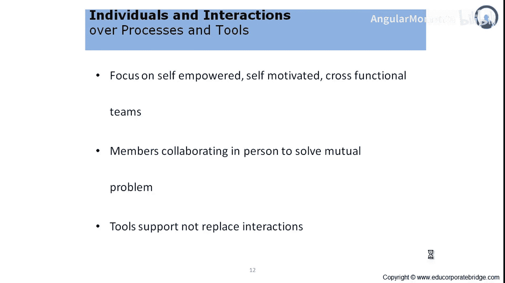
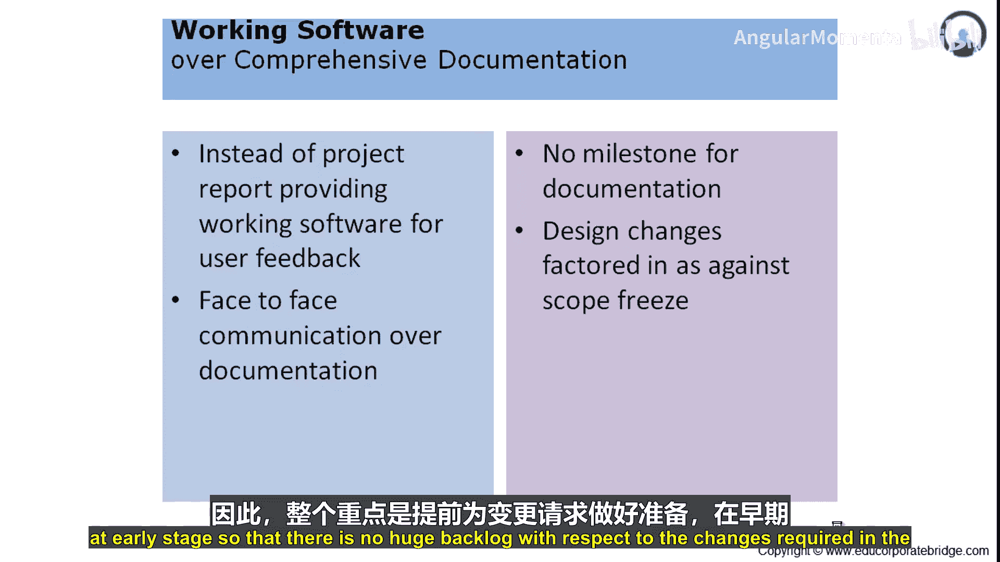

# 003：客户协作 🤝

在本节课中，我们将学习敏捷宣言中的核心价值之一：“客户协作胜过合同谈判”。我们将探讨这一原则如何改变传统的客户-供应商关系，以及它如何通过促进开放协作来提升项目价值。

---

## 传统模式：合同谈判 📜

在传统项目管理模式中，项目通常遵循以下流程：

*   客户有特定工作需求。
*   客户通过招标流程选择若干供应商。
*   双方起草并签署合同。
*   客户根据合同条款期待交付成果。
*   供应商根据合同约定期待获得服务报酬。

由于合同具有法律约束力，双方的所有互动、行动和冲突都以合同为基准进行协商。

---

## 敏捷模式：客户协作 🔄

上一节我们介绍了以合同为中心的局限，本节中我们来看看敏捷思维如何转变这一模式。敏捷提倡在客户与供应商或服务提供商之间建立协作关系。

其目标是创造一个开放、健康的合作氛围，以最优化的方式交付价值，并尽量避免法律诉讼或范围外的争论。这是敏捷在其宣言中推广的广泛框架或价值体系。

在传统系统中，客户通常只在交付阶段介入，验收时才发现产品不符合预期。为了避免给客户带来这种“惊喜”，敏捷要求客户从项目启动之初就以预定的频率参与进来。

以下是客户深度参与带来的关键转变：

*   **客户成为开发过程的一部分**：客户了解开发进展，有机会测试和部署开发成果，并在需要时提供反馈。
*   **避免“写文档、等软件”的低效模式**：客户通过日常参与，能够掌控和理解项目开发活动。
*   **客户成为过程的所有者**：客户不再仅仅是最终的验证者，而是作为过程所有者提供有效输入、使用开发成果并给出反馈，使过程更简化。
*   **打破供应商与客户的隔阂**：敏捷框架确保项目交付物符合价值体系，各方都能从项目中获益，因此在出现问题时不会相互推诿。

---

## 核心实践：响应变化而非遵循计划 🔄

传统项目管理方法论通常始于定义所有需求，签署后再开始开发。一旦需求变更，由于存在“变更冻结”，开发团队会对变更产生抵触。

敏捷项目管理方法论避免了这种场景。它提倡**拥抱变化**，而非抗拒变化。

敏捷预先承认变化必然会发生，并将这些变化纳入项目工作范围。为了响应变化，敏捷通过每日站会等方式讨论、辩论、接受、开发、测试并吸收变更。

整个重点在于预先为变更请求做好准备，并在早期阶段容纳这些变化，从而避免软件所需变更产生巨大的积压。

---

## 总结 📝

本节课中我们一起学习了“客户协作胜过合同谈判”这一敏捷核心价值观。我们对比了以合同谈判为基础的传统模式与以开放协作为基础的敏捷模式。关键在于让客户从项目开始就持续参与，成为开发过程的所有者，并建立一种能够积极拥抱和响应变化的协作文化，从而更高效地交付业务价值。