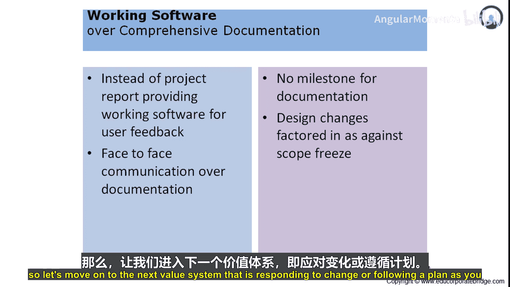
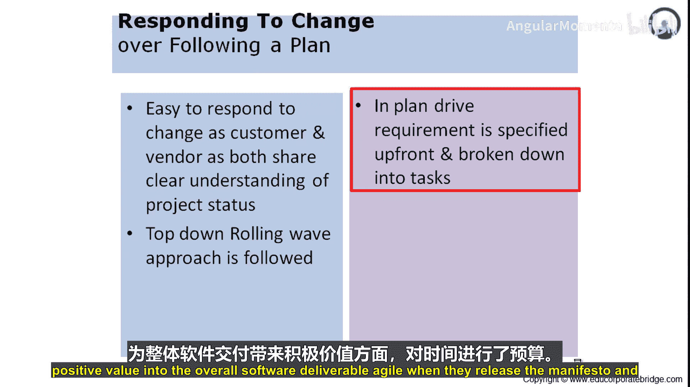
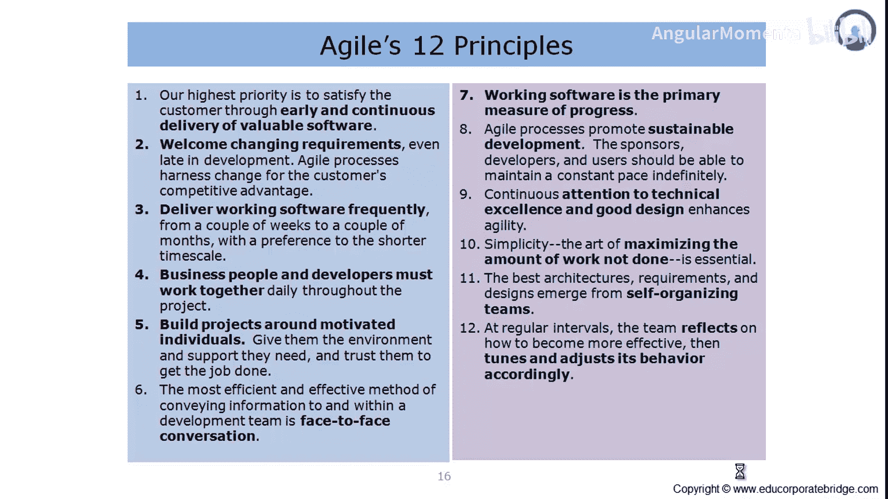

# 004：应对变化 vs. 遵循计划

在本节课中，我们将学习敏捷宣言中的第四个价值体系：“**响应变化** 高于 遵循计划”。我们将探讨这一原则的含义、它与传统项目管理方法的区别，以及它如何通过12条原则来具体实现。

## 从遵循计划到响应变化

上一节我们讨论了客户协作的重要性，本节中我们来看看敏捷如何对待项目中的变化。

在传统的项目管理方法中，计划通常在项目的早期阶段就制定完成。所有团队成员都致力于完成计划内的任务。如果需要执行计划外的、额外的工作，开发团队通常会对此产生抵触。

而敏捷宣言及其价值体系则提倡**响应变化**，而不是**遵循计划**。敏捷推荐，当客户和供应商都对项目状态有清晰的理解时，响应变化会更容易。

假设你正在开发一款iPhone手机。最初的规格要求屏幕响应时间在2毫秒以内。然而，一旦开发启动，某个竞争对手发布了一款响应时间为1毫秒的手机。如果你仍然坚持最初2毫秒的规格，那么无论你的产品做得多好，都可能没有顾客愿意购买。因此，规格需要向上修订，要求低于1毫秒。

在这种场景下，如果供应商和客户都固守最初的规格，产品将失去市场竞争力。为了更切合实际，敏捷宣言提倡客户和供应商共享对项目状态的清晰理解。他们知道哪些变化会给软件带来积极影响，并且他们的行动会尽早地适应这些变化。

## 渐进明细与滚动式规划

敏捷方法采用**自上而下**的**滚动式规划**。他们从高级别的规格开始，随着迭代的进行，在每次迭代中引入更详细的说明或更清晰的需求。这种滚动式方法有助于软件开发。

在传统方法中，你在开始时定义需求，然后开始开发。而在敏捷中，你定义高级别的范围，并通过滚动式波浪来逐步细化需求。

总结来说，敏捷为**处理变化**、**采纳变化**分配了时间预算，并确保变化能为整个软件交付物带来积极价值。

---

## 支撑价值体系的12条原则

敏捷在发布宣言和四个价值体系的同时，也发布了12条原则。这些原则是对价值体系的补充，并进一步详细说明了敏捷项目管理方法如何帮助客户获得更大价值。以下是支持敏捷宣言中四个价值体系的12条原则。

### 原则一：尽早持续交付有价值软件

我们的最高优先级是通过尽早和持续地交付有价值的软件来满足客户。

第一原则指出，我们希望尽早将软件交付给客户。“尽早”意味着在尽可能短的时间内，而不是让客户等待很久才能看到软件的雏形。我们将持续交付已完成的软件，以便客户可以使用、提供反馈。任何可以容纳的变更都能被纳入，整个重点在于为业务产生价值。

第一原则表明，我们将尽可能早地交付软件，进行持续交付，容纳变更，促进软件演进，并将价值持续传递给业务。

例如，在开发iPhone时，随着组件和组装的完成，业务方可以逐步体验到网络连接、屏幕响应、Wi-Fi连接、音频质量水平和下载速度等特性。

### 原则二：欢迎需求变化

即使在开发后期，也欢迎需求变更。敏捷过程利用变更为客户创造竞争优势。

与传统项目管理方法抵制变化不同，敏捷欢迎变化。它理解变化对于保持客户业务和为客户提供竞争优势至关重要。

因此，敏捷方法论以欢迎变化的方式进行工作。变化被提出来讨论、被充分理解、被深入辩论。团队会讨论容纳这些变化的各种方案，选择可行的方案，实施变化，并将其传递给客户。这就是客户偏爱敏捷方法论的原因，因为它欢迎变化，而变化在商业运营中是必要的。

### 原则三：频繁交付可工作软件

频繁地交付可工作的软件，交付周期从几周到几个月不等，且倾向于较短的周期。

与给出需求后等待很长时间才能获得测试软件不同，客户会获得有限的软件交付，以便他们可以开始使用、提供反馈、引入变化、进一步提升价值。整个重点是以尽可能短的频率交付软件或阶段成果。

### 原则四：业务人员与开发者密切合作

在整个项目过程中，业务人员和开发人员必须每天一起工作。

敏捷有每日站会这种简短的楼层会议。团队进行互动，讨论计划完成的工作、已交付的内容、遇到的挑战、所需的协调以及任何变化。项目团队内部的这种紧密互动有助于在团队成员之间建立清晰度，有助于聚焦对业务最重要的事情，并确保项目内的快速周转。

在传统项目中，通常允许3到5个工作日来评审文档。如果你花5个工作日来评审和确认需求文档，那么实际开发后的测试可能需要超过两周，然后缺陷被反馈回来进行修复。大量的时间浪费在团队成员之间的来回互动上。敏捷原则试图克服传统项目管理方法的这一缺点，其设计的项目互动方式使得开发人员和业务人员从开始到实现预期价值都紧密合作。

---

本节课中，我们一起学习了敏捷的第四个核心价值“响应变化高于遵循计划”，并了解了支撑这一价值的前四条敏捷原则。我们看到了敏捷通过欢迎变化、频繁交付和紧密协作，如何更灵活、更有效地应对不确定性和市场需求，从而持续为客户交付价值。