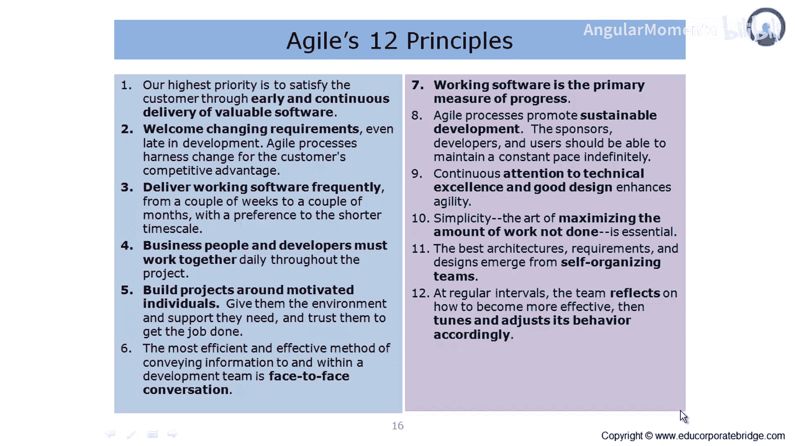
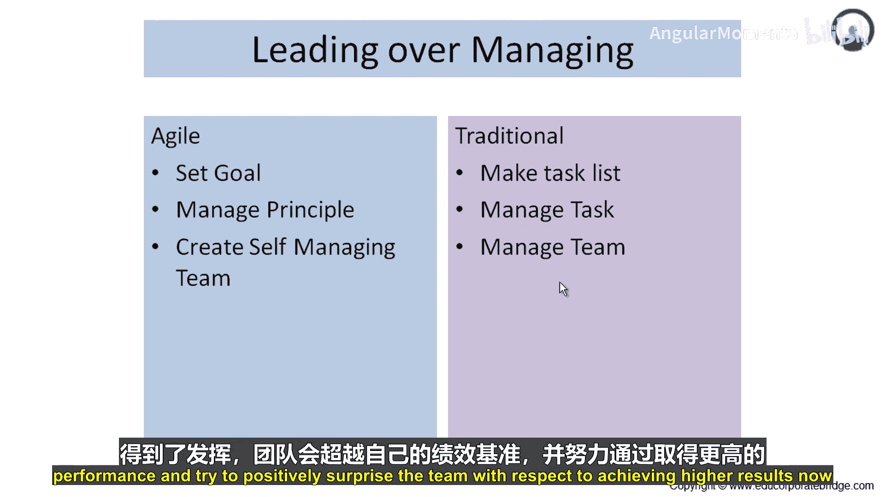
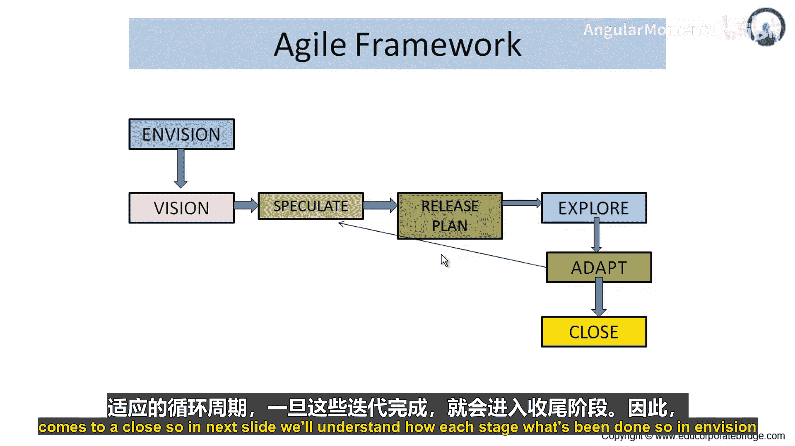
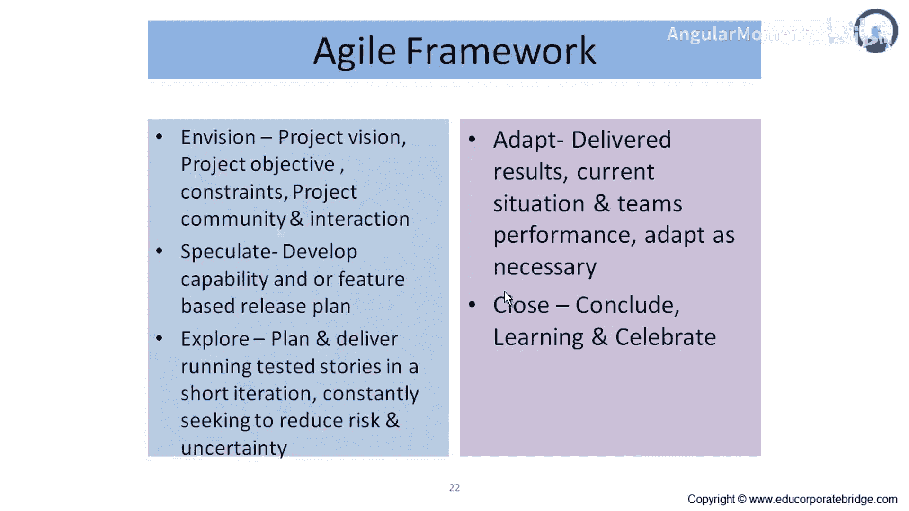

# 006：敏捷价值观框架 🎯

在本节课中，我们将学习敏捷方法论的核心价值观，并将其与传统项目管理方法进行对比。我们将深入探讨敏捷如何通过关注价值来克服传统“三重约束”的局限，并介绍敏捷框架的基本阶段。

## 理解敏捷价值观

上一节我们介绍了敏捷的核心理念，本节中我们来看看其具体的价值观体系。

在传统项目中，存在关于范围、质量和成本的“三重约束”。当你改变范围时，范围的变化会对质量或成本产生显著影响。当你想要提升质量时，范围和成本也需要向上调整。因此，这种**三重约束**在传统项目管理方法论中占主导地位。

而在敏捷方法中，所有这些三重约束都通过坚持**价值**而被克服，这里的价值包括外在质量和内在质量。当团队围绕成本、进度和范围工作时，他们引入了敏捷性。良好的沟通、可工作的软件产出以及协作，使得成本、范围和进度上的约束在敏捷方法论中被克服。

## 适应与确认

接下来我们探讨“适应”与“确认”这一组价值观。

在敏捷中，存在一个更倾向于业务和用户社区需求的**灵活发布计划**。规划的重点在于按特性进行：哪些特性优先级高，哪些特性是业务最迫切需要的。范围是灵活的，因此，关于范围和团队速率的变化都可以被交付。并且，在每一次迭代中都有学习发生。

相比之下，传统项目管理中的“确认”方法采用基线发布计划。一旦计划被基线化，交付物需要相当长的时间才能到达业务方手中，这导致了业务与项目团队之间的脱节。

以下是两种方法的关键区别列表：
*   **规划方式**：传统项目管理按任务规划，而敏捷方法论规划交付价值。
*   **范围处理**：传统项目管理基线化范围，而敏捷中范围是灵活的，范围根据团队的敏捷性以及客户和供应商的参与度来调整。
*   **学习时机**：传统项目管理中，所有开发完成后进行测试，缺陷才被项目团队知晓并修复，学习发生在最后。而在敏捷中，学习发生在每一次迭代中，因为每次迭代都会向业务方交付可工作的软件，业务方提供反馈，项目团队从而获得学习。

因此，敏捷是适应性的，而传统项目管理方法论是确认性的。

## 领导与管理

理解了适应与确认的区别后，我们来看看“领导”与“管理”这一价值观。

在敏捷中，团队为自己设定目标。而在传统方法中，为团队成员提供任务清单。任务不一定产生价值，而目标肯定能为项目带来价值。因此，在设定目标方面，敏捷相比为团队成员定义任务具有更好的方法。

以下是两种模式下团队管理的核心差异：
*   **管理基础**：传统方法中，团队成员通过任务被管理；而在敏捷中，团队成员通过他们带来的价值所依据的原则被管理。
*   **团队性质**：敏捷强调创建**自管理团队**，因此管理上的汇报和开销更少。由于团队自我激励，他们能产生更好的结果。
*   **潜力发挥**：在传统项目管理中，人们等待被告知需要做什么，并且只做被告知的事情，团队的完整潜力未被充分利用。而在敏捷中，团队的完整潜力得到发挥，团队不断超越自己的绩效基准，努力以更高的成果给团队带来惊喜。

## 敏捷框架概述

在对比了价值观之后，现在让我们来理解敏捷的实施框架。敏捷框架的第一步是“构想”，随后是“愿景”、“推测”、“准备发布计划”、“探索”和“适应”。然后，“适应”会进入下一个“推测”、“发布计划”、“探索”和“适应”的循环。一旦这些迭代完成，项目进入“收尾”阶段。

接下来，我们通过图示来了解每个阶段的具体工作。

## 敏捷框架详解

上一节我们概述了敏捷框架，本节中我们详细看看每个阶段。

### 构想阶段
在构想阶段，设计并规划项目的愿景、目标、约束、项目社区及其互动。这包括定义项目的全部内容、项目预期实现的目标、可能面临的约束或挑战、项目社区成员（关键干系人、业务方、开发者）以及他们的互动方式。

### 推测阶段
“推测”一词多用于交易术语，但敏捷所采用的整体方法是保持范围灵活性，并尝试在给定预算内交付最大价值，这就是推测的含义。敏捷团队不是预先承诺交付物，而是进行推测。在推测阶段，制定发布计划，该计划仅说明可以交付哪些特性以及大致的时间线。

### 探索阶段
进入探索阶段后，团队在较短的迭代中计划并交付经过测试、可运行的用户故事，不断寻求降低风险和不确定性。在探索阶段，他们承接用户故事或需求进行开发，将开发成果交付给业务社区并寻求反馈。

### 适应与循环
根据探索阶段获得的反馈，团队进入“适应”阶段，调整计划、范围或方法。随后，这又会引导至新的“推测”、“发布计划”和“探索”循环，形成一个持续的改进周期。

---

本节课中，我们一起学习了敏捷方法论的核心价值观，包括其如何以价值为中心克服传统约束，以及“适应”优于“确认”、“领导”优于“管理”的理念。我们还介绍了敏捷框架的基本阶段：构想、推测、探索和适应，理解了这是一个通过短迭代和持续反馈循环来交付价值并不断学习的动态过程。