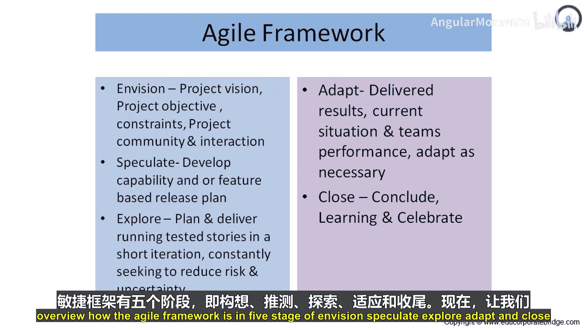
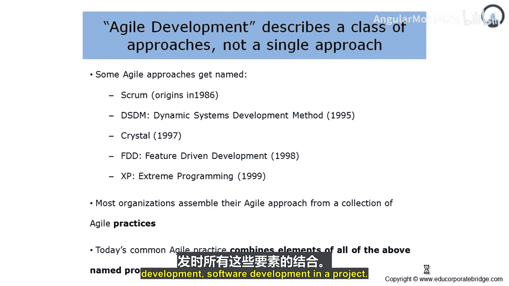
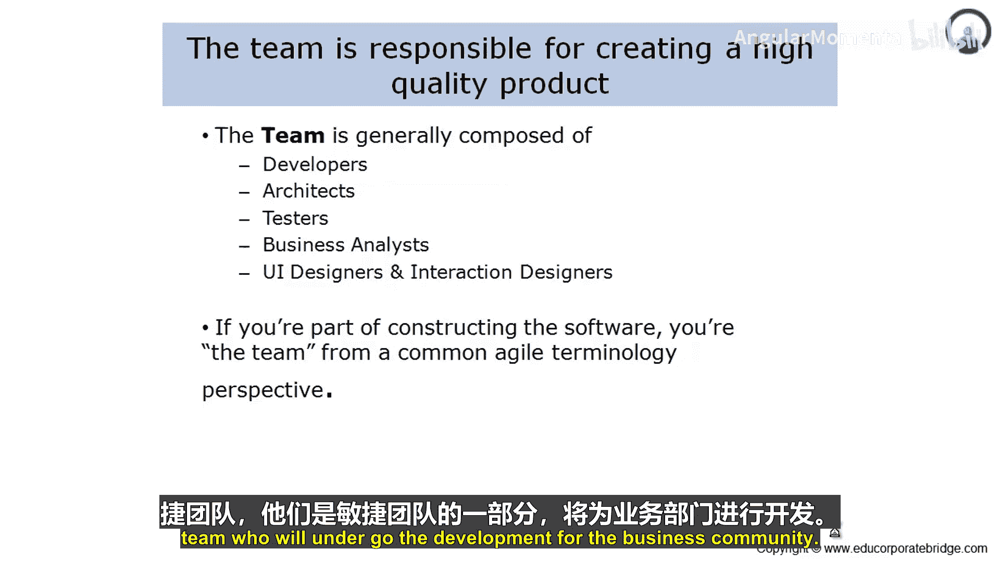

# 007：敏捷团队构成

在本节课中，我们将要学习敏捷框架的“适应”与“收尾”阶段，并深入了解敏捷方法的起源、主要构成以及敏捷项目团队的核心角色与职责。

## 适应与收尾阶段概述

上一节我们介绍了敏捷框架的“构想”、“推测”和“探索”阶段。本节中我们来看看最后两个阶段：“适应”与“收尾”。

在“适应”阶段，成果被交付，当前状况受到监控。团队的绩效得到监控与提升，并且团队会根据需要随时适应变化。

在“收尾”阶段，团队进行总结。他们分享关于项目整体开发和软件的学习成果，并庆祝所取得的储备成果。我们将在第2章更详细地了解这个框架。目前，我们已简要概述了敏捷框架的五个阶段：构想、推测、探索、适应和收尾。

## 敏捷方法的起源与构成

现在，让我们来理解这些敏捷方法是如何出现的，以及它们是如何被命名的。

这个敏捷方法类别包含五种主要方法：
*   **Scrum**：起源于1986年。
*   **DSDM**：即动态系统开发方法，于1995年发展起来。
*   **Crystal**：于1997年提出。
*   **FDD**：即特性驱动开发，于1998年提出。
*   **XP**：即极限编程，于1999年提出。

请始终记住，敏捷方法包含这五种主要类别。任何单一方法都可以最好地利用这些方法中的任何一种，或者将它们全部结合使用。因此，这些方法通常是组合在一起使用的。

大多数组织从一系列敏捷实践中组合出他们的敏捷方法。当今常见的敏捷实践结合了所有上述命名流程的元素。因此，任何用于产品开发或软件项目的敏捷方法，都是所有这些元素的组合。

## 敏捷团队的角色与构成

现在，让我们花些时间来理解项目团队的构成。

虽然敏捷不是一个特定的流程，但一个通用的流程生命周期和角色已经出现。因此，所有敏捷项目都具有本质上通用的流程生命周期和角色。

在敏捷开发中，人员通常扮演三种“超级角色”之一。敏捷项目有三种角色，参与敏捷项目的人员会扮演这三种超级角色之一。并且，人员通常可以在这些角色之间自由转换。请记住，利益相关者拥有多重“帽子”。他们根据项目需求在项目中行动，并且可以随着情况需求更换“帽子”、转换角色。

因此，敏捷团队拥有三种团队角色，它们被称为超级角色。这些角色是可以互换的。一个敏捷流程会经历特定的流程生命周期并包含这些角色。

现在，让我们来理解团队的责任与构成。

一般来说，敏捷团队由以下成员构成：
*   **开发者**：这些人员编写代码、开发界面、进行集成。
*   **架构师**：这些人员负责设计人员、流程、产品、合作伙伴之间的整体交互，这被称为业务或企业架构。
*   **测试者**：这些人员确保交付物符合需求。如果不符合，则修复缺陷并重新测试。因此，测试者在验证和确认方面扮演重要角色。
*   **业务分析师**：这些人员确保需求被很好地获取。他们关注业务流程的数字化，确保产出的软件满足最终需求。
*   **用户界面设计师和交互设计师**：这些人员确保两个系统、两个流程能够以和谐的方式相互交互，并且业务价值链中的所有交互都被捕获并数字化，以产生业务成果。

这些是敏捷项目中的关键角色。从通用的敏捷术语角度来看，如果你是软件构建的一部分，你就是团队的一员。因此，构建团队就是敏捷团队，他们是敏捷团队的一部分，将进行业务开发。

## 总结

本节课中我们一起学习了敏捷框架的最后两个阶段——“适应”与“收尾”，了解了敏捷方法的五大主要起源（Scrum, DSDM, Crystal, FDD, XP），并深入探讨了敏捷团队的核心构成。我们明确了敏捷团队通常包含开发者、架构师、测试者、业务分析师以及界面/交互设计师这几种关键角色，并且这些“超级角色”在项目中可以根据需要灵活转换。理解这些角色和流程是组建高效敏捷团队的基础。