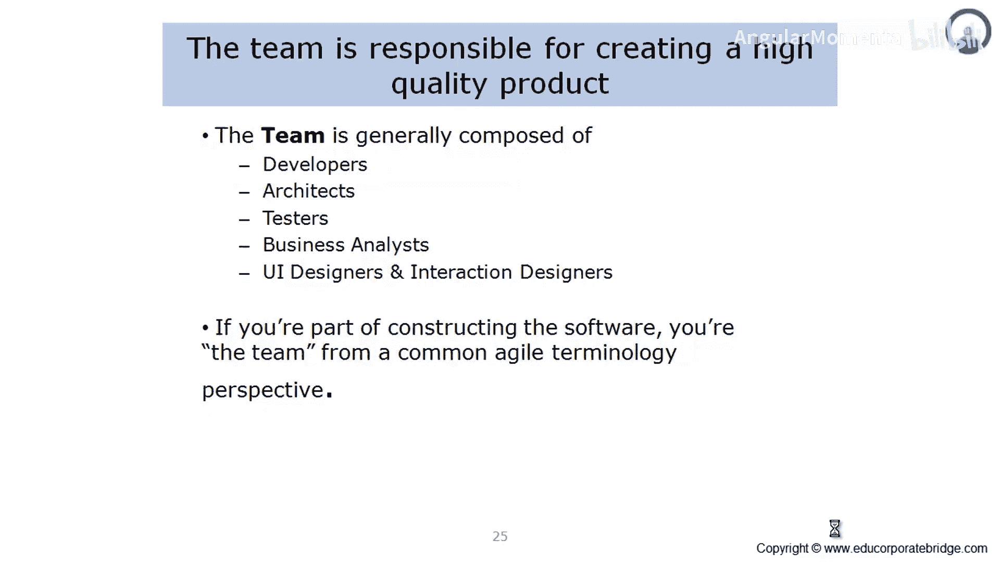
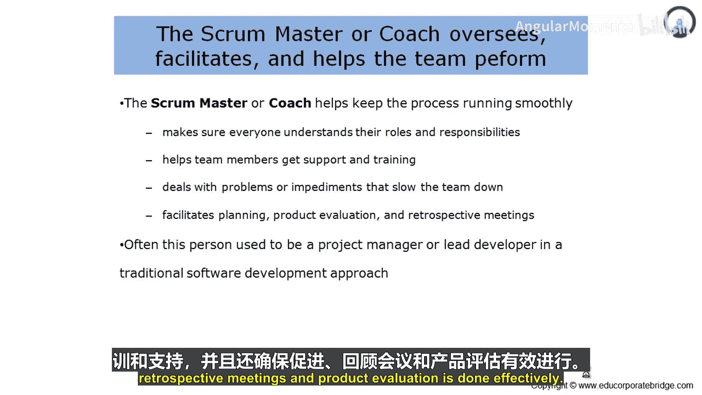
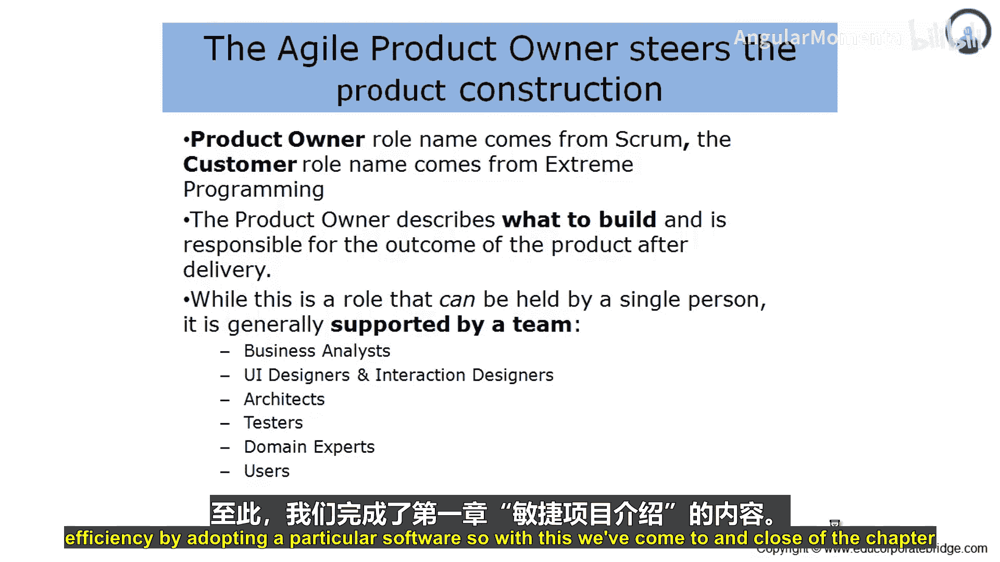
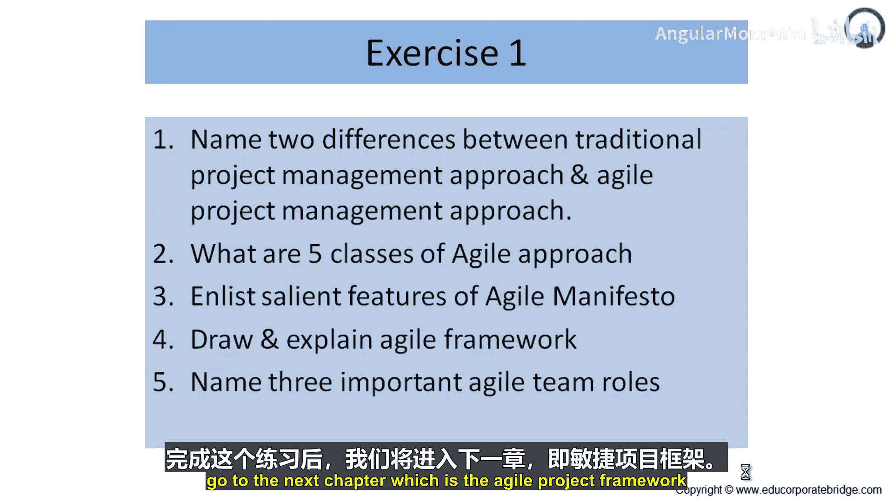
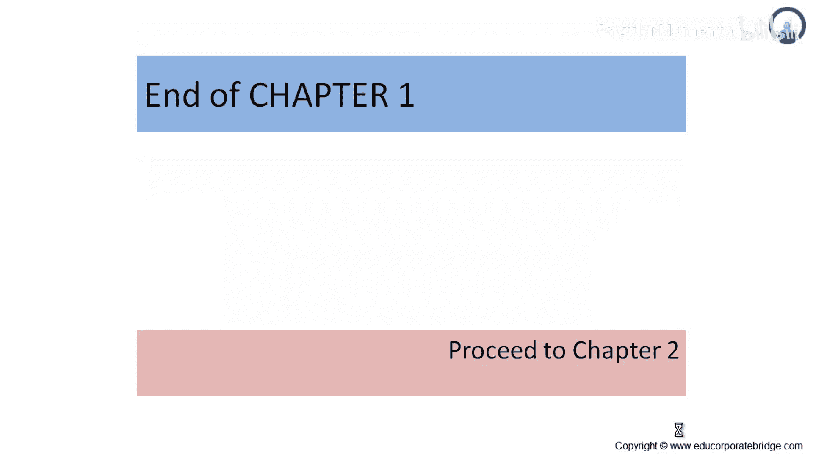

# 008：团队构成（续）👥

在本节中，我们将继续探讨敏捷团队中的关键角色，特别是**Scrum Master/教练**和**产品负责人**。理解这些角色的职责对于构建一个高效协作的敏捷团队至关重要。

上一节我们介绍了敏捷团队的基本构成，本节中我们来看看两个核心的引导与决策角色。

## Scrum Master/教练 🧑‍🏫

Scrum Master或教练帮助团队保持流程顺畅运行。

他确保团队中的每个人都理解自己的角色和职责。因此，教练能带来关于角色和职责的清晰性。

他帮助团队成员获得支持和培训。他是理解团队成员“热力图”的人，即了解团队成员的能力差距、培训需求，以及偶尔需要的手把手支持。

他处理阻碍团队速度的问题和障碍。他充当加速器的角色，确保那些拖慢流程或项目进度的问题能够得到快速有效的解决。

他协助规划会议、产品评审会议和回顾会议。因此，规划、由业务方进行的评审，以及关于管理变更的回顾会议，所有这些都是在Scrum Master或教练的帮助下完成的。

通常，教练这个角色在过去传统的软件开发方法中，可能由项目经理或开发负责人担任。那些在业务社区或项目社区中拥有一定权威和竞争力的人，通常会被提名为Scrum Master或教练。Scrum Master或教练的角色至关重要，因为他们充当加速器，明确每个人的分工，在需要时提供培训和支持，并确保回顾会议和产品评审能有效进行。

## 产品负责人 📋

现在让我们来理解产品负责人是谁。“产品负责人”这个名称来源于Scrum框架，而“客户”角色名称则来源于极限编程。

产品负责人描述要构建什么，并对产品交付后的成果负责。因此，产品负责人是构建物的设计和规格的监护人，他确保其与业务需求保持一致，并且客户建议的任何变更不会对整体构建产生负面影响。

虽然这个角色听起来是单个人的职责，但整个团队都会支持这个角色，以确保在产品所有权在项目内得到良好处理。

以下是支持这一角色的团队成员及其职责：

*   **业务分析师**：确保对业务正确的内容被传达和开发出来。
*   **UI设计师和交互设计师**：确保开发是用户友好的，并且用户界面根据业务需求达到最优。
*   **架构师**：确保可靠性、健壮性和性能得到处理。
*   **测试人员**：确保开发在验证和确认方面满足业务需求。
*   **领域专家**：确保遵循行业最佳实践。
*   **用户**：确保开发适合使用，并且采用特定软件能带来效率。

## 第一章总结与练习 📚

至此，我们完成了第一章“敏捷项目介绍”的学习。

在本章中，我们一起学习了：
*   典型的项目管理方法论是什么？
*   什么是项目管理、项目集管理和项目组合管理？
*   什么是敏捷宣言？
*   敏捷所倡导的四个价值观是什么？
*   十二项原则是什么？
*   我们理解了敏捷项目框架。
*   我们理解了团队构成。
*   我们理解了几个关键角色。

现在是练习时间。我们在这里列出了几个问题，需要你进行回答。请完成这个练习，你有30分钟时间解答以下五个问题：

1.  列举传统项目管理方法与敏捷项目管理方法的两个区别。
2.  定义敏捷方法的五种类型。
3.  列出敏捷宣言的显著特点。
4.  绘制并解释敏捷框架。
5.  说出三个重要的敏捷团队角色。

请完成这个练习，它将有助于进一步巩固你对敏捷项目管理框架的理解。

当你完成这个练习后，我们将进入下一章：敏捷项目框架。