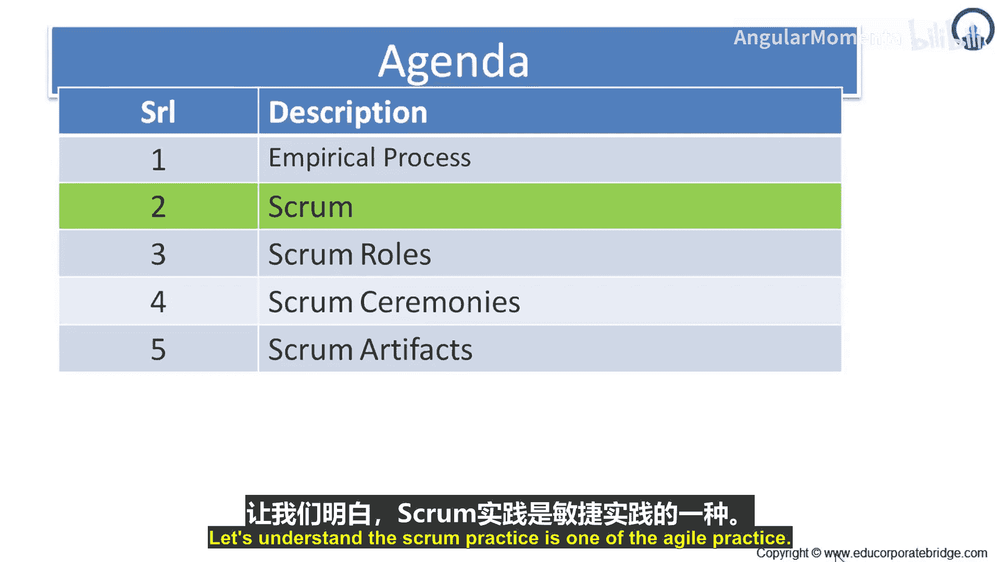
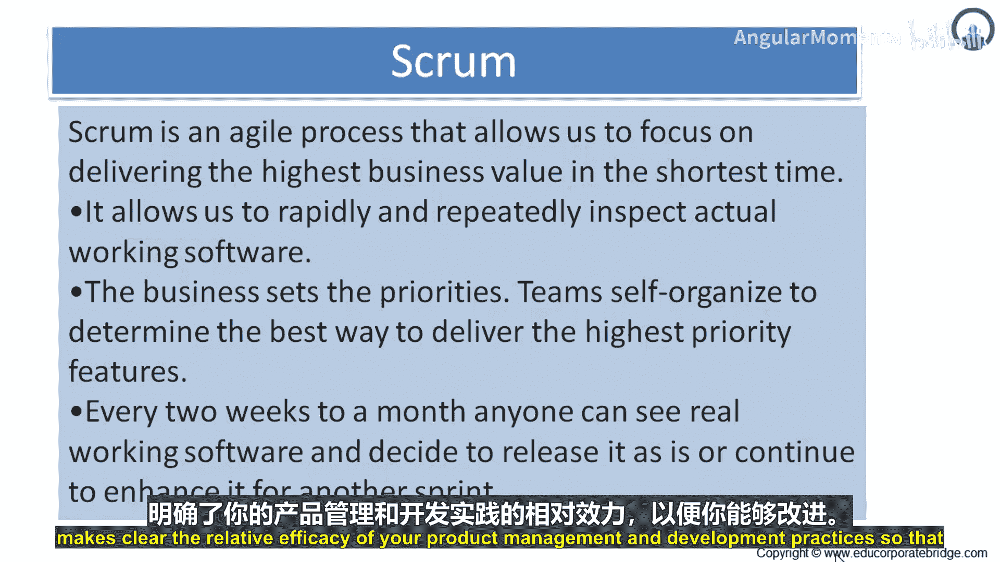
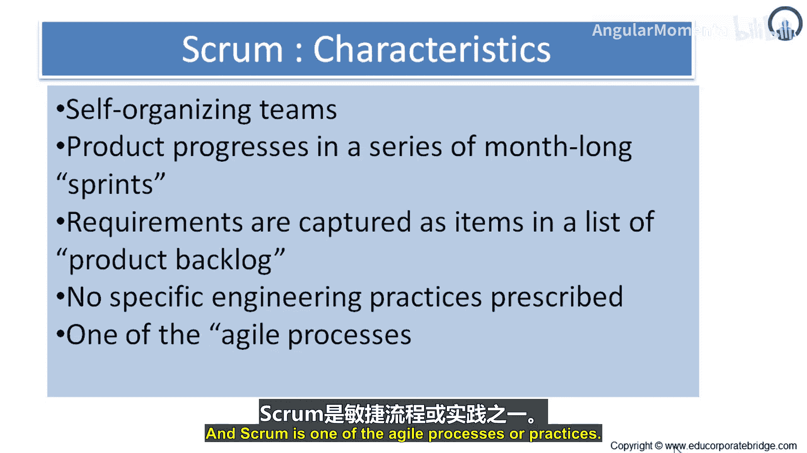
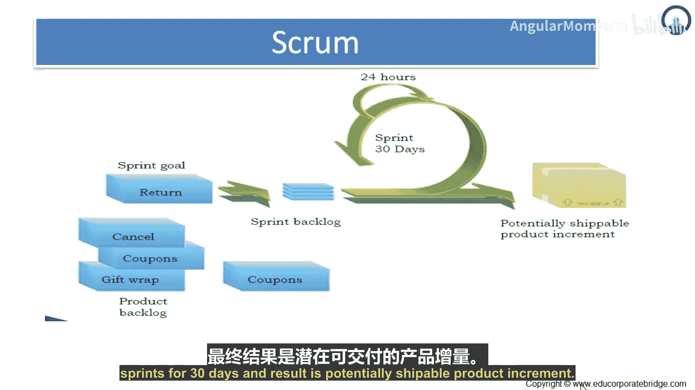
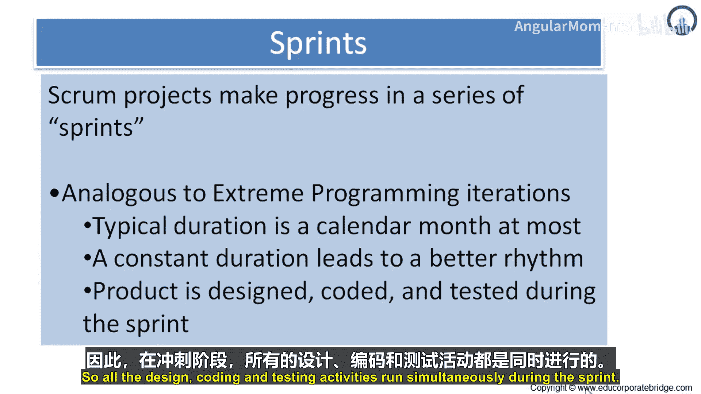
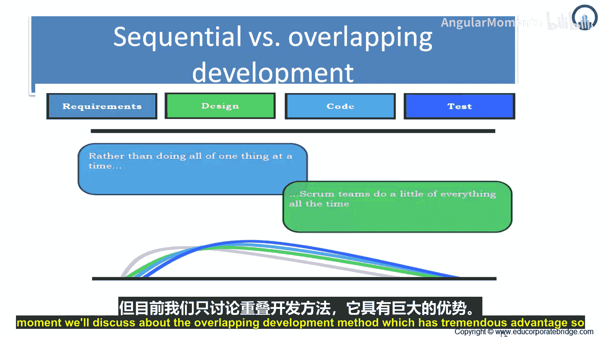
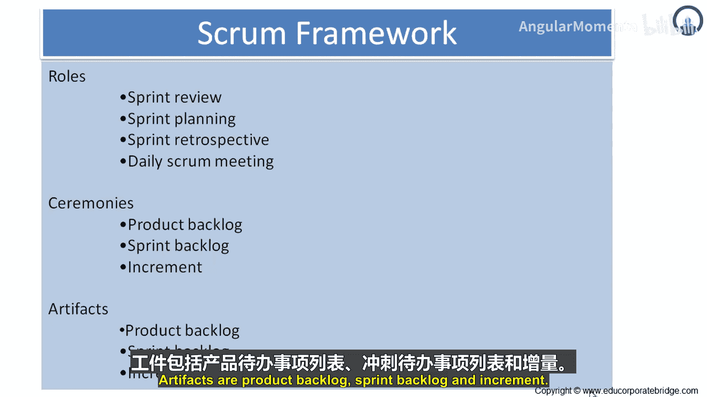

敏捷实践：01：Scrum实践导论 🚀

在本节课中，我们将要学习Scrum这一敏捷实践的核心概念、框架和运作方式。Scrum是一个帮助团队在最短时间内交付最高业务价值的轻量级框架。

---

### 什么是Scrum？

Scrum是一种敏捷过程，它使我们能够专注于在最短时间内交付最高的业务价值。因此，Scrum的首要原则是**在最短时间内交付最高价值**。

它允许我们快速且反复地检查实际可工作的软件。业务方设定优先级，团队则自组织地决定交付最高优先级特性的最佳方式。

每隔两周到一个月，每个人都能看到真实可工作的软件，并决定是将其作为产品发布，还是在下一个冲刺中继续增强。

Scrum是一个框架，人们可以在其中处理复杂的适应性问题，同时高效且创造性地交付最高价值的产品。Scrum有三个特点：一、轻量级；二、易于理解；三、极难精通。

Scrum是一个自20世纪90年代初以来就被用于管理复杂产品开发的过程框架。Scrum本身不是一个构建产品的过程或技术，而是一个**框架**，你可以在其中运用各种过程和技术。Scrum能清晰地展示你的产品管理和开发实践的效果，以便你进行改进。

---

### Scrum框架的构成

Scrum框架由Scrum团队及其相关的角色、事件、工件和规则组成。框架内的每个组件都有特定目的，对Scrum的成功和使用至关重要。

使用Scrum框架的具体策略各不相同，并在相关文档中描述。Scrum的规则将事件、角色、工件以及它们之间的管理关系和交互绑定在一起。这些规则在培训文档的主体部分有详细描述。

Scrum建立在称为经验主义的经验过程控制理论之上。经验主义主张知识来源于经验，并基于已知信息做出决策。Scrum采用迭代和增量的方法来优化可预测性和控制风险。

经验过程控制的三大支柱支撑着每一次实践：**透明度**、**检视**和**适应**。

*   **透明度**：过程的显著方面必须对负责结果的人可见。透明度要求这些方面根据共同标准定义，以便观察者对所看到的内容有共同理解。例如，所有参与者必须共享一个指代过程的共同语言，执行工作的人和接受工作产品的人必须共享一个“完成”的共同定义。
*   **检视**：Scrum使用者必须频繁检视Scrum工件和达成目标的进展，以发现不可取的偏差。检视不应过于频繁以至于妨碍工作。当熟练的检视者在工作现场勤勉地执行时，检视最为有益。
*   **适应**：如果检视者确定过程的某个或多个方面偏离了可接受的范围，并且将导致产品不可接受，则必须调整过程或被处理的材料。必须尽快进行调整，以最小化进一步的偏差。

Scrum规定了四个正式的检视和适应机会，在Scrum事件部分有描述：**Sprint计划会议**、**每日Scrum站会**、**Sprint评审会议**和**Sprint回顾会议**。

---

### Scrum的特点

上一节我们介绍了Scrum的框架和支柱，本节中我们来看看Scrum的具体特点。

**关于团队**：团队是自组织的。团队自己组织团队会议、评审、回顾和沟通。

**关于过程**：产品开发在一系列为期一个月的冲刺中进行。软件或产品的开发作为月度冲刺的一部分推进，其中从待办事项列表中选取项目进行开发。有每日站会、月度冲刺，最终从冲刺中产生可交付的产品。

**关于需求**：需求以产品待办事项列表中的项目形式捕获。因此，产品待办列表是一个占位符，是所有产品开发的输入来源。来自用户故事的所有需求都被捕获在产品待办列表中。

**关于工程实践**：Scrum没有规定特定的工程实践。因此，Scrum与特定的工程实践无关，你可以使用一种、两种或多种工程实践的组合来进行产品开发。

---

### Sprint流程

作为敏捷过程之一，Scrum的运作遵循一个清晰的流程。

以下是最常用于阐述冲刺过程的示意图。左侧是**产品待办列表**，由用户故事组成。基于产品待办列表，确定一个冲刺目标，并创建**冲刺待办列表**。

冲刺待办列表经历为期30天的冲刺，每个30天的冲刺包含24小时的日循环周期。在冲刺结束时，会产生**潜在可交付的产品增量**。

因此，Scrum的逻辑流程是：**产品待办列表 -> 冲刺待办列表 -> 30天冲刺 -> 潜在可交付的产品增量**。

---

### 冲刺的节奏与工作方式

Scrum项目通过一系列冲刺取得进展，这类似于极限编程的迭代。冲刺的典型持续时间最多为一个日历月。通常不允许冲刺超过30天。

固定的持续时间能带来更好的节奏感，因为团队成员习惯于在预定的时间内完成冲刺待办列表，他们习惯于进入开发和交付可交付产品的30天周期。一旦开始冲刺，团队内部就会形成一种节奏和韵律。

产品在冲刺期间进行设计、编码和测试，因此所有设计、编码和测试活动在冲刺期间同时进行。

---

### 重叠式开发

这里展示的图表显示了两种方法：第一种是**顺序式**，第二种是**重叠式**。

在顺序式开发中，需求、设计、编码和测试这些阶段一个接一个地进行，阶段之间几乎没有重叠。

而在重叠式开发中，你可以看到需求、设计、编码和测试同时发生。重叠式开发的基本原理是，Scrum团队不是一次做完所有的一件事，而是**一次同时做每件事的一小部分**。

这两种方法各有优缺点，但目前我们将讨论具有巨大优势的重叠式开发方法。

---

### Scrum框架的三要素

Scrum框架包含三大要素：**角色**、**事件**和**工件**。

以下是每个要素的具体内容：

*   **角色**：产品负责人、Scrum Master、开发团队。
*   **事件**：Sprint计划会议、每日Scrum站会、Sprint评审会议、Sprint回顾会议。
*   **工件**：产品待办列表、冲刺待办列表、产品增量。

---

### 总结

本节课中我们一起学习了Scrum实践导论。我们了解到Scrum是一个旨在快速交付价值的敏捷框架，其核心在于经验主义的三大支柱：透明度、检视和适应。Scrum通过固定周期的冲刺、自组织团队和重叠式开发来运作，其框架由明确的角色、事件和工件构成。掌握Scrum需要理解这些基础概念并在实践中不断应用和优化。