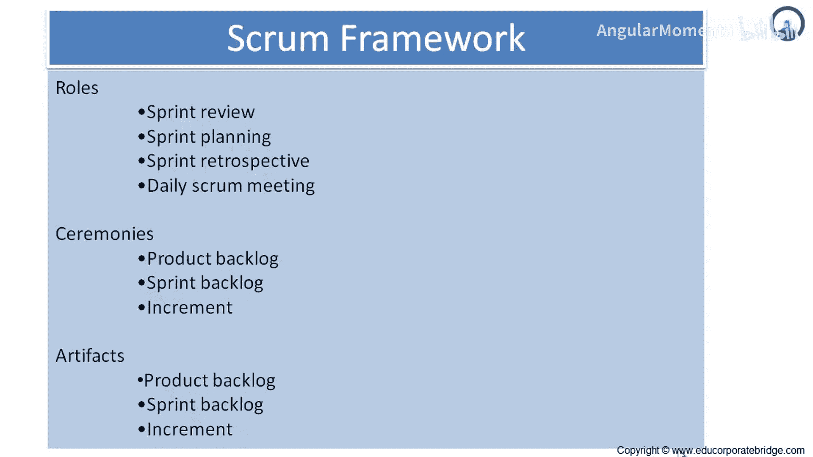
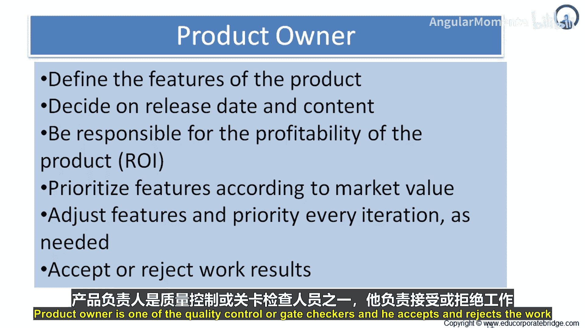
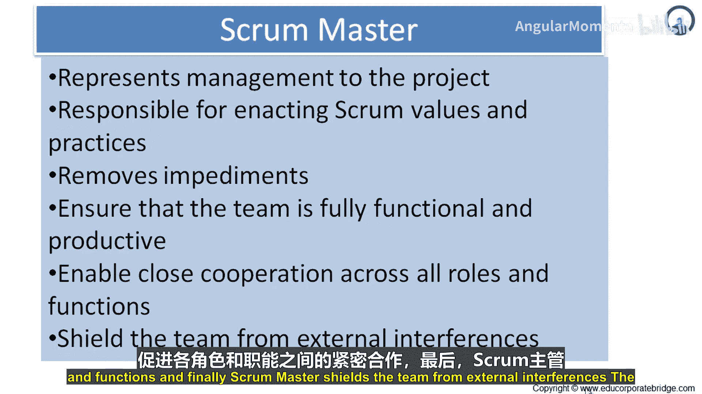
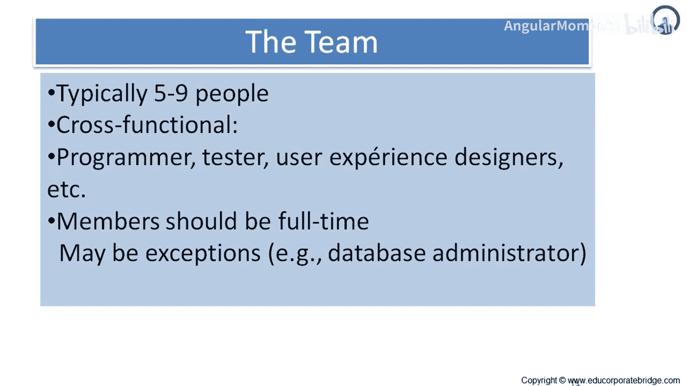

# 010：产品负责人、Scrum主管与团队 👥

在本节课中，我们将要学习Scrum框架中的三个核心角色：产品负责人、Scrum主管和开发团队。理解这些角色的职责和特点，是成功实施Scrum的基础。

## 产品负责人 📋

上一节我们介绍了Scrum的基本规则，本节中我们来看看第一个核心角色——产品负责人。

产品负责人负责最大化产品价值和开发团队工作的价值。具体实现方式可能因组织、Scrum团队和个人而异。产品负责人是唯一负责管理产品待办事项列表的人。

产品待办事项列表管理包括以下工作：
*   清晰地表达产品待办事项列表项。
*   对产品待办事项列表中的条目进行排序，以最好地实现目标和使命。
*   确保开发团队执行工作的价值。
*   确保产品待办事项列表对所有人可见、透明和清晰，并显示Scrum团队接下来要做什么。
*   确保开发团队充分理解产品待办事项列表中的条目。

产品负责人可以自己完成上述工作，也可以让开发团队来完成。然而，产品负责人对此仍负有最终责任。产品负责人是一个人，而不是一个委员会。产品负责人可以在产品待办事项列表中代表委员会的意愿，但任何想要更改待办事项优先级的人都必须说服产品负责人。

为了让产品负责人成功，整个组织必须尊重他/她的决定。产品负责人的决定体现在产品待办事项列表的内容和排序中。任何人都不允许告诉开发团队去执行另一套不同的需求，开发团队也不允许按照其他人的指令行事。

总结来说，产品负责人的职责如下：
*   **定义产品特性**：作为产品的负责人，他设计产品的特性、功能和各方面。
*   **决定发布时间与内容**：他决定发布的日期和内容。
*   **负责产品盈利**：确保投资能产生正回报，例如净现值、投资回报率对客户而言是积极的。
*   **根据市场价值确定特性优先级**：产品负责人将运用自己的专业知识和技能，收集所有必要信息，根据市场价值来决定特性的优先级。
*   **在每次迭代中调整特性与优先级**：随着迭代进行，产品负责人有机会对特性和优先级进行进一步的微调，不断添加、删除或调整特性和优先级。
*   **质量控制**：作为质量控制的把关者之一，他接受或拒绝工作成果。

## Scrum主管 🛡️

了解了产品负责人的职责后，接下来我们认识Scrum团队中的另一个关键角色——Scrum主管。

Scrum主管负责确保Scrum被理解并得到贯彻。Scrum主管通过确保Scrum团队遵循Scrum理论、实践和规则来做到这一点。Scrum主管是Scrum团队的仆人式领导者。

Scrum主管帮助团队外的人员理解哪些与Scrum团队的互动是有益的，哪些不是。Scrum主管帮助每个人改变这些互动方式，以最大化Scrum团队创造的价值。

Scrum主管为产品负责人提供服务，方式包括：
1.  寻找有效的产品待办事项列表管理技术。
2.  清晰地向开发团队传达愿景、目标和产品待办事项列表项。
3.  教导Scrum团队创建清晰、简洁的产品待办事项列表项。
4.  在经验主义环境中理解长期规划。
5.  理解并实践敏捷性。
6.  根据需要或要求，促进Scrum事件。

同样地，Scrum主管也为开发团队提供服务，包括：
1.  指导开发团队进行自组织和跨职能协作。
2.  教导并引导开发团队创造高价值产品。
3.  移除阻碍开发团队进度的障碍。
4.  根据需要或要求，促进Scrum事件。
5.  在尚未完全采纳和理解Scrum的组织环境中指导开发团队。

此外，Scrum主管也为整个组织提供服务，方式包括：
1.  领导并指导组织采纳Scrum。
2.  规划组织内的Scrum实施。
3.  帮助员工和利益相关者理解并实施Scrum和经验性产品开发。
4.  推动变革以提高Scrum团队的生产力。
5.  与其他Scrum主管合作，提高Scrum在组织中的应用效果。

总结来说，Scrum主管的职责如下：
*   在项目中代表管理层。
*   负责推行Scrum价值观和实践。
*   移除障碍。
*   确保团队功能完整且高效。
*   促进所有角色和职能之间的紧密合作。
*   保护团队免受外部干扰。

## 开发团队 👨‍💻👩‍💻

最后，我们来了解Scrum框架中负责交付价值的核心执行者——开发团队。

开发团队由专业人士组成，他们在每个Sprint结束时完成交付一个潜在可发布的、“完成”的产品增量。只有开发团队的成员才能创建这个增量。

开发团队由组织构建并授权，以组织和管理他们自己的工作，由此产生的协同作用优化了团队的整体效率和效能。

开发团队具有以下特征：
1.  **自组织**：没有人（甚至包括Scrum主管）会告诉开发团队如何将产品待办事项列表转化为潜在可发布的功能增量。
2.  **跨职能**：作为一个团队，拥有创建产品增量所需的所有技能。
3.  **无头衔**：Scrum不为开发团队成员设定除“开发者”以外的任何头衔。无论个人承担何种工作，此规则没有例外。
4.  **集体负责**：个别开发团队成员可能拥有专业技能和专注领域，但责任属于整个开发团队。
5.  **无子团队**：开发团队内部不包含专门负责特定领域（如测试或业务分析）的子团队。

**开发团队的规模**：最佳的开发团队规模是足够小以保持灵活，又足够大以完成重要工作。少于3名成员会减少互动并导致生产力增益降低。规模过小的团队可能在Sprint期间遇到技能限制，导致无法交付潜在可发布的增量。超过9名成员则需要过多的协调工作。规模过大的团队会给经验性过程管理带来过多复杂性。产品负责人和Scrum主管的角色不计入此人数，除非他们也参与Sprint待办事项的工作。

总结来说，团队通常有 **5到9人**。团队构成是跨职能的，主要包括开发者、测试员等，例如程序员、测试员、用户体验设计师等。成员应为全职，例外情况下某些成员可以是兼职，例如数据库管理员。

---

本节课中我们一起学习了Scrum框架的三个核心角色：**产品负责人**负责定义价值与优先级，**Scrum主管**负责移除障碍与保障流程，**开发团队**负责交付可工作的产品增量。这三个角色各司其职又紧密协作，共同构成了Scrum团队成功的基础。