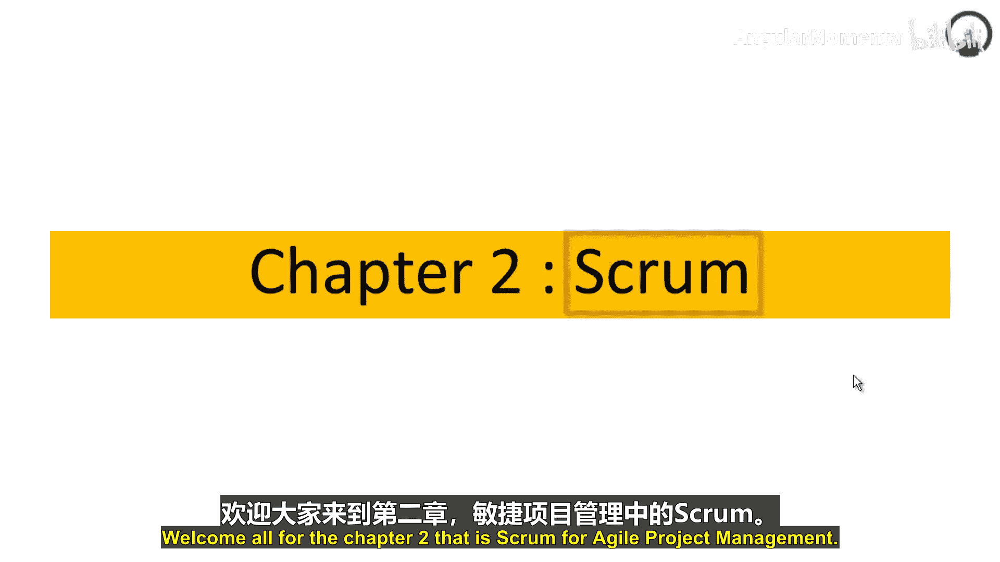
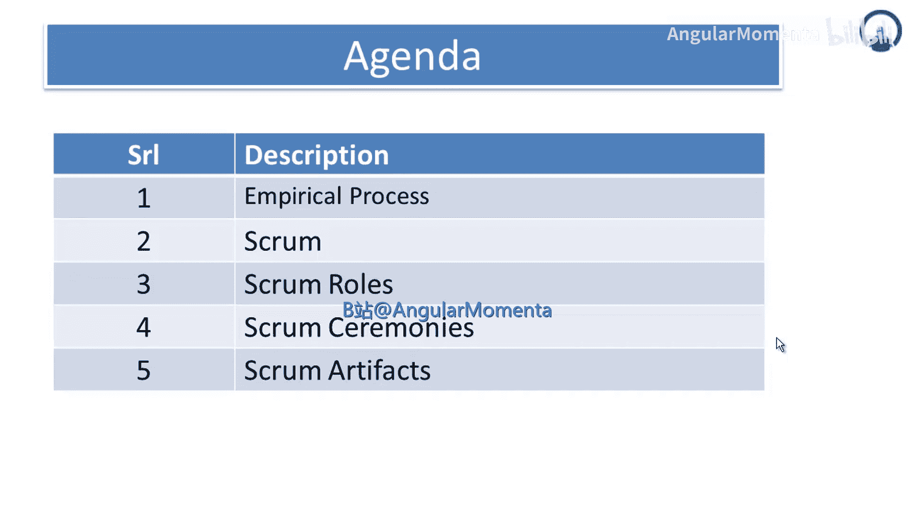
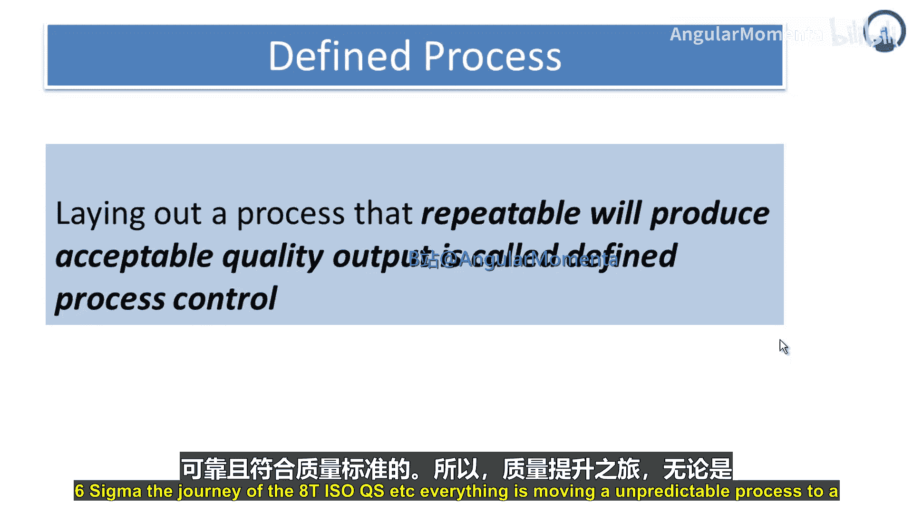
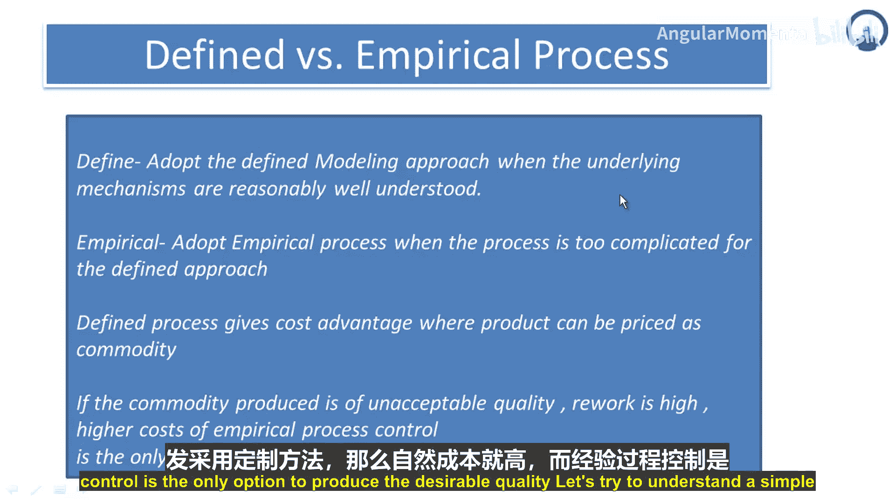
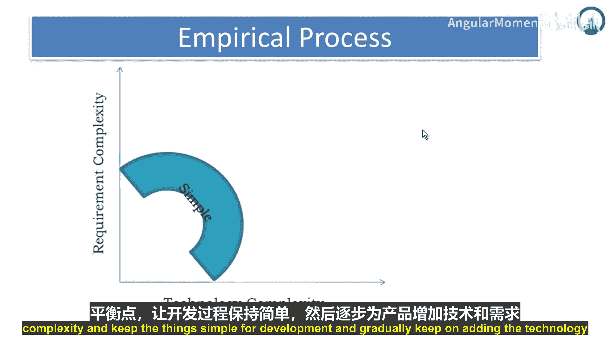
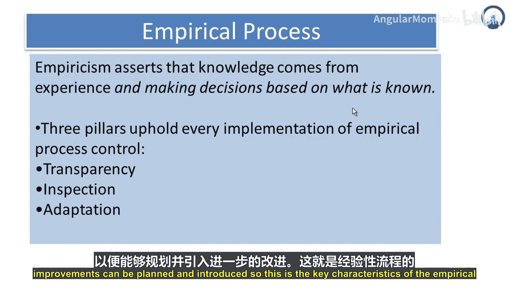
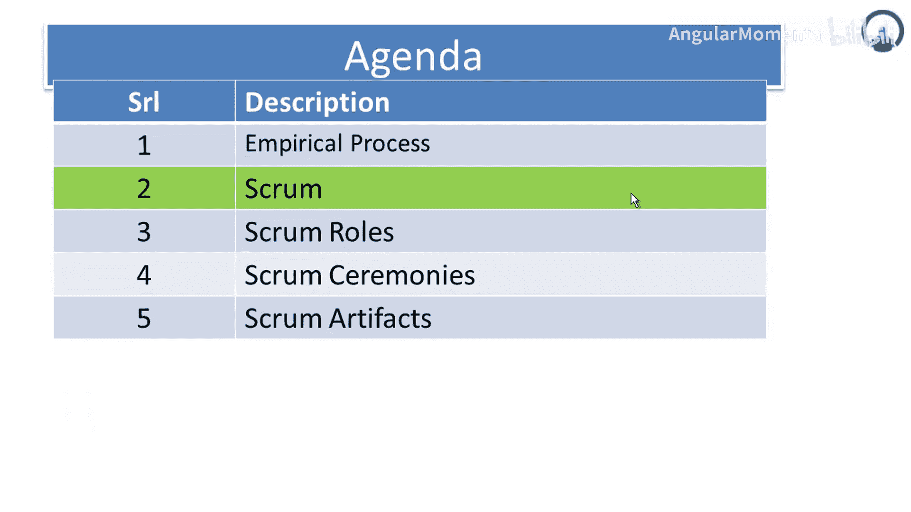

# 011：Scrum与经验性过程控制 🚀

在本节课中，我们将学习敏捷项目管理中的核心框架——Scrum。我们将从理解其理论基础“经验性过程控制”开始，逐步探讨Scrum的角色、会议和工件，帮助你掌握这一流行敏捷方法的基本构成。

## 什么是经验性过程控制？🤔

上一节我们介绍了课程的整体议程，本节中我们来看看第一个核心概念：经验性过程控制。

经验性过程控制模型，为那些定义不完善且产出不可预测、不可重复的过程，提供了通过频繁**检视**和**调整**来实施控制的方法。

在一个过程中，存在两类情况：
*   **定义完善的过程**：能产生完美、可重复的结果。
*   **定义不完善的过程**：无法产生可重复的产出。

例如，开发一个预期在10分钟内执行的软件。如果该软件始终能在10分钟内给出稳定输出，则过程是完善的。如果其输出有时是2分钟，有时是20或50分钟，则产出了不可重复的结果。经验性过程方法正是针对这类定义不清晰、产出不一致的过程，进行频繁的检视和调整。因此，**检视**与**调整**是经验性过程的支柱。

## 定义过程 vs. 经验过程 🔄

理解了经验性过程后，我们有必要将其与传统的定义过程进行对比，以明确各自的适用场景。

**定义过程**，顾名思义，是制定了可重复且能产出符合质量标准的输出的过程。这被称为定义过程控制。你知道软件能给出稳定的测试结果，你知道界面响应能稳定在毫秒级。这些都是稳定且符合质量标准的产出，是定义过程的关键特征。定义过程被清晰地规划出来，是表述精确的流程，其产出也是一致、可靠且符合质量标准的。质量学、持续改进、六西格玛等方法的旅程，正是将不可预测的过程转变为定义过程。

以下是定义过程与经验过程的主要区别：

*   **定义过程**：当底层机制被充分理解时，采用定义建模方法。定义过程基于建模方法，其关键输入、驱动因素、影响最终结果的参数都已被充分理解。你对过程拥有大部分信息，变量在控制之中，对其有足够的知识。
*   **经验过程**：当过程过于复杂，无法采用定义方法时，则采用经验过程。当过程过于复杂，有多个参数影响最终结果，且这些参数与输出之间没有非常标准或线性的关系时，就是经验过程。例如，一个软件能检测95%的缺陷，但5%的缺陷需要人工检查才能捕获。这类过程对其输入、参数、变量的信息掌握度较低，无法给出符合预期的稳定输出，经验方法就适用于此类过程。

定义过程具有成本优势，产品可作为商品定价。因为变量少、标准差小、信息充分，你可以将产品商品化，并将成本优势传递给客户。如果商品化产品符合质量要求，而经验过程控制则返工率高、成本更高。如果过程定义不清晰、存在复杂性、无法将产品商品化、必须为每次开发采取定制化方法，那么成本自然更高，经验过程控制就成为生产该产品的唯一选择。

## 经验过程的平衡与支柱 ⚖️

在对比了两种过程后，本节我们来深入看看经验过程的一些关键特性，特别是如何平衡复杂性与它的三大支柱。

让我们通过一个简单的图表来理解经验过程。Y轴是需求复杂性，X轴是技术复杂性。如图所示，如果需求复杂性高，技术复杂性就需要最小化；反之，如果技术复杂性非常高，需求就需要简单化。这个倒C形曲线表明，需要在需求复杂性和技术复杂性之间取得适当平衡，保持开发的简洁性，并逐步为产品增加技术和需求的复杂性。

经验过程有三个核心特征：

1.  **它主张知识来源于经验，并根据已知信息做出决策**。因此，经验是经验性过程的基石。因为它提供了历史信息，建立了基准，让你知道如何在困难情况下导航、克服复杂性，并根据已知信息决策，将未知因素搁置一旁，更侧重于利用现有信息支持决策。
2.  **支撑经验性过程实施的三大支柱是：透明、检视、调整**。
    *   **透明**：关于什么在起作用、什么不起作用、什么过程产生什么输出、存在哪些缺陷、有哪些返工、关键关注领域是什么、某项决策有哪些信息或数据支持。
    *   **检视**：进行频繁的检视。除非你检视，否则无法获得正确的信息。因此，要努力建立信息库以支持决策，进行频繁检视并收集关于结果、输出一致性、可重复性等信息。
    *   **调整**：正在开发/生产的内容适应得如何？存在哪些适应挑战？以便规划和引入进一步的改进。

这就是经验性过程的关键特征。接下来，我们将在下一节中了解Scrum。

---

**本节课总结**：本节课我们一起学习了敏捷项目管理的核心基础。我们首先探讨了**经验性过程控制**的概念，理解了它通过**检视**和**调整**来管理复杂、不确定的项目。接着，我们对比了**定义过程**与**经验过程**的适用场景与区别。最后，我们深入分析了经验过程的平衡艺术及其三大支柱：**透明、检视、调整**，为接下来学习具体的Scrum框架打下了坚实的理论基础。