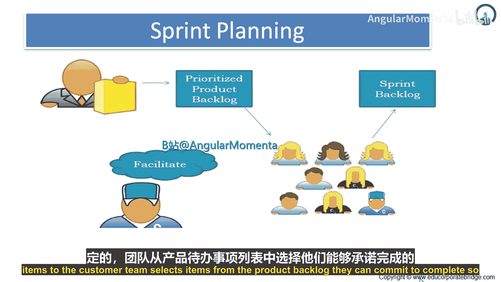
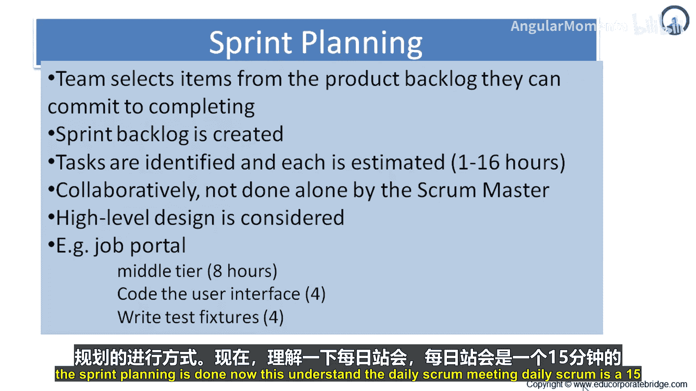
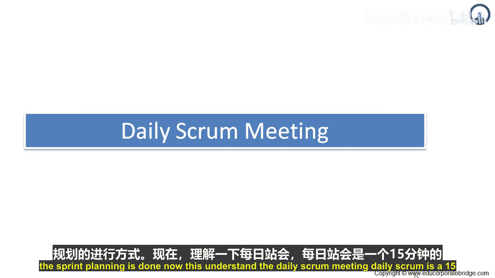
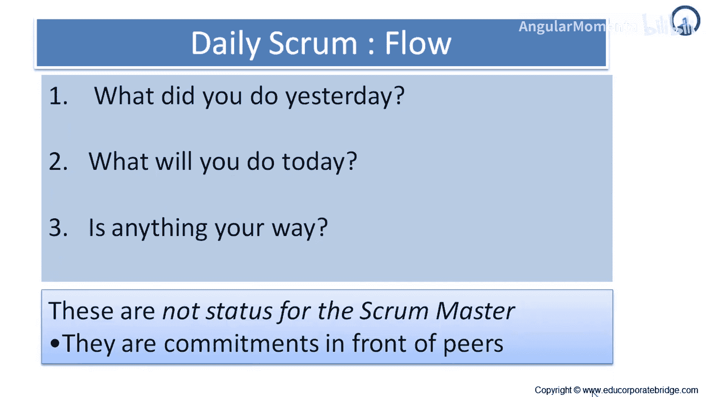

# 012：冲刺评审 🚀

## 概述

在本节课中，我们将学习敏捷开发中冲刺评审的核心流程。我们将从冲刺规划开始，了解团队如何从产品待办事项列表中选取任务，并详细探讨每日站会的运作机制、目的及其规则。

---

## 冲刺规划流程 📋

上一节我们介绍了敏捷的基本框架，本节中我们来看看冲刺规划的具体步骤。

幻灯片展示了一个高层次的冲刺规划流程。团队首先审视一个有优先级的**产品待办事项列表**，然后创建**冲刺待办事项列表**。这个过程由引导者（通常是Scrum Master）来推动。

**冲刺待办事项列表** 是用于规划冲刺和交付可发布工作项给客户的依据。

以下是团队创建冲刺待办事项列表的步骤：

1.  **选择任务**：团队从产品待办事项列表中选取他们承诺能够完成的项目。
2.  **选择标准**：选择的标准基于那些能为客户创造最大价值，并且能在规定时间内交付给客户的功能主题。
3.  **分解与估算**：基于团队的输入创建冲刺待办事项列表，识别具体任务，并对每个任务进行估算（通常为1到16小时）。
4.  **任务排序**：将冲刺待办事项分解为任务，创建任务序列，并估算每个任务所需时间。

这个过程需要所有团队成员协作完成，而不是由个人或Scrum Master单独决定。规划时通常会考虑高层设计。例如，如果团队正在设计一个招聘门户网站，他们可能会预估中间层开发需要8小时，用户界面编码需要4小时，编写测试用例需要4小时，等等。冲刺规划就是这样完成的。

---

## 每日站会详解 🗣️

完成了冲刺规划，团队就进入了冲刺执行阶段。在这个阶段，每日站会是保持同步和调整方向的关键活动。

**每日站会** 是一个限时15分钟的活动，目的是让开发团队同步工作进展并为接下来24小时制定计划。

这是通过检视自上次站会以来的工作，并预测在下次站会前能完成什么来实现的。每日站会每天在相同时间、相同地点举行，以减少复杂性。

在会议期间，每位开发团队成员需要说明：
*   自上次会议以来完成了什么？
*   在下次会议前计划做什么？
*   遇到了什么障碍？

开发团队利用每日站会来评估朝向冲刺目标的进展，以及评估完成冲刺待办事项列表中工作的趋势。每日站会优化了开发团队达成冲刺目标的可能性。开发团队经常在站会后立即开会，重新规划冲刺剩余的工作。

每天，开发团队都应该能够向产品负责人和Scrum Master说明，他们打算如何作为一个自组织团队协作，以完成目标并在冲刺剩余时间内创造预期的增量。

Scrum Master确保开发团队召开此会议，但会议由开发团队负责主持。Scrum Master教导开发团队将每日站会控制在15分钟的时间盒内。

如果团队需要超过15分钟，Scrum Master会询问所有人：“我们需要讨论一些重要事项，这会超出15分钟的时间盒。大家是否同意再延长五分钟？” 如果所有人都同意，会议继续；否则，会议在15分钟后结束。

Scrum Master强制执行规则：只有开发团队成员可以参与每日站会。每日站会不是状态汇报会议，而是为那些将产品待办事项转化为增量的人服务的。

每日站会能改善沟通、消除其他不必要的会议、识别并移除开发障碍、突出并促进快速决策，以及提高开发团队的产品知识水平。这是一个关键的检视和调整会议。

每日站会的基本原理是确保细粒度的协调：
*   团队完成了什么
*   团队正在做什么
*   他们需要什么帮助
*   需要解决哪些风险问题以保证团队有效运作

它旨在寻求承诺（今天结束前能完成什么？），推动团队成员完成每日工作，提出障碍以便被理解、解释和解决。整个生态系统会对表现不佳的成员施加压力，以提升他们的表现，使其与同伴匹配，同时评估朝向冲刺目标的进展。

以下是每日站会的关键参数：
*   **频率**：每日举行。
*   **时长**：15分钟。
*   **形式**：站立会议。
*   **性质**：不是问题解决会议，而是一种以不同方式进行的会议。
*   **参与者**：仅限团队成员参加。Scrum Master和产品负责人可以旁听。
*   **作用**：有助于避免不必要的会议。这是团队必须参加的唯一会议，因此他们的会议承诺在此完成。
*   **责任**：团队负责主持此会议。这是自组织团队的责任。

会议的核心问题是：
1.  你昨天做了什么？
2.  你今天打算做什么？
3.  有什么阻碍你的进展吗？

---

## 总结

本节课中，我们一起学习了敏捷冲刺评审的两个核心环节。首先，我们详细了解了**冲刺规划**的流程，包括如何从产品待办事项中选取和估算任务以形成冲刺待办事项列表。接着，我们深入探讨了**每日站会**的目的、规则和最佳实践，认识到它是团队同步、识别障碍和保持冲刺进度的关键日常活动。掌握这些实践，有助于团队更高效地协作并交付价值。