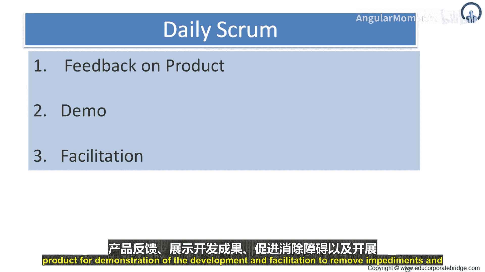
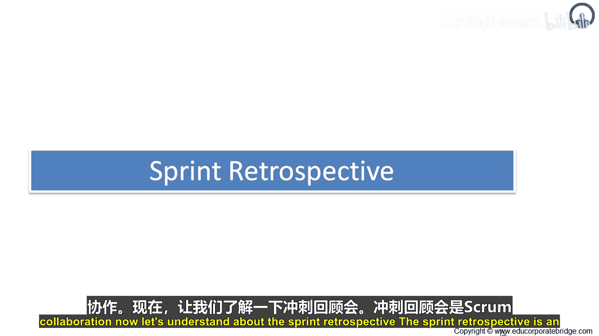
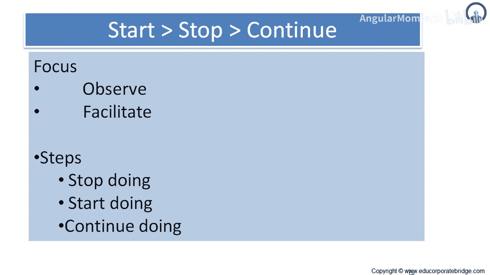

# 014：回顾性研究

在本节课中，我们将要学习Scrum框架中的两个核心事件：每日站会和冲刺回顾会。我们将了解它们的目的、结构、参与角色以及如何有效执行，以帮助团队持续改进。

## 每日站会

上一节我们介绍了冲刺规划，本节中我们来看看团队如何保持日常同步。每日站会是一个限时15分钟的活动，旨在让开发团队同步工作，并为接下来的24小时制定计划。

该活动通过检视自上次站会以来的工作，并预测在下一次站会前可以完成的工作来实现。

每日站会每天在固定时间和地点举行，以减少会议复杂性。在会议中，每位开发团队成员需要说明：

以下是每位成员需要回答的三个核心问题：
*   **自上次会议以来完成了什么？**
*   **下次会议前计划做什么？**
*   **遇到了什么障碍？**

开发团队利用这些信息来评估向冲刺目标的进展，并评估冲刺待办列表中工作的完成趋势。每日站会优化了开发团队达成冲刺目标的可能性。

开发团队通常在每日站会后立即碰头，重新规划冲刺剩余的工作。每一天，开发团队都应该能够向产品负责人和Scrum Master解释，他们打算如何作为一个自组织团队来达成目标，并在冲刺剩余时间内完成预期的增量。

Scrum Master确保开发团队召开此会议，但开发团队负责主持每日站会。Scrum Master教导开发团队将每日站会控制在15分钟的时间盒内。Scrum Master强制执行规则：只有开发团队成员可以参与每日站会。

每日站会不是状态汇报会议，而是为那些将产品待办列表转化为增量的人服务的会议。每日站会能够：
*   改善沟通
*   消除其他不必要的会议
*   识别并移除开发障碍
*   突出并促进快速决策
*   提升开发团队的项目知识水平

这是一个关键的检视与调整会议。因此，每日站会主要用于获取产品反馈、展示开发进展以及促进障碍移除和团队协作。

## 冲刺回顾会

了解了每日的检视调整后，我们来看看在冲刺周期结束时，团队如何进行更全面的反思。冲刺回顾会为Scrum团队提供了一个检视自身并制定改进计划的机会，以便在下个冲刺中实施。

冲刺回顾会发生在冲刺评审会之后、下一个冲刺规划会之前。

这是一个限时会议，对于为期一个月的冲刺，会议时长通常为3小时。对于更短的冲刺，按比例分配更少的时间。

冲刺回顾会的目的是：
1.  检视上一个冲刺在人员、关系、过程和工具方面的表现。
2.  识别并排序做得好的主要事项和潜在的改进点。
3.  制定计划，以改进Scrum团队的工作方式。

Scrum Master鼓励Scrum团队在Scrum过程框架内，改进其开发过程和实践，使其在下一个冲刺中更高效、更愉快。在每个冲刺回顾会期间，Scrum团队会通过适时调整“完成的定义”来规划提高产品质量的方法。

在冲刺回顾会结束时，团队应该已经识别出将在下一个冲刺中实施的改进项。在下个冲刺中实施这些改进，是对Scrum团队自身的检视与调整。尽管改进可以在任何时候实施，但冲刺回顾会提供了一个专注于检视与调整的正式机会。

因此，冲刺回顾会定期举行，以审视哪些做法有效、哪些无效。它在每个冲刺结束后进行。参与者包括Scrum Master、开发团队和产品负责人。有时还会对回顾会本身进行回顾，评估回顾会的计划和执行情况。

其重点是观察和促进。通常的步骤是：**停止做、开始做、继续做**。

以下是团队在回顾会中常问的问题：
*   **我们应该停止哪些活动？**
*   **我们应该开始哪些活动？**
*   **我们应该继续哪些活动？**

这些问题旨在帮助团队即兴发挥、进一步加快速度、加强协作等。

---

本节课中我们一起学习了每日站会和冲刺回顾会。每日站会是团队每日同步和快速调整的短会，而冲刺回顾会是团队在每个冲刺结束后进行深度反思和制定系统性改进计划的关键会议。两者都是Scrum框架中实现持续改进和适应变化的核心实践。