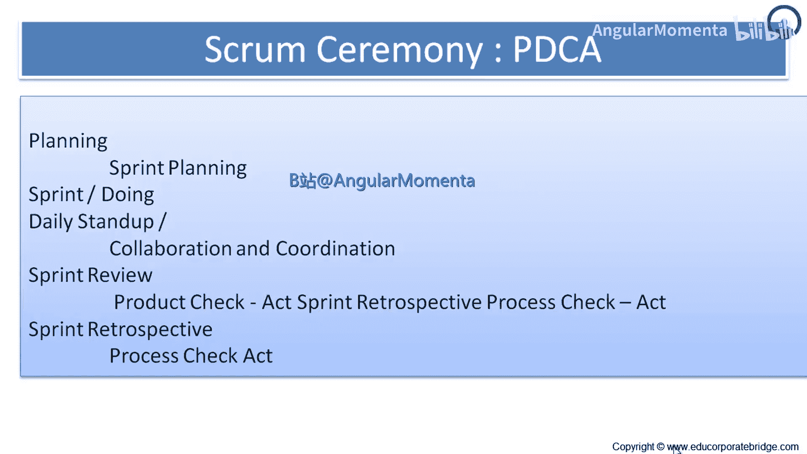
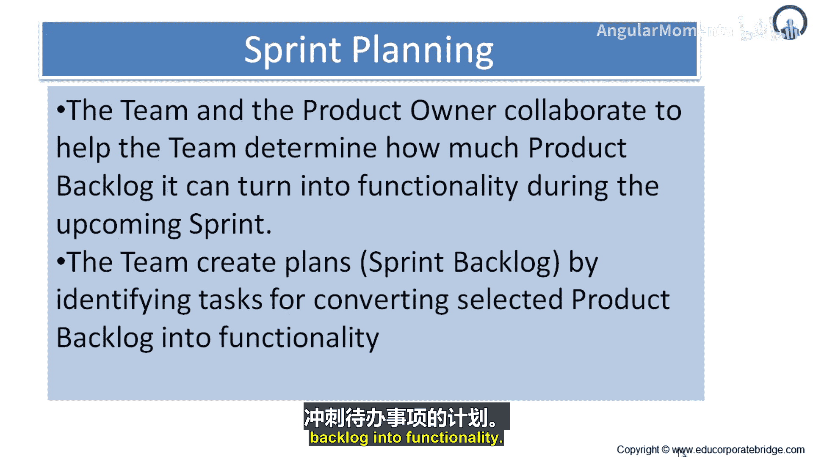
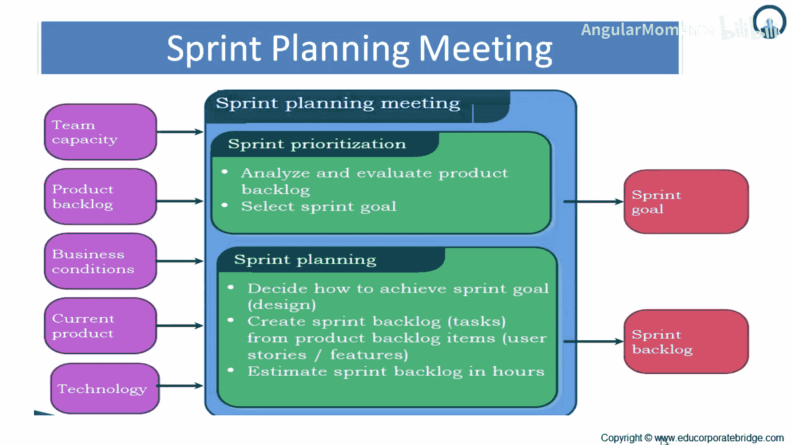

# 015：冲刺会议 🏃‍♂️

在本节课中，我们将要学习敏捷开发中一个核心的会议——冲刺规划会议。我们将了解它的目的、结构、参与角色以及如何有效地执行，以帮助团队在固定周期内交付可工作的产品增量。

---

## 团队组织与仪式

理想的敏捷团队是自组织的，通常不设头衔，但这在实践中较为少见。团队成员通常只在冲刺之间进行调整。

现在，我们来看看Scrum框架中的核心仪式。一个冲刺周期主要包括以下活动：
*   **冲刺规划**：规划本冲刺的工作。
*   **冲刺执行**：进行日常开发工作，包括每日站会。
*   **冲刺评审**：对产品增量进行检查。
*   **冲刺回顾**：对开发过程进行检查和改进。

接下来，让我们深入探讨冲刺规划会议。

---

## 深入冲刺规划会议

冲刺规划会议的目的是为即将到来的冲刺制定计划。该计划由整个Scrum团队协作创建。

**会议时长**是固定的。对于一个月的冲刺，会议时间盒为8小时。对于更短的冲刺，会议时间按比例缩短。例如，一个两周的冲刺，规划会议时长为4小时。

冲刺规划会议由两个部分组成，每个部分的时间各占会议总时长的一半。这两个部分分别回答以下两个核心问题：
1.  本次冲刺要交付什么？
2.  如何完成这些工作？

### 第一部分：本次冲刺要做什么？🎯

在这一部分，开发团队需要预测在冲刺中将要开发的功能。产品负责人向开发团队展示已排序的产品待办事项列表，整个Scrum团队协作理解冲刺的工作内容。

本部分的决策依据包括：
*   最新的**产品待办事项列表**
*   最新的**产品增量**
*   开发团队在本冲刺的**预计产能**
*   开发团队**过往的表现**

**只有开发团队**能够评估在接下来的冲刺中可以完成什么。在开发团队预测了要交付的产品待办事项后，Scrum团队共同制定一个**冲刺目标**。冲刺目标是通过实现产品待办事项列表要在本次冲刺中达成的目的，它为开发团队构建产品增量提供了指引。

### 第二部分：选定的工作如何完成？🔧

在选定了冲刺的工作内容后，开发团队需要决定如何将这些功能构建成“已完成”的产品增量。为本冲刺选定的产品待办事项项及其交付计划，合称为**冲刺待办事项列表**。

开发团队通常从设计系统开始，规划如何将产品待办事项转化为可工作的产品增量。工作可以按规模或预估工作量来划分。在规划会议中，团队会规划足够的工作量，以便能预测在即将到来的冲刺中可以完成的任务。开发团队会将冲刺头几天的工作分解为一天或更小的单位。

**开发团队是自组织的**，他们自行承担冲刺待办事项列表中的工作。在规划会议期间以及整个冲刺中，产品负责人可能需要在场，以澄清选定的产品待办事项，并在开发团队认为工作过多或过少时协助调整。开发团队也可以邀请其他人参会，以提供技术或领域建议。

在冲刺规划会议结束时，开发团队应该能够向产品负责人和Scrum主管解释，他们打算如何作为一个自组织团队来完成冲刺目标并创建预期的产品增量。

---

## 会议流程与产出总结

简而言之，在冲刺规划中，团队和产品负责人协作，帮助团队确定在即将到来的冲刺中能将多少产品待办事项转化为功能。团队通过识别将选定产品待办事项转化为功能所需的任务，来创建称为“冲刺待办事项列表”的计划。

下图展示了冲刺规划会议的流程：

**输入**包括：
*   团队产能
*   产品待办事项列表
*   业务条件
*   当前产品与技术状态

会议分为两部分：
1.  **第一部分：确定优先级**。分析和评估产品待办事项列表，并选定冲刺目标。
2.  **第二部分：制定计划**。决定如何实现冲刺目标，进行设计，从产品待办事项项中创建任务，并估算冲刺待办事项列表。

**输出**是：
*   **冲刺目标**
*   **冲刺待办事项列表**

---

## 理解冲刺目标

冲刺目标为开发团队在实现冲刺内的功能时提供了一定的灵活性。开发团队在工作时会始终牢记这个目标。为了满足冲刺目标，他们会实现相应的功能和技术。

如果实际工作与开发团队的预期不同，他们会与产品负责人协作，在冲刺内协商调整冲刺待办事项列表的范围。冲刺目标可能是产品路线图中更大目标的一个里程碑。

---

## 总结

本节课中，我们一起学习了敏捷Scrum框架中的冲刺规划会议。我们了解到，这是一个结构化的、时间盒限定的会议，旨在回答“做什么”和“怎么做”两个核心问题。会议需要整个团队（产品负责人、Scrum主管、开发团队）协作参与，最终产出明确的冲刺目标和可执行的冲刺待办事项列表，为冲刺的成功执行奠定坚实基础。理解并开好冲刺规划会议，是确保团队高效交付价值的关键一步。