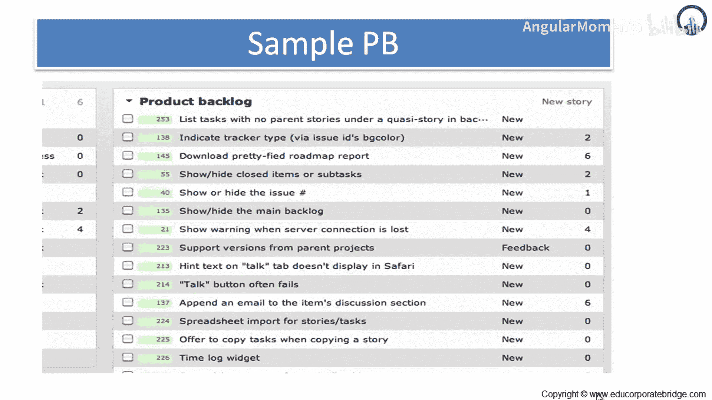
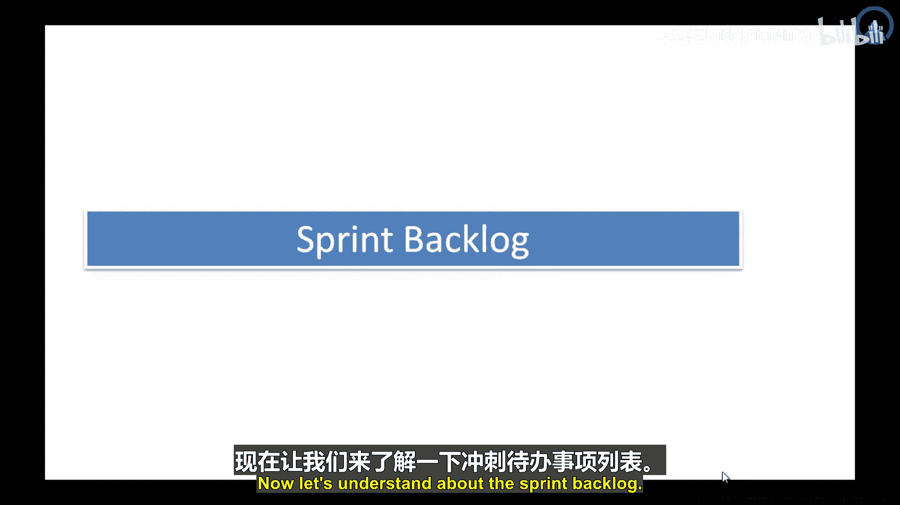
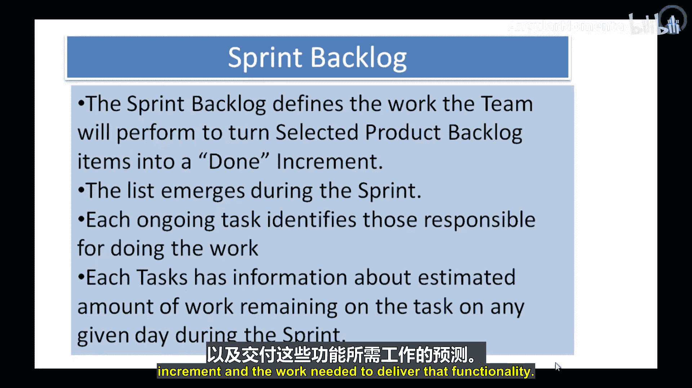

# 016：更多关于冲刺会议的内容

在本节课中，我们将学习产品待办事项列表和冲刺待办事项列表的具体构成与区别。我们将通过示例来理解这两个核心敏捷工件，并了解它们在冲刺规划会议中的作用。

## 产品待办事项列表示例

上一节我们介绍了冲刺会议的基本流程，本节中我们来看看支撑这些会议的核心工件。首先，我们来看一个产品待办事项列表的示例。

如图所示，这是一个非常简单的列表。列表中的条目就是进入待办事项列表的用户故事。

列表基于条目如何被添加或收到新反馈的方式设置了不同的列。

以下是一个示例产品待办事项列表所包含的内容：
*   列出没有父故事的任务。
*   指明跟踪器类型。
*   下载简化的路线图报告。
*   显示高优先级关闭项或子任务。

这里展示的是一种示例产品待办事项列表，供参与者参考。

## 理解冲刺待办事项列表

了解了产品级的规划列表后，接下来我们聚焦于一次冲刺周期内的具体计划。现在让我们来理解冲刺待办事项列表。

**冲刺待办事项列表**是为本次冲刺所选出的**产品待办事项列表**条目的集合，外加一份交付产品增量并实现冲刺目标的计划。

**冲刺待办事项列表**是开发团队对下一次增量中将包含哪些功能、以及交付这些功能所需工作的预测。

本节课中我们一起学习了产品待办事项列表与冲刺待办事项列表。产品待办事项列表是产品所有需求的动态清单，而冲刺待办事项列表是从中选取的、计划在本次冲刺内完成的具体任务集合，它包含了实现冲刺目标的详细工作计划。理解这两个列表的区别与联系，是有效进行冲刺规划的基础。