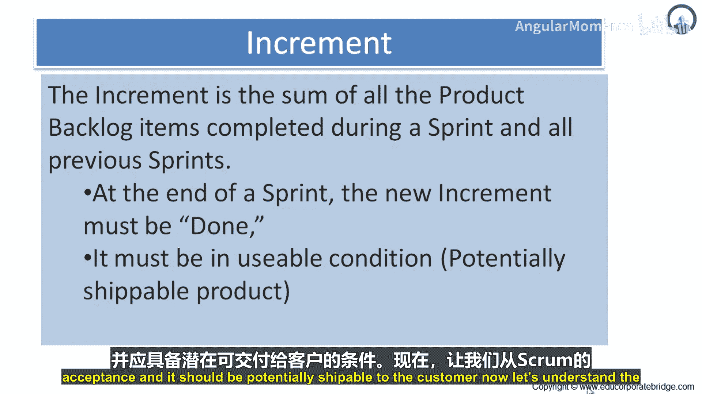
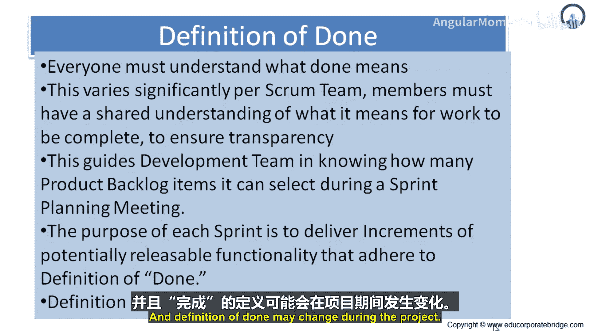
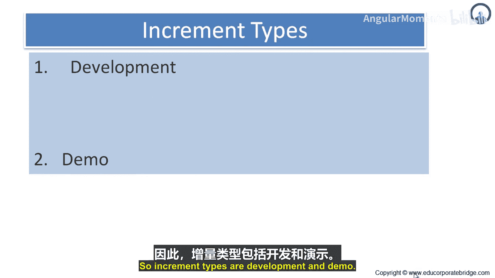

敏捷实践：P17：增量与完成的定义 📈

在本节课中，我们将要学习Scrum框架中的两个核心概念：**增量** 和 **完成的定义**。理解这两个概念对于确保团队交付高质量、可用的产品至关重要。

---

### 理解增量

上一节我们介绍了Scrum的基本框架，本节中我们来看看其中一个重要的产出物：**增量**。

增量是在一个Sprint期间完成的所有产品待办事项项的总和，再加上之前所有Sprint中完成的增量。在Sprint结束时，新的增量必须是“完成的”。

这意味着它必须处于**可用状态**，并且符合Scrum团队对“完成”的定义。无论产品负责人是否决定实际发布它，增量本身都必须是可用的。因此，增量的重点是完成一部分产品待办列表，并在开发、测试和功能验收等所有方面都达到完成标准，使其成为**潜在可交付**给客户的产品。

---

### 完成的定义

理解了增量的概念后，我们需要明确什么才算是“完成”。从Scrum的角度来看，当描述一个产品待办事项项或一个增量“完成”时，团队中的每个人都必须理解“完成”的含义。

虽然这在不同团队间差异很大，但每个Scrum团队的成员必须对“工作完成”有一个**共享的理解**，以确保透明度。这个共享的理解就是 **“完成的定义”**。

完成的定义被Scrum团队用来评估产品增量上的工作何时完成。同一个定义也指导开发团队在Sprint计划会议中了解能选择多少产品待办事项项。每个Sprint的目的都是交付符合团队当前“完成的定义”的、具有潜在可发布功能的增量。

开发团队每个Sprint都交付一个产品功能增量。这个增量是可用的，因此产品负责人可以选择立即发布它。每个增量都是**累加**到所有先前增量之上的，并且经过测试，确保所有增量能协同工作。

随着Scrum团队的成熟，其“完成的定义”预计会扩展，包含更严格的标准以实现更高质量。

“完成的定义”的前提是，每个人都必须理解“完成”时所处的状态。因此，对于进行中工作的完成度，应该有一个**一致的看法**。它在团队内部应被一致理解，尽管不同团队之间可能不同。

“完成的定义”也指导团队在Sprint计划会议中了解能选择多少工作项，目的是在每个Sprint结束时，交付可以交付给客户的、具有潜在可靠功能的增量。此外，“完成的定义”在项目过程中可能会发生变化。

以下是“完成的定义”通常包含的一些检查项示例：
*   代码已编写并通过同行评审。
*   代码已合并到主分支。
*   单元测试和集成测试已通过。
*   功能已通过验收测试。
*   用户文档已更新。
*   产品负责人已确认功能符合要求。

---

### 增量的类型

根据其用途，增量主要可以分为两种类型：
*   **开发增量**：主要用于内部开发、集成和测试，是构建最终产品的基础。
*   **演示增量**：具备足够完整的功能，可以展示给利益相关者（如产品负责人、客户）以获取反馈。

---

### 总结与Scrum的完整性

本节课中我们一起学习了Scrum中的**增量**和**完成的定义**。增量是可用的、潜在可发布的工作总和，而“完成的定义”是团队对工作完成标准的共同协议，确保透明度和质量。

最后需要强调的是，Scrum的规则是**不可变**的。虽然只实施Scrum的部分内容是可能的，但结果不再是Scrum。Scrum只作为一个**完整的整体**存在时才能良好运作，并作为容纳其他技术、方法和实践的容器。

---

Thank you。