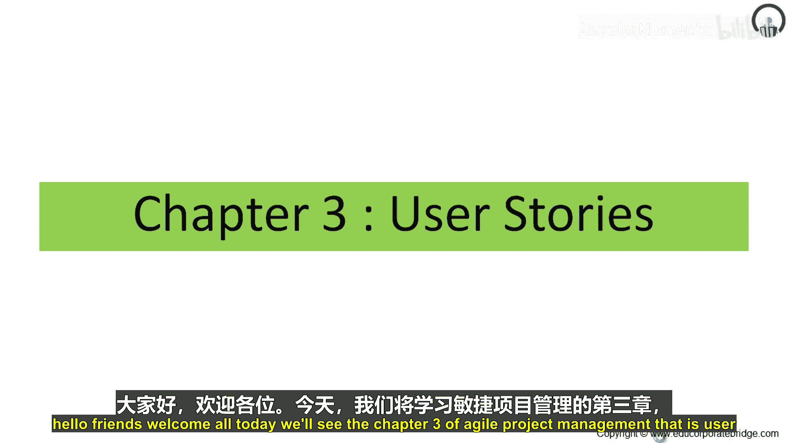
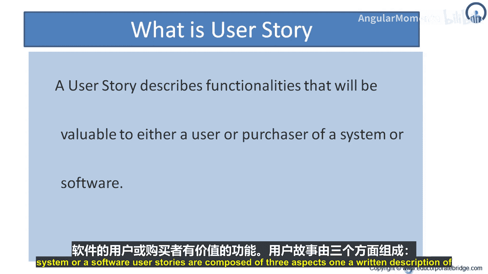
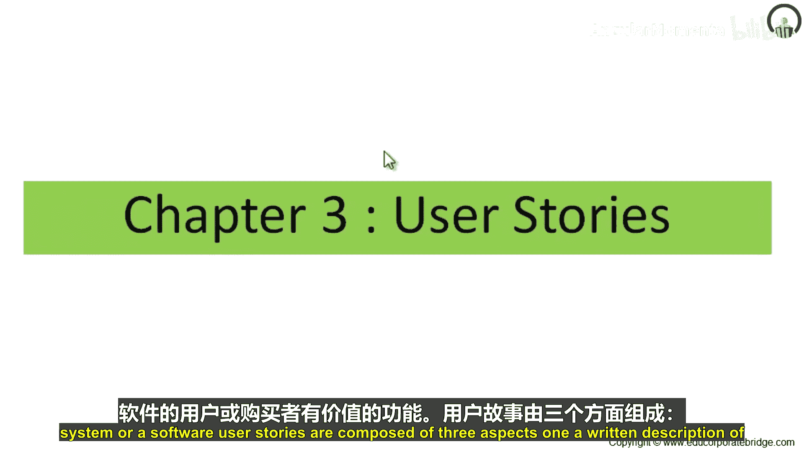
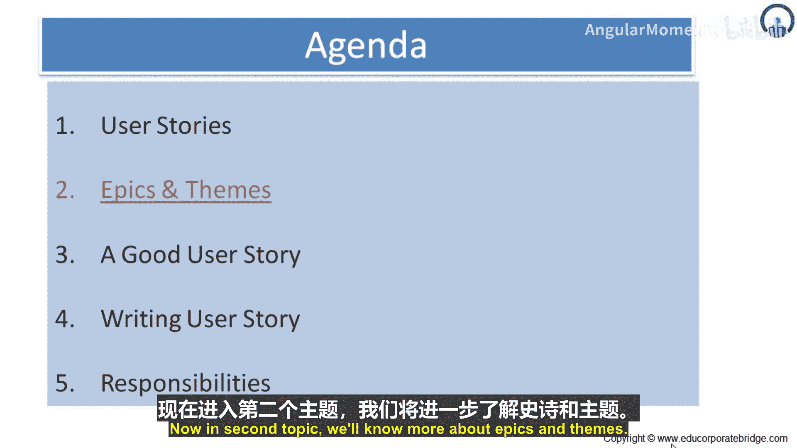

# 018：用户故事入门 🧩

在本节课中，我们将学习敏捷项目管理中的核心概念——用户故事。我们将了解用户故事是什么、什么是史诗和主题、一个好的用户故事由哪些部分组成、如何编写用户故事，以及在敏捷项目中，各利益相关方在用户故事方面的角色与职责。

---

## 什么是用户故事？🤔

用户故事描述了对用户或系统/软件的购买者有价值的功能。用户故事由三个方面组成：

1.  **书面描述**：用于规划和提醒的故事文字说明。
2.  **对话**：用于充实故事细节的讨论。
3.  **测试**：传达和记录细节，并可用于确定故事何时完成的验收标准。

因此，用户故事描述了对购买者或用户有价值的功能。它包含书面描述、用于充实细节的对话，以及用于确认完成的测试。

### 用户故事示例

*   **正确示例**：
    *   用户可以搜索工作。
    *   公司可以发布新的职位空缺。
    *   用户可以限制谁可以查看她的简历。
*   **错误示例**：
    1.  软件将用 C++ 编写。
        *   **错误原因**：用户需要给出需求或说明他们期望的功能或价值，而不是直接进入解决方案模式。
    2.  程序将通过连接池连接到数据库。
        *   **错误原因**：同上，用户没有给出需求，而是进入了解决方案模式。

用户故事不需要以传统的需求文档风格来扩充。它是客户与团队成员之间的一项协议，用于在迭代期间细化需求。它强调口头沟通而非书面沟通，并且其大小适合用于规划。它应尽可能简短，是一种沟通工具，而非文档。用户故事本身不是需求文档，需求需要通过讨论来捕获。

---

## 用户故事的通用流程 📋

项目的初始故事通常在故事编写研讨会中完成，但故事可以在项目期间的任何时间编写。在研讨会中，每个人尽可能多地集思广益，提出故事。有了初始的故事集后，开发人员会估算每个故事的规模。

### 为什么由客户编写故事？

客户团队（而非开发人员）编写用户故事主要有两个原因：
1.  每个故事必须用业务语言（而非 C++ 或连接池等技术术语）编写，以便客户团队能对故事进行优先级排序，决定将其纳入迭代或发布。
2.  客户团队拥有主要的产品愿景，最适合描述产品的行为。

---

## 为什么使用用户故事？✨

上一节我们介绍了用户故事的定义，本节我们来看看使用用户故事的优势。用户故事强调口头沟通而非书面沟通。它们对用户和开发人员都易于理解。用户故事的大小适合规划，适用于迭代开发。并且，用户故事鼓励推迟细化细节，直到你对真正需要的东西有了最好的理解。

---

## 用户故事的“3C”原则 🃏

现在，让我们深入了解用户故事的核心框架——“3C”原则。

### 1. 卡片 (Card)

用户故事通常写在一张 3x5 英寸的便签卡上。这张卡片可能会附有注释、估算等信息。因此，卡片上会简要记录需求，并可能有一些注释来进一步阐述需求，以及一些粗略的估算。

### 2. 对话 (Conversation)

用户故事背后的细节在于与产品负责人和客户的对话中浮现。当用户提出一个用户故事时，他/她只给出非常简要的需求描述。例如，一个用户故事描述可能是“公司可以发布新的职位空缺”。这只是项目团队获得的简短信息。随后，客户和项目团队会进行讨论，进一步细化这个用户故事。这个对话更多的是理解这个需求是什么、高层期望是什么、包含什么、排除什么、存在哪些依赖关系，以便这个用户故事可以被纳入迭代开发。

### 3. 确认 (Confirmation)

确认（即验收标准）用于确认故事被正确引用。这一点非常重要，因为在执行验收测试时，需要回溯到该需求所属的用户故事。最重要的标准之一就是回溯并检查最初的高层需求是否得到满足。

验收测试是验证故事是否按照客户团队预期的方式开发的过程。一旦迭代开始，开发人员开始编码，客户团队就开始指定测试。根据客户团队成员的技术熟练程度，这可能意味着从在故事卡背面编写测试到将测试放入自动化测试工具中的任何事情。对于技术性更强的任务，客户团队中应包含一名专注且熟练的测试人员。

测试应尽早编写，甚至在迭代开始前，如果你能大致猜测下一个迭代的内容。尽早编写测试非常有帮助，因为客户团队的更多假设和期望能更早地传达给开发人员。

**例如**：
假设你写了一个故事：“用户可以用信用卡支付她购物车中的商品。”然后你在故事卡背面写下这些简单的测试：
*   使用 Visa、Mastercard 和 American Express 进行测试。
*   使用 Diner‘s Club 进行测试（通过/失败）。
*   使用 Visa 借记卡进行测试（通过/失败）。
*   使用有效、无效和缺失的卡 ID 号（来自卡背面）进行测试。
*   使用过期的卡进行测试。
*   使用不同的购买金额进行测试，包括超过卡限额的金额。

通过这种方式，编写了验收测试，并根据原始的用户故事或需求获得了确认。

**总结**：记住“3C”——卡片、对话和确认。

---

## 如何编写用户故事 ✍️

关于用户故事，始终要记住：作为一个想要此功能的**用户**。需要提及用户想要什么，以及为什么需要它。如果用户或业务获得了该功能，会发生什么变化、会产生什么积极影响、业务会做什么、业务能期待什么好处。

因此，用户故事的三个要素是：
*   **作为** (As a) [用户角色]
*   **我想要** (I want) [功能]
*   **以便于** (So that) [价值/收益]

**公式**：`作为 <用户角色>，我想要 <功能>，以便于 <价值/收益>。`

---

## 总结 📚

本节课我们一起学习了敏捷项目管理中的用户故事。我们了解了用户故事的定义、组成部分和“3C”原则（卡片、对话、确认）。我们还探讨了为什么由客户编写故事、用户故事的优势以及标准的编写格式。理解并正确应用用户故事，是进行有效迭代规划和交付有价值产品功能的基础。在接下来的章节中，我们将继续探讨史诗、主题等更宏观的敏捷规划概念。