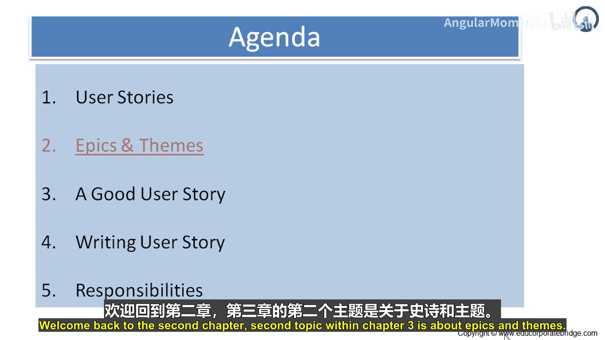
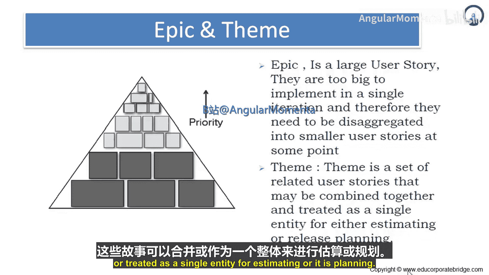
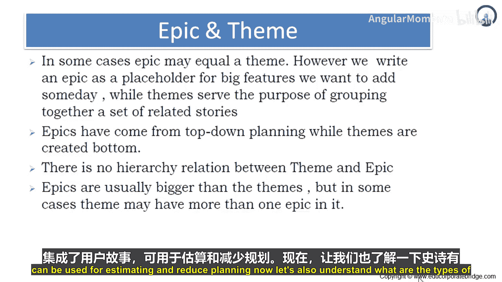
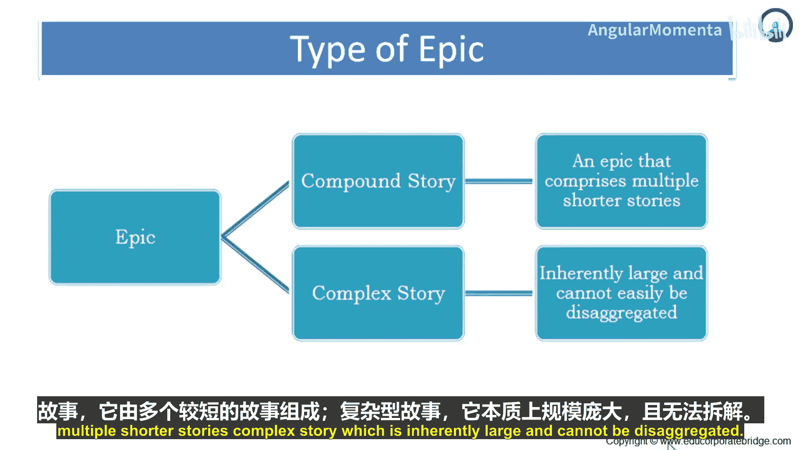
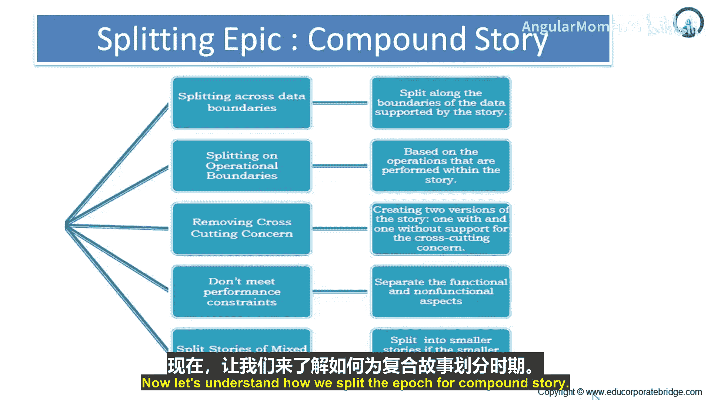
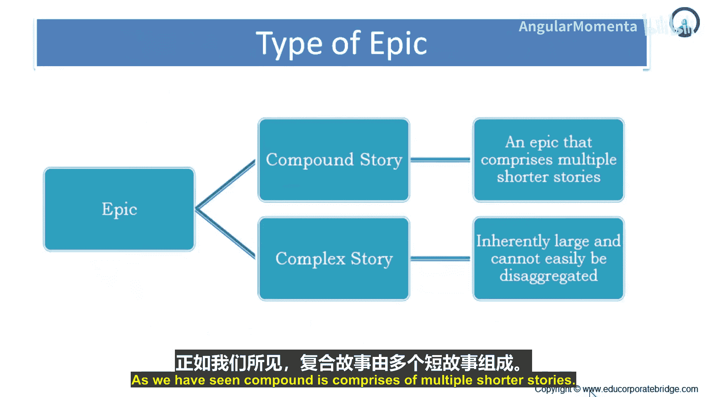
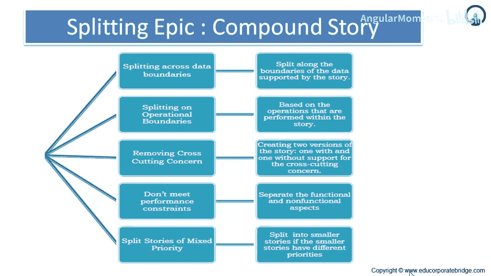

# 019：史诗与主题 🎯

在本节课中，我们将要学习敏捷开发中的两个重要概念：**史诗**和**主题**。我们将了解它们的定义、区别、类型以及如何拆分史诗，帮助你更好地组织和管理大型需求。

## 概述

上一节我们介绍了用户故事的基本概念。本节中，我们来看看当用户故事变得过于庞大时，我们如何处理。我们将重点探讨**史诗**和**主题**，它们是管理大型和复杂需求的关键工具。

## 什么是史诗？ 📖

史诗是一个大型的用户故事。它过于庞大，无法在单个迭代中实现。因此，它需要在某个时间点被分解成更小的用户故事。

传统上，一个用户故事是用户需求的简短描述。例如：
*   用户能够搜索工作。
*   公司能够发布新的职位空缺。
*   用户能够限制谁可以查看她的简历。

这些都是简单的用户故事。但是，如果用户故事是“公司可以发布一个新职位”，那么这背后意味着公司需要拥有一个**职位管理门户**。这就构成了一个庞大的用户故事集合。我们可以说，这不再是一个简单的用户故事，而是一个**史诗**，因为它太大，无法在一个迭代中完成，需要被分解。

例如，“公司可以拥有一个职位门户”这个史诗可以被分解为：
*   公司可以发布简历。
*   公司可以搜索候选人。
*   公司可以下载简历。
*   公司可以筛选简历。

这些就是分解后的不同用户故事。这就是史诗如何被转化为多个用户故事的过程。

## 什么是主题？ 🧩

主题是一组相关的用户故事，这些故事可以组合在一起，作为一个单一实体进行估算或发布计划。

史诗构成大型故事，而主题构成相关故事的集合，可用于估算或发布计划。

回到职位门户的例子，“通过筛选简历”、“通过下载筛选简历”、“通过自动匹配工具筛选简历”这三个用户故事就形成了一个主题，即“访问简历并从中筛选出少数简历”。这三个故事都属于“公司拥有一个职位门户”这个史诗。

简而言之，**史诗是一个大型故事，而主题是一组相关的用户故事，可以组合或作为一个单一实体进行估算或发布计划。**

## 史诗与主题的关系 🔗

在某些情况下，一个大的史诗可能包含一个主题。然而，我们通常将史诗视为未来要添加的大型功能的占位符。而主题的作用是将一组相关的故事分组在一起。

学生有时会混淆史诗和主题。有时它们可能相等，但要理解，我们总是将史诗写为大型故事的占位符。从这个大型故事中，我们分解出具有集成功能的主题，这些主题可用于估算和发布计划。

此外，史诗通常来自**自上而下**的规划，而主题是在**自下而上**时创建的。

理解这个区别：史诗对应于自上而下。意思是，先识别一个大的用户故事，然后将其分解为主题，再进一步分解为用户故事。这种方法是：从一个更大的故事开始，分解为子功能，再进一步分解为功能。

而主题是在底层创建的。例如，在职位门户的例子中，“简历搜索”、“简历匹配”、“简历发布”这些可能成为在底层创建的主题。

主题和史诗之间没有预定义或固定的层级关系，但史诗通常处于顶端，而主题处于底层。史诗通常比主题大。但在某些情况下，一个主题可能包含多个史诗。

想象一种情况，一个主题可能包含多个史诗。以职位门户为例，如果你有一个“简历处理”主题，那么“下载简历”、“匹配简历”、“索引简历”是其中的三件事。而在这三者中，“简历处理”本身也可以成为一个史诗，成为一个更大的故事。

因此，方法是灵活的，但基本原则是明确的：**史诗是一个占位符，是一个更大的故事；主题在底层，包含集成的用户故事，可用于估算和发布计划。**

## 史诗的类型 🧱

现在让我们也了解一下史诗的类型。广义上讲，史诗有两种类型：**复合型故事**和**复杂型故事**。

在复合型故事中，一个史诗由多个较短的故事组成。它是一个由大量较短用户故事复合而成的整体。例如我们举过的例子：“拥有一个职位门户”是一个史诗，而较短的用户故事是“简历发布”、“简历搜索”、“简历下载”、“简历匹配”等。

复杂型故事本质上是庞大的，并且不容易被分解。例如，“处理简历”可能是一个复杂的故事，它无法被进一步分解。

所以，复合型故事，你可以分离出组成部分1、2、3；但在复杂型故事中，你无法真正分离其组成部分，也无法进行分解。

记住有两种类型的史诗：**复合型故事**，由多个短故事组成；**复杂型故事**，本质庞大且无法分解。

## 如何拆分复合型史诗 ✂️

现在让我们了解如何拆分复合型史诗。

正如我们所看到的，复合型史诗由多个较短的故事组成。

以下是拆分复合型故事的几种方式：

1.  **按数据边界拆分**：这主要是沿着故事所支持的数据边界进行拆分。
2.  **按操作边界拆分**：这是第二种拆分类型，基于故事内执行的操作进行拆分。例如，如果你有一个“搜索工作”的用户故事，你可以按操作拆分：在互联网上搜索、通过分类广告搜索、按地点搜索、按职位名称搜索、按薪资搜索。
3.  **移除横切关注点**：这是关于创建两个版本的故事，一个支持横切关注点，另一个不支持。
4.  **不满足性能约束**：这将功能性和非功能性方面分开。当你有一个软件需求时，功能性需求是软件应该做什么（例如，搜索引擎应该快速、准确，给出最可能的结果），而非功能性需求涉及可靠性、可维护性、可用性等。因此，与功能相关的用户故事归为一类，与非功能相关的用户需求归为另一类。你可以通过这种方式拆分复合型故事。
5.  **按混合优先级拆分故事**：如果较小的故事具有不同的优先级，则将其拆分为更小的故事。你可以根据“必须拥有”、“最好拥有”等来拆分故事，并相应地分配优先级。然后，优先开发“必须拥有”的用户故事，一旦完成这些必须的需求，再处理“最好拥有”的需求。这样，你就可以根据混合优先级对故事进行优先排序。

## 总结

本节课中，我们一起学习了敏捷开发中的**史诗**与**主题**。我们明确了史诗是过于庞大、需要分解的大型用户故事，而主题则是用于估算和发布计划的相关用户故事集合。我们探讨了两者的关系、史诗的两种类型（复合型与复杂型），并重点介绍了拆分复合型史诗的五种实用方法。掌握这些概念有助于更好地管理和规划大型、复杂的项目需求。