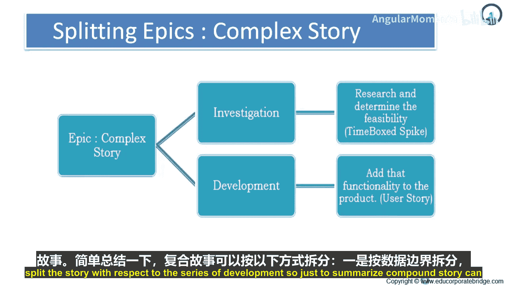
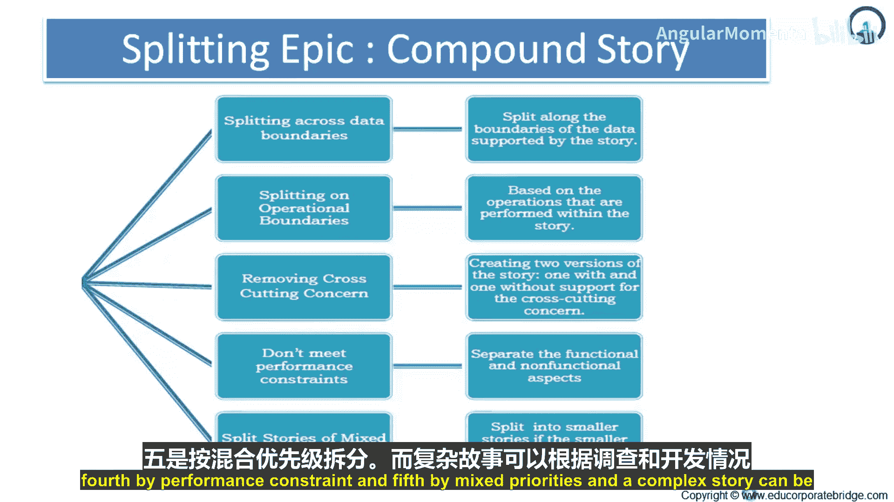
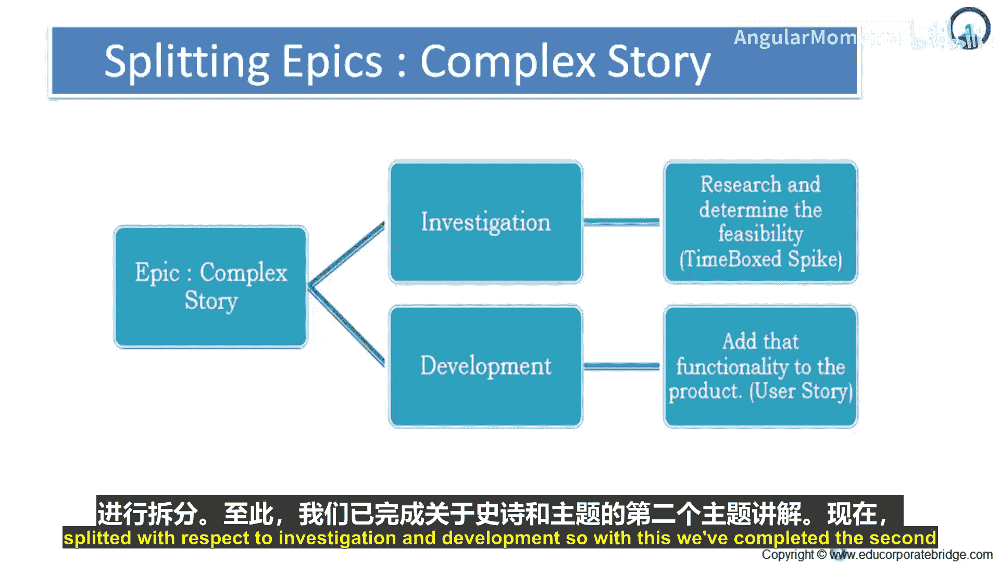
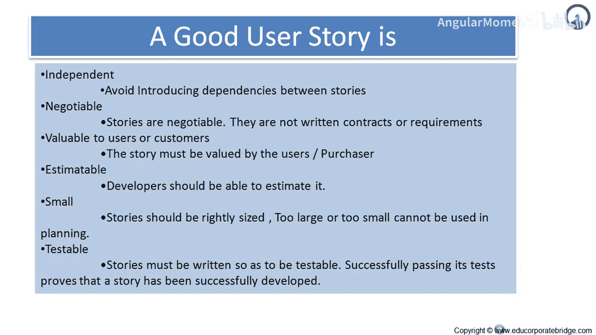

# 020：史诗与主题 🎯

在本节课中，我们将学习如何拆分复杂的故事，并了解构成一个好用户故事的标准。我们将通过具体示例和核心原则，帮助你掌握评估和优化用户故事的技巧。

## 拆分复杂故事的方法 🔍

上一节我们介绍了史诗与主题的概念，本节中我们来看看如何将复杂的故事拆分为更小、更易管理的部分。

根据定义，复杂故事无法直接聚合为更小的故事，因为其中的各个部分相互关联。因此，我们需要特定的方法来处理。

以下是拆分复杂故事的两种主要方法：

*   **通过调研拆分**：此方法涉及研究和确定可行性。你可以设定一个时间盒（Time-boxed Spike）来探索解决方案。通过深入调研，你可以明确实现路径，从而将复杂故事分解。
*   **通过开发拆分**：此方法涉及为产品的用户故事添加功能。例如，对于一个“自动化功能”的复杂故事，你可以先选取其中一小部分进行开发，通过一系列的增量开发来逐步拆分整个故事。

总而言之，一个复合型故事可以通过以下几种边界进行拆分：

1.  **数据边界**
2.  **操作边界**
3.  **横切关注点**
4.  **性能约束**
5.  **混合优先级**

而一个复杂故事则可以通过**调研**和**开发**这两种途径来拆分。

## 什么是好的用户故事？ ✅

理解了如何拆分故事后，我们接下来需要判断一个用户故事本身是否“好”。一个好的用户故事是有效规划和开发的基础。

我们将通过一系列示例来直观感受。请判断以下用户故事是好是坏，并思考原因：

1.  **用户可以在Windows XP和Linux系统上运行该软件。**
    *   **答案：好故事。** 它明确了用户价值（跨平台使用）和验收条件。
2.  **所有图表绘制将使用第三方库完成。**
    *   **答案：不是好故事。** 用户不关心技术实现细节，只关心“能否绘制出所需的图表”这一结果。
3.  **用户可以撤销最多50个操作命令。**
    *   **答案：好故事。** 它描述了具体的、对用户有价值的功能。
4.  **软件将在6月30日前发布。**
    *   **答案：不是好故事。** 这是一个项目约束或目标，应在发布规划中考虑，而非作为一个功能故事。
5.  **软件将使用Java语言编写。**
    *   **答案：通常不是好故事。** 除非产品是面向Java程序员的类库，否则用户不关心实现语言。这属于技术决策。
6.  **用户可以从下拉列表中选择其国家。**
    *   **答案：好故事。** 它清晰描述了用户需要完成的一个具体操作。
7.  **系统将使用Log4J将所有错误信息记录到文件中。**
    *   **答案：不是好故事。** 与示例2类似，它过度指定了技术方案，而非关注“系统需要记录错误信息”这一用户或业务需求。
8.  **如果用户超过15分钟未保存工作，系统将提示其保存。**
    *   **答案：好故事。** 它描述了系统应有的、对用户友好的行为。
9.  **用户可以选择“导出到Excel”功能。**
    *   **答案：好故事。** 它陈述了一个明确的用户需求。
10. **用户可以将数据导出为XML格式。**
    *   **答案：好故事。** 它定义了一个具体的、可验收的功能点。

## 好用户故事的六大特征 📋

通过以上示例，我们获得了一些感性认识。敏捷实践为我们提供了更系统的评估标准，即好用户故事的六大特征（INVEST原则）：

以下是构成一个好用户故事的六个关键特征：

*   **独立的**：故事应尽可能独立，避免与其他故事产生依赖。依赖关系会导致优先级排序和计划制定变得困难，也会让估算更复杂。
    *   **示例**：假设有三个关于支付的故事：“用户可以用Visa卡支付”、“用户可以用Mastercard支付”、“用户可以用American Express支付”。这三个故事高度依赖相同的底层支付接口。
    *   **解决方法**：
        1.  **合并**：将它们合并为一个更大的独立故事，如“用户可以用信用卡支付”。
        2.  **重新拆分**：按不同维度拆分，例如“用户可以用一种信用卡支付”和“用户可以用另外两种信用卡支付”。
        3.  **双重估算**：如果必须保留依赖，可以为卡片标注两个估算值：一个是在依赖故事完成前的估算（较高），一个是在之后的估算（较低）。
*   **可协商的**：用户故事的细节应该是可以讨论的，它不是一份不可更改的合同。故事卡是对话的起点。
*   **有价值的**：每个故事都必须对用户或客户体现明确的价值。它应该回答“为什么需要这个功能？”的问题。
*   **可估算的**：开发团队应该能够估算完成该故事所需的工作量。如果故事太大或太模糊而无法估算，就需要进一步拆分或澄清。
*   **小的**：故事应该足够小，以便在一个迭代（Sprint）内完成。通常团队会设定一个故事点的上限。
*   **可测试的**：故事必须有清晰的验收标准，以便判断其是否完成。一个不可测试的故事意味着需求不明确。

**独立性**尤为重要，因为依赖故事会带来估算和执行上的问题。用户故事作为一个可度量的开发单元，应尽量保持独立。如果存在依赖，就必须考虑上述的合并或拆分策略。

---

本节课中我们一起学习了如何拆分复杂的故事，并通过INVEST原则深入了解了优秀用户故事应具备的六大特征：独立、可协商、有价值、可估算、小型化和可测试。掌握这些标准，将帮助你编写出更清晰、更易于管理和交付的用户故事，从而提升敏捷开发的效率。