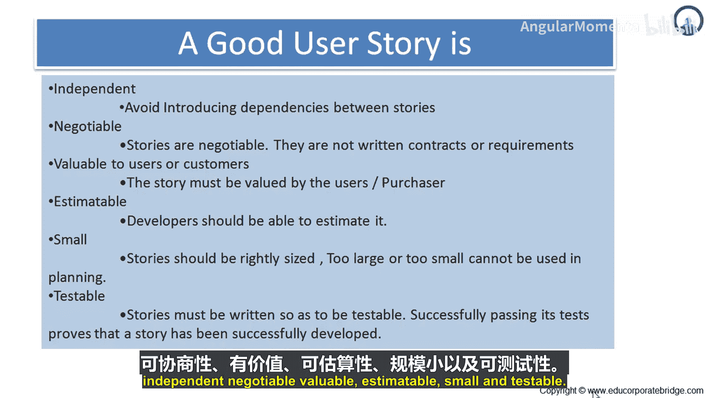
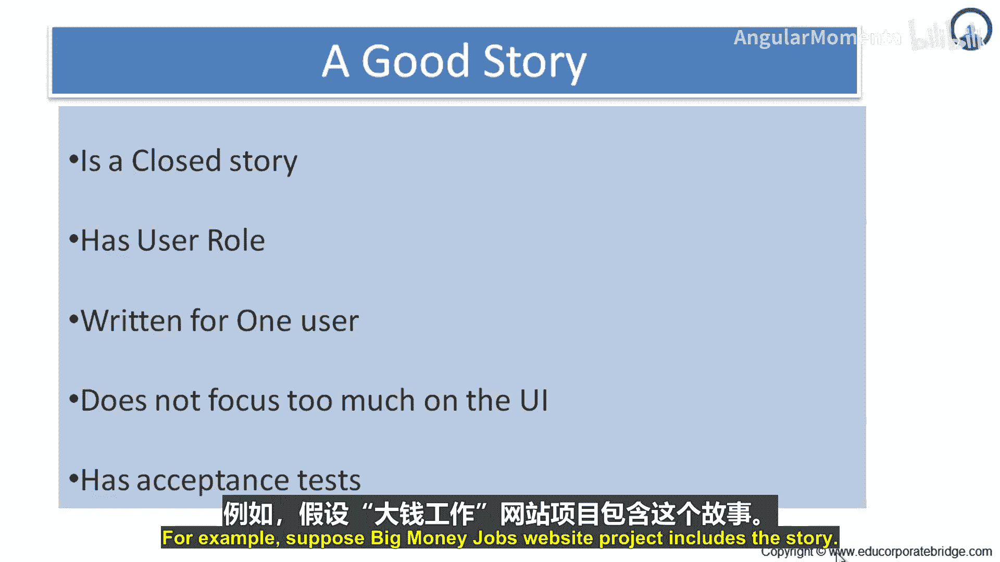
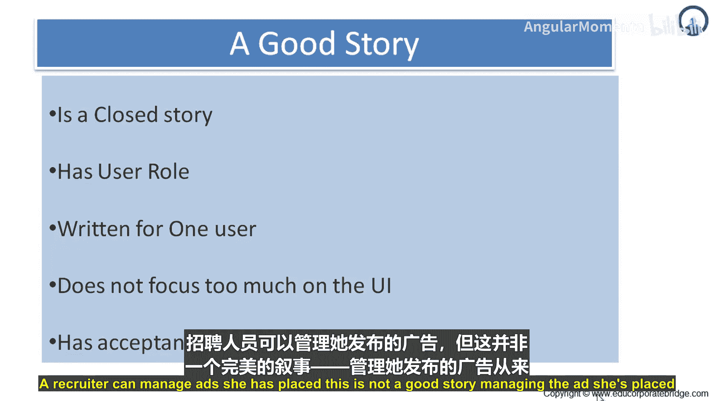
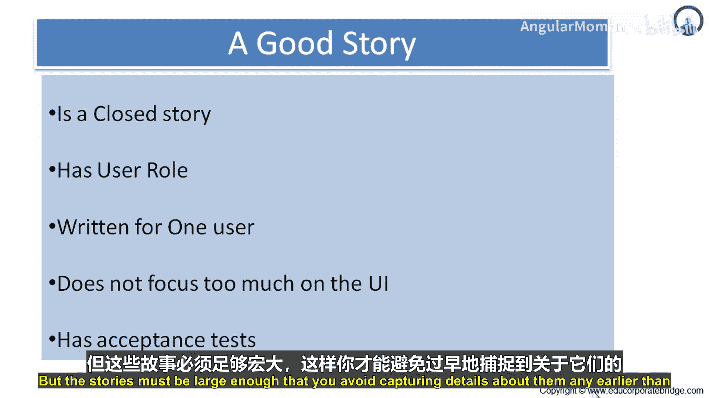
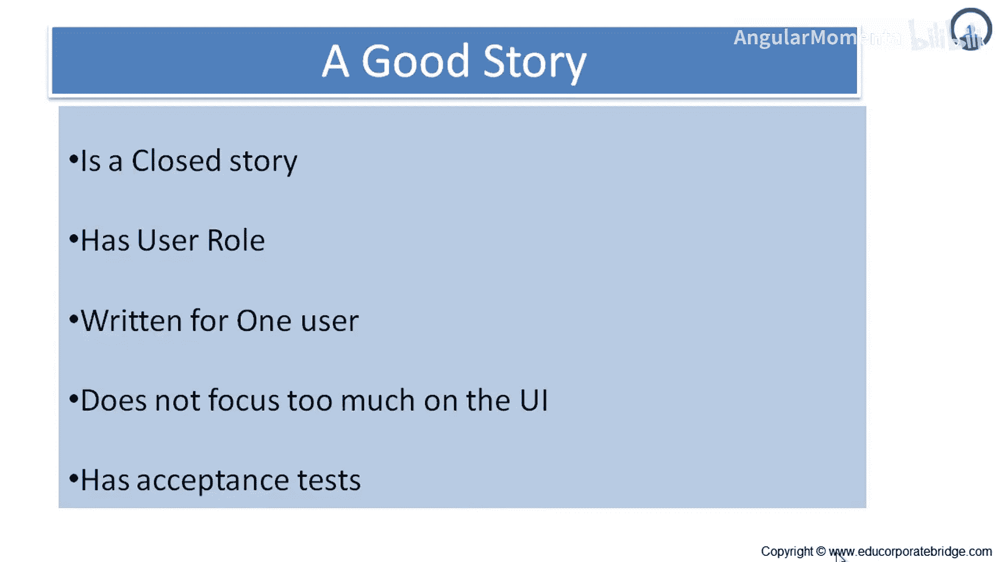

# 022：优秀用户故事的特征解析 📝

在本节课中，我们将深入探讨优秀用户故事的核心特征，特别是其“可测试性”和“完整性”。理解这些特征有助于我们编写出清晰、有效且便于团队执行的用户故事。

上一节我们介绍了用户故事应具备的六个特征，本节中我们重点来看看“可测试性”这一关键特征。

## 可测试性 ✅

优秀用户故事的第六个特征是**可测试性**。用户故事必须以可被测试的方式编写。成功通过测试证明该故事已开发完成。如果故事无法被测试，开发者如何知道编码工作何时结束？

不可测试的故事通常出现在非功能性需求中。非功能性需求是关于软件本身，而非其直接功能的要求。

例如，考虑以下非功能性故事：
*   用户觉得软件易于使用。
*   用户绝不需要长时间等待任何屏幕加载。

按此写法，这些故事是不可测试的。只要可能，测试应实现自动化。这意味着应追求99%的自动化率，而非10%。你几乎总能实现比想象中更多的自动化。

当产品以增量方式开发时，情况可能瞬息万变，昨天还能工作的代码今天可能就失效了。你需要自动化测试来尽早发现此类问题。

只有极少数测试无法实际实现自动化。例如，一个用户故事写道：“无经验的用户无需培训即可完成常见工作流程。”这个故事可以被测试，但无法自动化。测试此类故事可能需要人因专家设计包含观察环节的测试，并选取有代表性的无经验用户作为随机样本。这类测试可能耗时且昂贵，但故事本身是可测试的，并且可能适用于某些产品。

而“用户绝不需要长时间等待任何屏幕加载”这个故事是不可测试的，因为它使用了“绝不”这个词，并且没有定义“长时间”的具体含义。证明某事“绝不”发生是不可能的。一个更简单、更合理的目标是证明某事“极少”发生。这个故事可以改写为：“新屏幕在95%的情况下在2秒内加载完成。”这样，甚至可以编写一个自动化测试来验证它。

另一个例子：“用户可以创建和修改自动化职位搜索代理。”用户应能创建自动化搜索代理，也应能修改此类代理。因此，可测试性以及对需求的验证和确认，是优秀用户故事非常重要的一个方面。

所以，让我们重复一遍，优秀用户故事的六个特征是：**独立的、可协商的、有价值的、可估算的、小的、可测试的**。

## 完整的故事 🎯

一个优秀的故事通常也是一个**完整的故事**。那么，什么是完整的故事呢？

Soren Lauesen在2002年在其需求技术纲要中提出了任务完整性的概念，这一思想同样适用于用户故事。一个完整的故事是指，其完成意味着实现了一个有意义的目标，并让用户感到自己完成了一些事情。

例如，假设“大富翁招聘网站”项目包含这样一个故事：“招聘人员可以管理她已发布的广告。”这不是一个好故事。管理已发布的广告是一项永远不会完全结束的持续性活动。相反，它可以被更好地构建为一组完整的故事。

以下是该故事可能分解出的完整子故事示例：

*   招聘人员可以查看她某一条广告的申请者简历。
*   招聘人员可以修改某一条广告的截止日期。
*   招聘人员可以删除与职位不匹配的申请。

以上每一个完整的故事都是原故事（不完整）的一部分。在完成其中一个完整故事后，用户很可能获得一种成就感。

编写完整故事的愿望需要与竞争性需求相权衡。请记住，故事还需要足够小以便估算，并且能方便地安排进单个迭代周期。但同时，故事必须足够大，以避免过早地捕捉不必要的细节。

---

**本节课总结**

本节课中，我们一起学习了优秀用户故事的两个重要特征：**可测试性**与**完整性**。我们了解到，可测试的故事是确保开发质量与进度的基础，而完整的故事则能带给用户明确的完成感和价值。结合之前学习的独立性、可协商性、有价值、可估算和足够小等特征，我们便能构建出真正高效、实用的用户故事，从而驱动敏捷项目的成功。