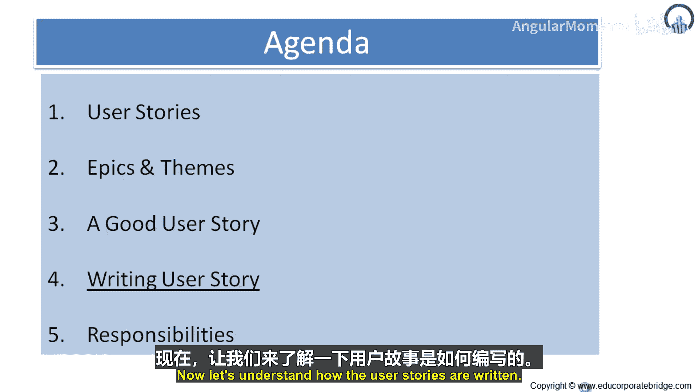
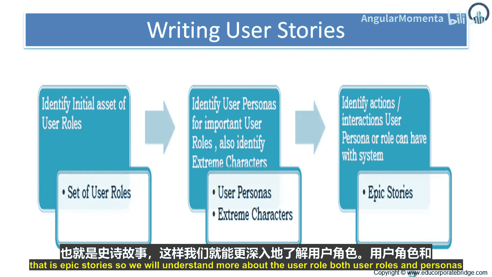
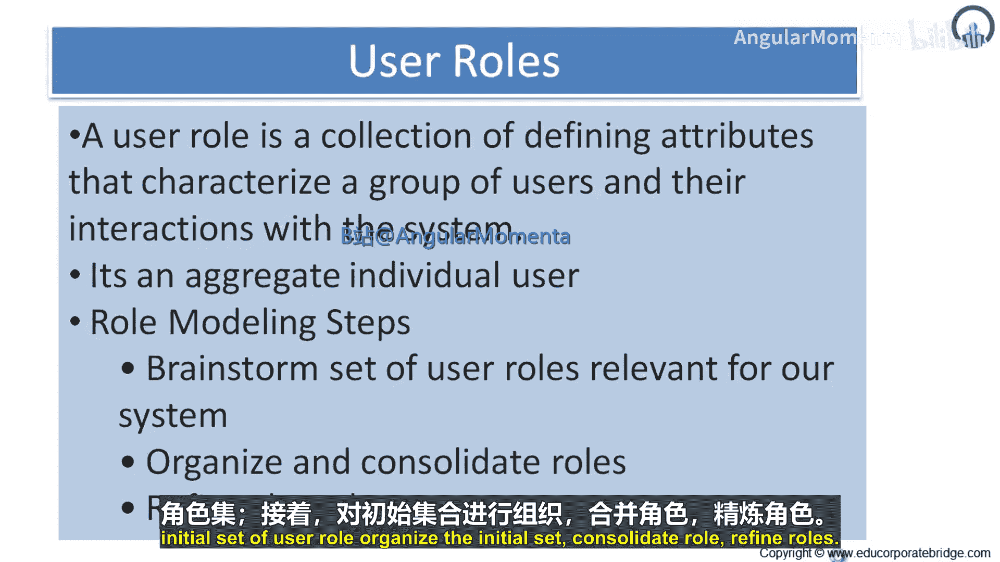
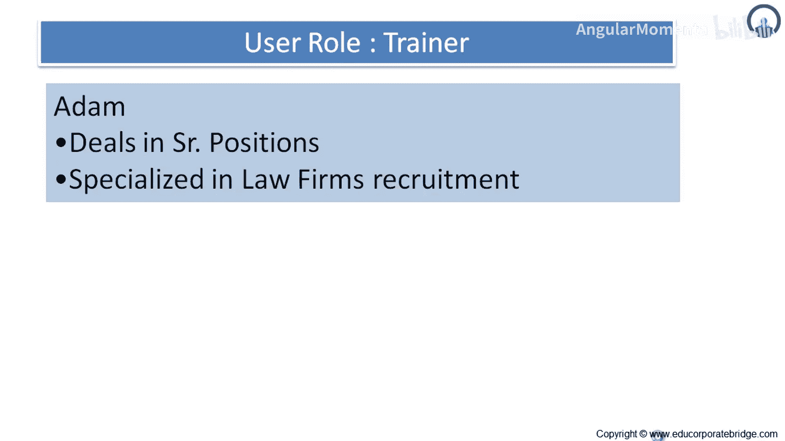
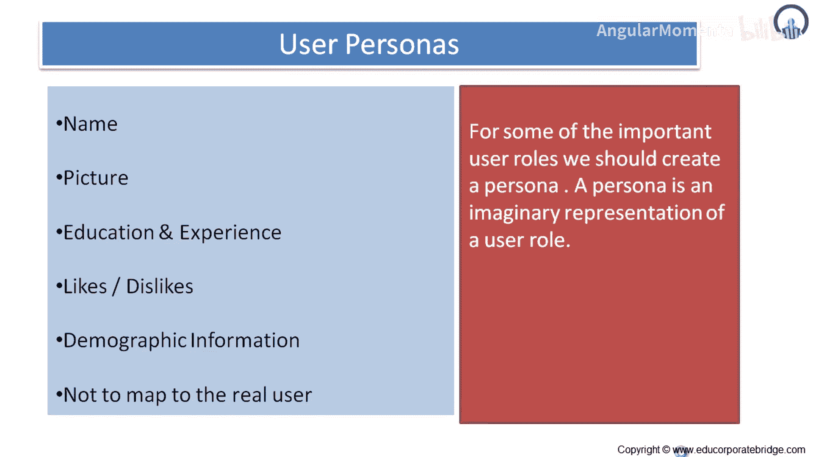

# 024：如何撰写优质用户故事 📝

在本节课中，我们将要学习如何撰写优质的用户故事。用户故事是敏捷开发中表达需求的核心工具，它以用户为中心，描述用户希望系统为其完成什么功能。我们将从理解用户角色和用户画像开始，逐步介绍撰写用户故事的三步流程。

---

## 理解用户角色与用户画像 👥

上一节我们介绍了用户故事的基本概念，本节中我们来看看撰写用户故事的第一步：理解用户角色和用户画像。

用户角色和用户画像都是捕捉和传达用户基本理解的有效手段，但它们存在区别。

*   **用户画像** 描述的是**用户本身**。它们是具象化的模型，旨在模拟真实的用户，甚至包括照片、背景信息和个人历史。这种拟真性有助于团队建立同理心，从用户视角思考问题。
*   **用户角色** 描述的是**用户与系统之间的关系**。它们是抽象的模型，专注于那些与呈现和交互设计最相关的方面。用户角色是一个**集合**，它定义了代表一组用户及其与系统交互的属性。

**角色建模步骤**通常包含以下四步：
1.  头脑风暴，列出初始的用户角色集合。
2.  组织初始集合。
3.  合并相似的角色。
4.  精炼角色定义。

例如，一个用户角色可以是“培训师亚当”，他是一名资深职位专家，专攻律师事务所招聘。

---

## 创建用户画像 🎭

对于某些最重要的用户角色，值得更进一步，为其创建用户画像。用户画像是用户角色的虚构代表。

一个用户画像不仅仅是给用户角色加个名字。它需要被充分描述，让团队中的每个人都感觉认识这个人。例如，之前提到的“马里奥”（负责为公司发布新职位）可以被详细描述。

以下是创建用户画像时通常包含的信息：
*   **姓名**与**照片**
*   **教育背景**与**工作经验**
*   **喜好**与**厌恶**
*   **人口统计信息**

**注意**：用户画像**不是**真实用户的直接映射。在创建前，必须确保进行了足够的市场和人口研究，使所选画像能真正代表产品的目标受众。

一个扎实的用户画像定义，配上一张照片，能让团队对用户有透彻的了解。由于定义通常较长，建议写在纸上并张贴在团队的公共区域。你不需要为每个用户角色都创建画像，但可以为最关键的一两个主要角色创建。

---

## 从角色/画像到用户故事 📖

在识别了用户角色，并可能创建了一两个用户画像后，你就可以开始用具体的角色或画像名称来撰写用户故事，而不是使用泛指的“用户”。

使用角色或画像名称撰写故事，并不意味着其他角色不能执行这些功能，而是意味着在讨论或编码该故事时，思考特定用户角色或画像会带来益处。

例如，与其写：
> 用户可以将职位搜索限制在特定的地理区域。

不如写成：
> 地理搜索者可以将他的职位搜索限制在特定的地理区域。

这样写故事时，可能会让你想起正在毛伊岛找工作的艾伦，从而使故事更具表现力和上下文。

---

## 总结 ✨

本节课中我们一起学习了撰写优质用户故事的方法。我们首先区分了**用户角色**（抽象的关系模型）和**用户画像**（具象的用户代表），并介绍了创建它们的步骤。接着，我们了解到为关键角色创建详细的用户画像能增强团队的代入感。最后，我们实践了如何利用具体的角色或画像名称来撰写更生动、更具上下文意义的用户故事，从而更好地指导开发和设计。记住，核心在于始终从用户的角度出发，思考他们需要系统做什么。