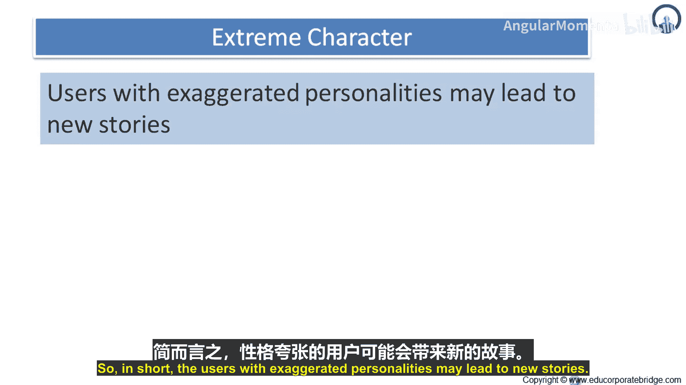
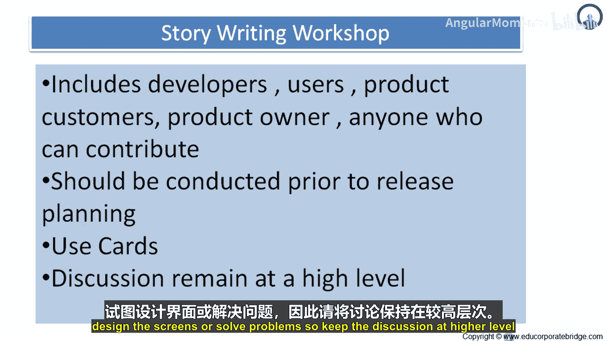
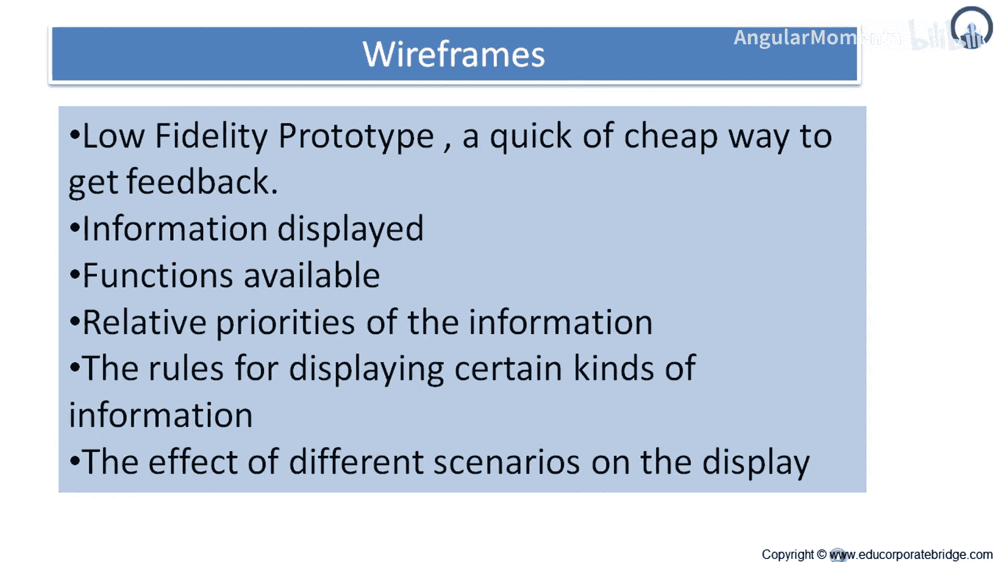

# 025：如何撰写优质用户故事（续篇） 🧩

在本节课中，我们将继续学习撰写优质用户故事的两种高级技巧：**极端角色法**与**故事撰写工作坊**。我们将探讨如何运用这些方法来激发创意、收集需求，并确保讨论聚焦于核心价值。

---

## 理解极端角色法 🎭

上一节我们介绍了用户画像等基础方法，本节中我们来看看一种更具创意的技巧——极端角色法。这是一种在设计新系统时可以考虑的第二种技巧，它建议我们思考具有极端特征的用户。

极端角色法建议，不要只为典型的用户（例如一位衣着光鲜、驾驶宝马车的管理顾问）设计系统，而应考虑具有夸张个性的用户。作者以设计个人数字助理（PDA）为例，建议考虑为以下极端角色设计：
*   一名毒贩。
*   教皇。
*   一位同时周旋于多位男友之间的20岁女性。

考虑极端角色很可能引导你发现那些原本可能被忽略的需求。例如，很容易想象，毒贩和那位有多位男友的女性可能都希望PDA能维护多个独立的日程表，以防设备被警察或某位男友看到。教皇可能对保密性需求较低，但可能希望字体更大。

然而，虽然极端角色法可能催生新的故事，但很难判断这些故事是否应该被纳入产品。因此，可能不值得投入大量时间，但你可以尝试使用极端角色法。至少，你可以花几分钟有趣地思考一下教皇会如何使用你的软件，这可能会带来一两个有价值的洞见。

**核心概念**：`考虑极端角色 -> 可能发现隐藏需求 -> 需评估其产品价值`

总而言之，考虑具有夸张个性的用户可能会引发出新的用户故事。

---

## 理解故事撰写工作坊 ✍️

既然用户故事会在项目中不断演变和更替，我们就需要一套轻量、可迭代使用的技巧来收集它们。一些最有价值的创作故事集的技巧包括用户访谈、问卷调查、观察和**故事撰写工作坊**。

让我们花些时间更深入地了解故事撰写工作坊。在故事撰写工作坊期间，重点应放在**数量而非质量**上。即使你最终会以电子方式保存故事，在工作坊期间也请使用卡片。让想法自然涌现并写下来。一个现在看起来糟糕的想法，可能在几周后显得很出色，或者它能启发另一个故事。

此外，你**不**希望陷入冗长的辩论或完善某个故事的细节中。如果一个故事是多余的，或者之后被更好的故事取代，你只需撕掉那张卡片即可。同样，当客户为版本排列故事优先级时，她可以将低质量的故事赋予低优先级。

有时，工作坊的某些参与者很难开始或突破某个瓶颈。在这种情况下，能够参考竞争产品或类似产品会非常有益。请注意工作坊中是谁在贡献想法。偶尔会有参与者在大部分或全部会议期间保持沉默。如果出现这种情况，请在休息时与该参与者交谈，确保她对流程感到舒适。有些参与者不愿在同事和上级面前发言，这就是为什么在会议期间**不评判**故事想法非常重要。一旦参与者确信他们的想法只会被记录下来，而不会在此时被争论，他们就会更愿意贡献。

最后，需要重申的是，用户故事工作坊期间的讨论应保持在非常高的层面。目标是**在尽可能短的时间内写出许多用户故事**。这不是设计界面或解决问题的时候。

以下是故事撰写工作坊的关键要点：
*   **参与者**：包括开发者、用户、产品客户、产品负责人以及任何能做出贡献的人。
*   **时机**：应在发布计划之前进行。
*   **工具**：应使用卡片。
*   **讨论层级**：保持在高层级，不试图设计界面或解决问题。

---

## 总结 📝

本节课中，我们一起学习了两种提升用户故事撰写质量的高级技巧。**极端角色法**通过考虑具有夸张特征的用户，帮助我们跳出思维定式，发现潜在需求。**故事撰写工作坊**则提供了一个高效、协作的环境，鼓励团队快速产生大量故事创意，并强调在初始阶段追求数量与广度，而非细节与深度。掌握这些方法，能让你的需求收集过程更具创造性和包容性。