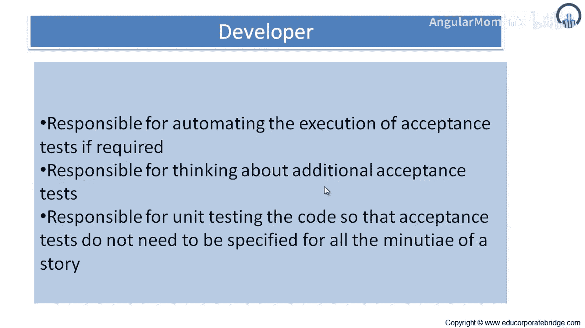

# 026：职责与责任

在本节课中，我们将学习用户故事完成后，不同项目干系人（特别是客户和开发人员）所承担的职责与责任。我们将明确各方在用户故事识别、编写、测试和验收过程中的具体任务。

## 📝 线框图：快速原型与反馈工具

上一节我们介绍了用户故事编写工作坊，本节中我们来看看线框图。

线框图是一种原型吗？是的。它是一种低保真度的原型，是一种获取反馈的快速且低成本的方式。因此，一旦开发出线框图，就很容易获得反馈和用户输入，通过调整一些方框的位置、对齐方式并获得签字确认。

线框图更多地关乎信息展示。它规划了信息如何在页眉、页脚、列、功能区、菜单、子菜单以及下钻操作中显示。它列出了可用的功能列表、这些功能对应的权限，以及用户如何在软件中导航。

线框图还给出了信息的相对优先级。通过“相对”一词，意味着你将拥有层级式的下钻信息：首先在全局层面获得摘要，下钻后可以进入国家级视图，进一步下钻会进入州级，再下钻则会进入区级。这种分层级的相对信息展示是必要的，因为将所有信息显示在一个屏幕上是不可能的，否则用户的理解、分析和解读将面临挑战。

线框图也设定了展示特定信息类型的规则。例如，如果用户有一个选择菜单，那么相关的规则将被设定：如果用户选择输入A，输出应与A组相关；或者，如果用户给出某些输入，基于此会进行某些算术计算，并相应地显示结果。因此，线框图能够为展示特定类型的信息设定规则。

线框图还能展示不同场景对显示效果的影响。例如，如果存在参数设置，当用户设置某些参数时，线框图也能展示这些参数设置对最终输出的影响。

以下是一个基本线框图的示例：
*   左上角可以看到公司或软件的标志。
*   有一个购物篮项目。
*   流程从登录/创建账户开始，然后进入主屏幕，依此类推。

你可以开发这样的线框图。它是一种快速有效的原型，通过它你可以获取需求、微调需求、设定条件、构建规则，并推进用户故事的编写。

至此，我们完成了关于用户故事的第四章内容。

## 👥 干系人的职责与责任

现在我们将理解他们在用户故事方面的责任。这里的“他们”指的是项目干系人。关于用户故事，他们各自有什么责任呢？

### 客户的责任

客户的责任是识别适当的角色。这里的“适当角色”指的是Scrum主管、产品负责人、开发人员、测试人员、业务用户等。

客户需要参与识别用户角色和人物角色的过程。如你所知，用户故事关乎用户角色和人物角色。而客户对用户角色和人物角色有很好的了解，因此客户在提供用户角色和人物角色输入方面的参与，对项目成功至关重要。

客户需要编写故事。每个客户都是业务用户，都有一些需求，因此他或她需要编写适用的故事。在编写故事时，要确保每个故事至少能关联到一个用户或人物角色。因此，编写用户故事并确保其附属于用户角色或人物角色，这种组合将为开发人员进行开发提供完整的图景。这对于有效的软件开发非常关键。

如果你在编写故事时需要帮助，你有责任安排和主持故事编写工作坊。因此，如果你遇到困难或需要帮助，最好的方法是设立一个故事编写工作坊，设定主题，列出需要编写的用户故事清单，获取关键干系人的输入，并逐一编写故事。

### 开发人员的责任

那么，开发人员在用户故事方面有什么责任呢？

首先，开发人员应参与识别用户角色和人物角色的过程。负责开发软件的开发人员应该帮助并参与其中，以便更好地理解用户角色和人物角色。这样，当他拿到用户故事时，就能通过编码有效地进行开发。

开发人员可以参与编写用户故事。对于非功能性需求或某些功能性需求，开发人员也可以编写用户故事；或者，当客户难以写出好的用户故事时，开发人员可以自己编写故事。

在早期的章节中，我们讨论过用户故事也需要验收测试。因此，你需要编写验收测试。要编写验收测试，你需要有一个用户故事，为每个用户故事编写一个验收测试。对于项目中的所有用户故事，你都需要为每个独立的故事准备验收测试。一旦你能对单个用户故事进行验收测试，你就可以编写称为SUT的系统测试，以整体测试系统。这样，你将为发布做好准备。

### 验收测试的职责划分

关于验收测试的编写，职责划分如下：客户负责编写验收测试。客户提供需求，因此他也需要给出需要满足的条件，以便用户故事的验收得以完成。编写的测试应尽可能为故事增加价值和清晰度。不仅要编写验收标准，还要编写具体的值。例如，如果你需要屏幕响应时间为2毫秒，容差为±0.1毫秒，那么你需要写明屏幕响应时间应在1.9毫秒到2.1毫秒之间。如果需要检查分贝值，你需要说明通过声级计检查分贝值。

因此，客户编写了用户故事，客户编写了验收测试，开发人员完成了开发。现在是客户执行验收测试的时候了。通过进行验收测试，用户将第一时间提供信息和反馈，说明开发是否符合预期，是否满足验收测试概述的质量要求。

所以，开发人员在验收测试中也扮演着重要角色。开发人员负责在可能和需要的情况下，自动化执行验收测试。正如我们所理解的，敏捷原则之一就是自动化测试。因此，对于从客户那里收到的验收需求，开发人员应该将其自动化。例如，Fitnesse、TestComplete是自动化工具之一，市场上还有很多专业的测试自动化工具，如IBM Rational等。

开发人员还负责考虑额外的验收测试。如果开发人员认为有更多需要测试的内容，而客户提供的验收测试覆盖不足，他可以全面地填补空白，编写额外的标准以使验收测试更全面。

开发人员负责对代码进行单元测试，这样就不需要为故事的每一个微小细节都指定验收测试。因此，在客户进行验收测试之前，开发人员会进行单元测试，以便修复一些微小的缺陷。真正由客户识别的缺陷，是那些在开发代码中仍然存在的缺陷；否则，大多数缺陷都由开发人员自己识别和修复了。

## 📚 总结

本节课中，我们一起学习了用户故事完成后各方职责的划分。我们明确了客户在识别角色、编写故事和验收测试中的核心作用，以及开发人员在理解需求、协助编写、实施自动化测试和进行单元测试中的关键责任。理解并履行这些职责，是确保用户故事被正确理解、开发和验收，从而推动敏捷项目成功的重要基础。