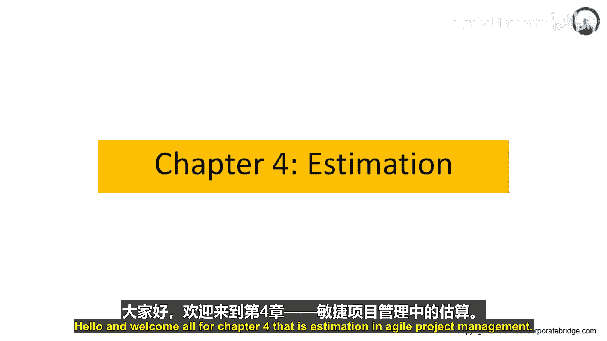
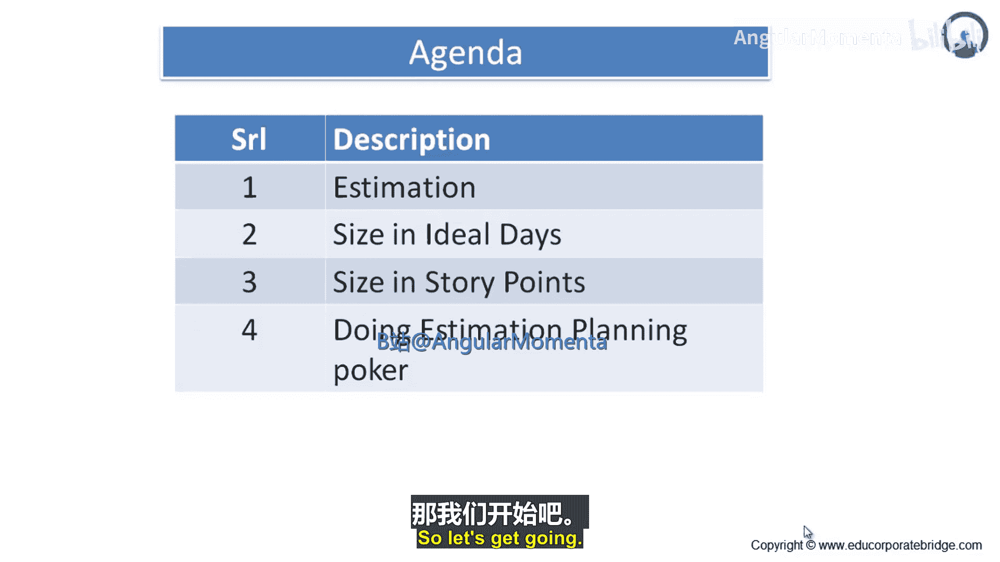
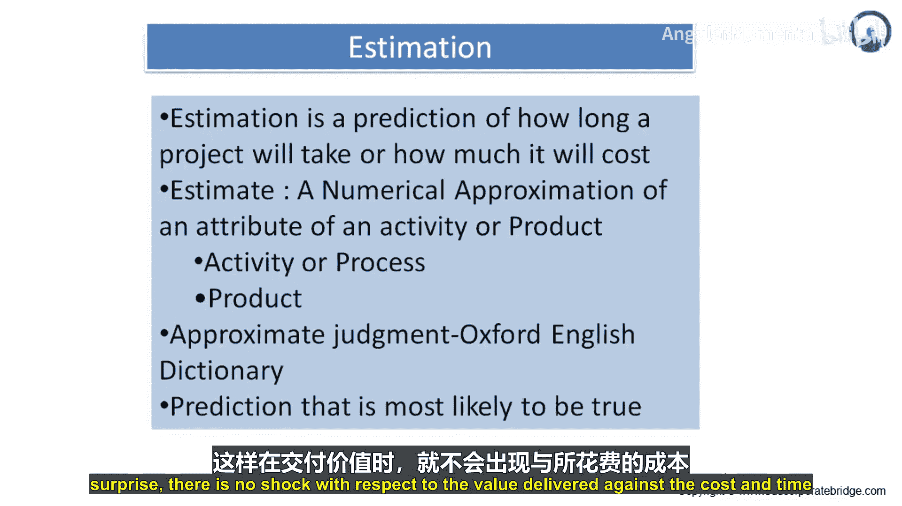
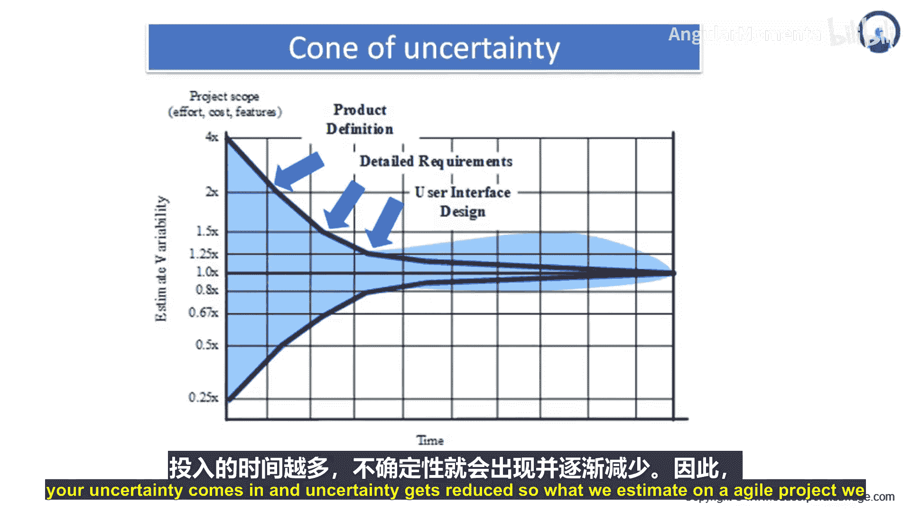
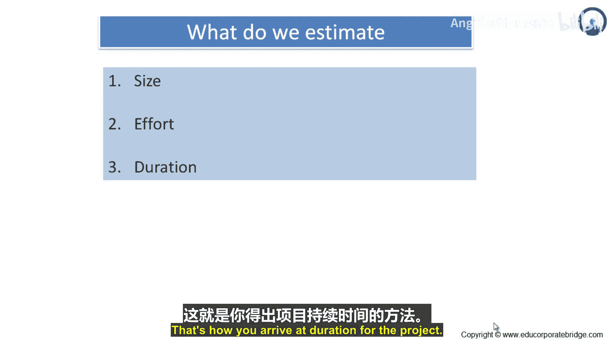

# 027：估算导论 🎯

在本节课中，我们将学习敏捷项目管理中的估算。我们将探讨什么是估算、为什么需要估算，以及如何在敏捷项目中估算规模、工作量和持续时间。课程将介绍“不确定性锥”的概念，并解释估算如何随着项目进展而变得更加精确。

## 什么是估算？🤔

上一节我们介绍了本章的主题，本节中我们来看看估算的基本定义。

估算是对项目将花费多长时间或多少成本的预测。它是一种预测，用于决定是否启动项目、了解项目所需资源（主要是人力资源、时间和成本），以及在项目进行中，对照估算来评估实际进展。

估算是对一项活动或产品的数值近似。在敏捷项目中，我们通过用户故事获取需求，并估算所有用户故事所需的工作量。我们还会估算测试、部署和发布所需的工作量。通过自下而上、自上而下、专家意见或类比等方法汇总这些估算，我们就能得出项目的总持续时间。估算可以在活动或流程层面进行，具体取决于项目经理希望分解的详细程度。也可以对产品本身进行估算。

牛津词典将估算定义为“近似的判断”。因此，估算本身是近似的，其准确度也因估算阶段和估算类型而异。例如，粗略估算非常模糊，数量级估算范围较大，而专家判断或确定性估算则较为准确，可能在实际成本或时间的-10%到+5%之间浮动。请记住，预测不是占星术，而是基于特定事实、数据和统计的。敏捷项目经理管理估算，使其尽可能接近实际结果。估算的接近程度是项目经理的成功因素之一。如果偏差过大（即需要额外的时间、成本或资源），项目经理就必须与利益相关者、发起人和客户沟通，这反过来会给项目经理带来负面印象。

总而言之，估算是一种预测。我们对活动、流程或产品进行估算，并且需要准确或接近实际成本，这样在交付价值所花费的成本和时间方面就不会出现意外或冲击。

## 不确定性锥 📊

上一节我们定义了估算，本节中我们来看看影响估算精度的“不确定性锥”。

“不确定性锥”阐述了估算的可变性如何随时间变化。如图所示，在项目初期，对于项目范围、工作量、成本和功能存在高度的不确定性。随着你推进到产品定义阶段，不确定性会降低。进入详细需求阶段，不确定性进一步减少。当你进行用户界面设计和软件开发时，不确定性继续降低。最终，在测试和发布阶段，不确定性几乎变为零。

从逻辑上理解：当你开始处理产品范围、其工作量、成本和功能时，你对产品的了解很少，因此处于高度不确定性的阶段。当你获得产品定义时，你开始将事物纳入框架，明确包含和排除的内容。当你获得用户故事和详细需求时，你确切知道要做什么，但在集成、适配和发布方面仍存在一些不确定性。通过开发用户界面、设计软件、建立企业架构等步骤，你尽可能地消除了不确定性。因此，“不确定性锥”描绘了估算可变性随时间的变化：在项目上花费的时间越多，确定性就越高，不确定性则降低。

## 我们在敏捷项目中估算什么？📝

上一节我们了解了不确定性如何影响估算，本节中我们来看看在敏捷项目中具体估算哪些内容。

在敏捷项目中，我们主要估算三样东西：规模、工作量和持续时间。

*   **规模**：指的是一个版本中包含多少用户故事，包含哪些功能。这构成了项目的“大小”。
*   **工作量**：指的是构建、开发或编码这些用户故事，并进行测试和发布所需的人力投入。
*   **持续时间**：指的是从项目开始到发布所需的时间。持续时间是通过获取需求、规划活动、为活动分配资源、为“资源-活动”组合分配时间，然后汇总得出的。你估算每个用户故事的持续时间，然后汇总所有用户故事及其所需时间，从而得出项目的总持续时间。

## 总结 📚

本节课中我们一起学习了敏捷项目管理中的估算基础。我们首先明确了估算是对项目时长或成本的预测，用于决策和追踪进展。接着，我们探讨了“不确定性锥”的概念，理解了项目初期的不确定性最高，并随着项目细节的明确而逐渐降低。最后，我们明确了在敏捷项目中需要估算的三个核心要素：**规模**（如用户故事数量）、**工作量**（所需的人力投入）和**持续时间**（项目总时长）。掌握这些基础概念是进行有效敏捷估算的第一步。