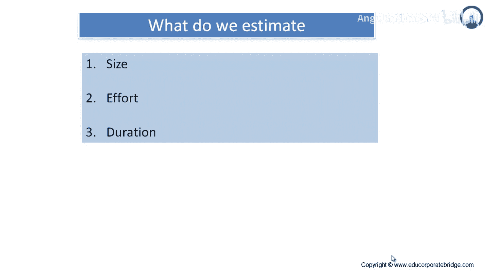
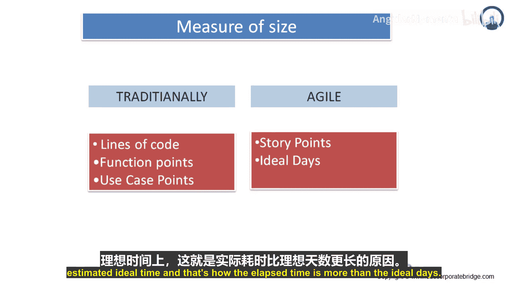
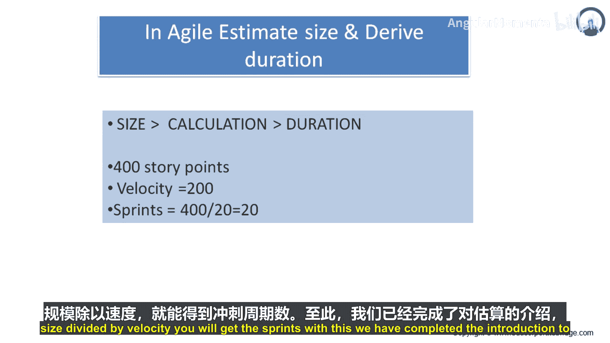
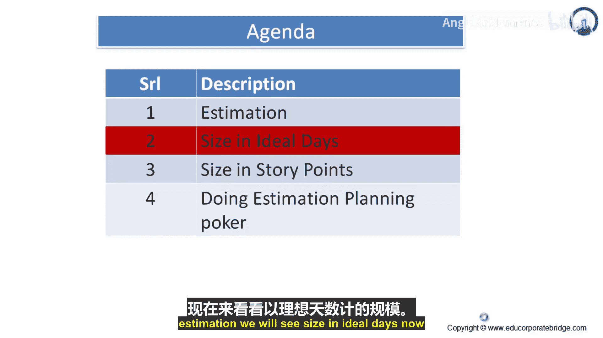

# 028：尺寸测量 📏



在本节课中，我们将要学习敏捷项目中如何测量工作的“尺寸”。我们将探讨传统方法与敏捷方法的区别，并重点理解**故事点**和**理想人天**这两个核心的尺寸度量单位。

## 概述

准确估计工作规模是项目规划的基础。传统上，我们通过代码行数、功能点或用例点来衡量软件规模。然而，在敏捷开发中，我们主要使用**故事点**和**理想人天**来评估用户故事或特性的规模。本节将详细介绍这两种方法及其应用。

## 传统尺寸测量方法

在深入敏捷方法之前，我们先回顾一下传统的尺寸测量方式。

传统上，测量软件规模时，通常使用代码行数。但并非所有代码行都能为软件增加价值，例如注释行、文件头尾和循环结构等。因此，除了代码行数，传统方法还会测量功能点，即代码中包含多少功能点；以及用例点，即开发和项目中包含多少用例点。这些是传统的估算方式。

## 敏捷尺寸测量方法

上一节我们介绍了传统方法，本节中我们来看看敏捷方法的核心度量单位。

在敏捷开发中，尺寸的主要度量单位是**故事点**和**理想人天**。

### 故事点

故事点是用于表达用户故事、特性或其他工作项整体规模的度量单位。

当我们使用故事点进行估算时，会为每个工作项分配一个点值。我们分配的具体数值本身并不重要，重要的是数值之间的**相对关系**。例如，一个被估值为2个故事点的故事，其工作量应该是估值为1个故事点的故事的两倍，同时也应该是估值为3个故事点的故事的三分之二。

以下是两种常见的初始估算方法：

*   **第一种方法**：选择一个你预期会完成的、较小的工作项，并将其估值为1个故事点。
*   **第二种方法**：选择一个看起来中等规模的工作项，并给它一个你预期使用范围内的数字（例如3或5）。

### 理想人天

在软件项目中，用理想时间来预测一个事件的持续时间，几乎总是比用实际流逝的时间更简单、更准确。

理想时间与实际流逝时间不同，并非因为超时、不完整的传递或“受伤”，而是因为我们每天都会经历的自然开销。在任何一天，除了处理项目计划内的活动，团队成员可能还需要花时间处理邮件、给供应商打支持电话、面试分析师职位的候选人以及参加多个会议。

理想时间不等于实际流逝时间的更多例子包括：支持当前版本、技能提升时间、会议、演示、个人事务、电话、特殊项目、培训、邮件审阅和走查、面试候选人、任务切换、修复当前版本的缺陷以及管理评审。

当经理问团队成员“这需要多长时间？”时，问题就可能出现。团队成员回答“五天”。经理于是在日历上数出五天并标记出来。然而，团队成员真正的意思是“如果我只做这一件事，需要五天。但我还有很多其他事要做，所以实际上可能需要两周。”此外，多任务处理也会扩大理想时间与实际流逝时间之间的差距。就像足球教练不会让球员同时去打一场高优先级的冰球比赛一样，被要求多任务处理的软件开发者在切换任务时会损失大量效率。

在估算软件项目时，我们可能会选择用理想人天来估算用户故事或其他工作。当使用理想人天估算时，你假设被估算的故事是你唯一要做的工作，开始时所需的一切都已就绪，并且不会有任何中断。

所以请记住，理想人天更多地关乎你的优先级：你是只做一件事还是同时处理多件事？开始工作时你是否拥有所有资源？工作中是否有任何中断或干扰？

## 理想人天作为规模度量

当我们估算一个用户故事所需的开发、测试和验收的理想人天数时，无需考虑团队工作环境开销的影响。例如，开发一个特定界面需要我1个理想人天。无论我是受雇于一个没有额外开销或时间要求的初创公司，还是一个庞大的官僚机构，这1个理想人天的工作量是不变的。

当然，在时钟或日历上实际流逝的时间会有所不同。在低开销的初创公司，我可能接近完成1个理想人天的工作。随着对我时间要求的增加，我能用于项目交付物的时间就减少了，完成1个理想人天工作所需的实际流逝时间就会增加。

当忽略组织开销的考虑时，理想人天可以被视为另一种规模估算，就像故事点一样。一个以理想人天数表达的规模估算，可以**使用速率**以与用户故事点完全相同的方式转换为持续时间估算。

因此，理想人天是指**不考虑迭代周期、只做此项工作且所有资源可用的情况下，一个资源完成任务所需的时间**。由于组织设置带来的各种开销会加在估算的理想时间之上，这就导致了实际流逝时间多于理想人天。

## 敏捷项目如何估算规模并推导工期

了解了核心概念后，我们来看一个具体的应用示例。

假设你需要为组织开发一个招聘门户，该项目总规模为 **400个故事点**。团队的速度是 **每个冲刺完成20个故事点**。

那么，所需的冲刺数量可以通过以下公式计算：

```
所需冲刺数 = 总规模 / 团队速度
```

代入数值：

```
所需冲刺数 = 400 / 20 = 20个冲刺
```

所以，完成这个项目大约需要20个冲刺。





## 总结



本节课中我们一起学习了敏捷项目中的尺寸测量。我们了解到，敏捷方法摒弃了传统的代码行数等度量，转而使用**故事点**来衡量工作的相对规模，以及使用**理想人天**来估算在理想条件下的纯工作时间。关键在于理解理想时间与实际日历时间的区别，并学会通过 **`规模 / 速度 = 所需冲刺数`** 这个基本公式，从规模估算推导出项目的大致工期。至此，我们完成了对估算的介绍。