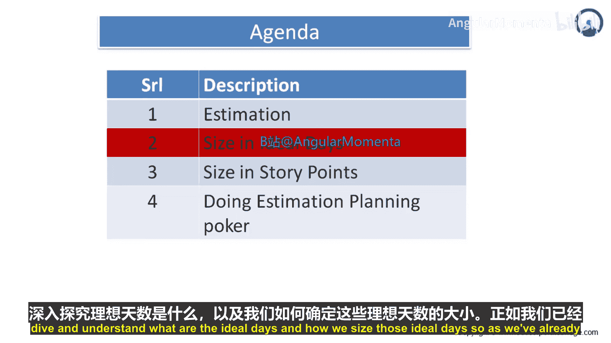
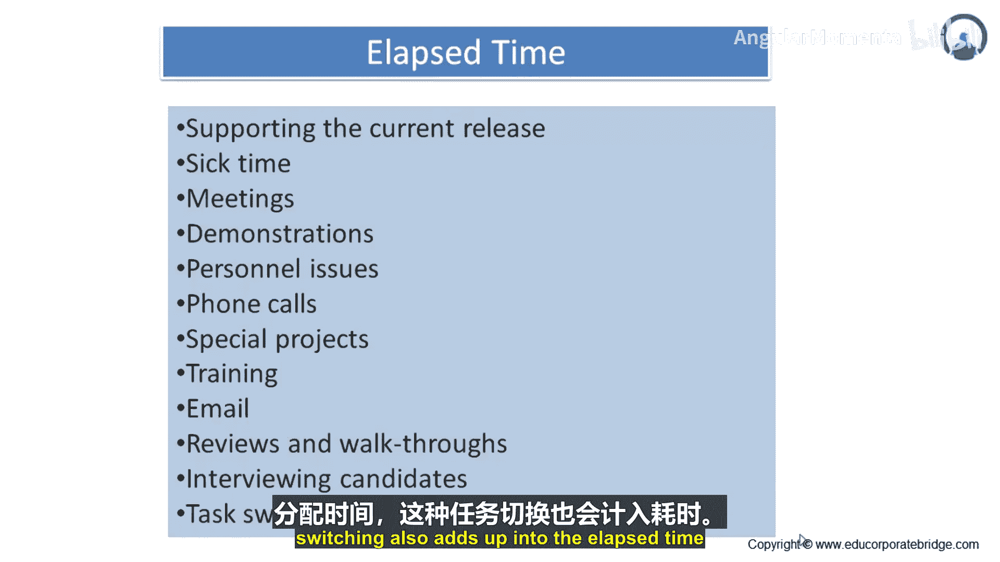

# 029：深入理解理想日与规模估算



在本节中，我们将深入探讨“理想日”的概念，并学习如何对理想日进行规模估算。上一节我们介绍了“理想的一天”是什么，本节中我们来看看理想日的具体构成及其与“实际耗时”的区别。

## 什么是理想日？

理想日是指，当你**100%专注于**某项特定活动，且**没有任何中断**时，完成该活动所需的时间。这意味着：
*   这是你唯一的工作任务。
*   所有必要的工具、资源、设备和人力支持都已就绪。
*   没有会议、电话、邮件或其他事务的干扰。

因此，理想日代表了一项任务可能的最短估计时间。

## 理想日与实际耗时

与理想日相对的是**实际耗时**。在实际工作中，你无法避免各种中断和资源限制，因此完成同一任务实际花费的时间总会超过理想日。

以下是构成实际耗时的主要部分：

*   **支持当前发布**：包括文档编写、测试、确保用户采纳度、培训最终用户等。
*   **病假时间**：因身体不适而无法工作的时间。
*   **会议与演示**：包括每日站会、定期评审、客户咨询、电话会议。准备演示、进行演示以及根据反馈修改所花费的时间也属于此类。
*   **个人事务**：例如处理银行交易、支付账单、接送机等。
*   **电话沟通**：回答疑问、澄清问题、寻求信息等。
*   **特殊项目**：参与组织战略倡议，如提供需求反馈、面试资源、确保项目治理合规等。
*   **培训**：为适应新技术或新版本而进行的学习或授课。
*   **电子邮件**：日常大量的邮件阅读、回复和报告分发。
*   **评审与走查**：在敏捷项目中，包括每日评审、演示、周度回顾、审计以及代码走查等。
*   **面试候选人**：为项目招募新成员。
*   **任务切换**：由于多任务处理，根据优先级切换任务所消耗的时间。

## 核心概念总结

我们可以用以下公式来理解理想日与实际耗时的关系：

**实际耗时 = 理想日 + 所有中断与等待时间**

或者，更直观地通过代码逻辑表示：

```python
def calculate_elapsed_time(ideal_days, interruptions):
    """
    计算实际耗时。
    ideal_days: 理想日估算。
    interruptions: 所有中断任务消耗的时间列表。
    """
    total_interruption_time = sum(interruptions)
    elapsed_time = ideal_days + total_interruption_time
    return elapsed_time # 返回值总是大于 ideal_days
```



本节课中，我们一起学习了理想日的精确定义，并详细分析了导致实际耗时远超理想日的各种因素。理解这两者的区别，对于做出更准确的项目时间估算至关重要。下一节，我们将探讨如何利用这些概念进行有效的任务规模估算。