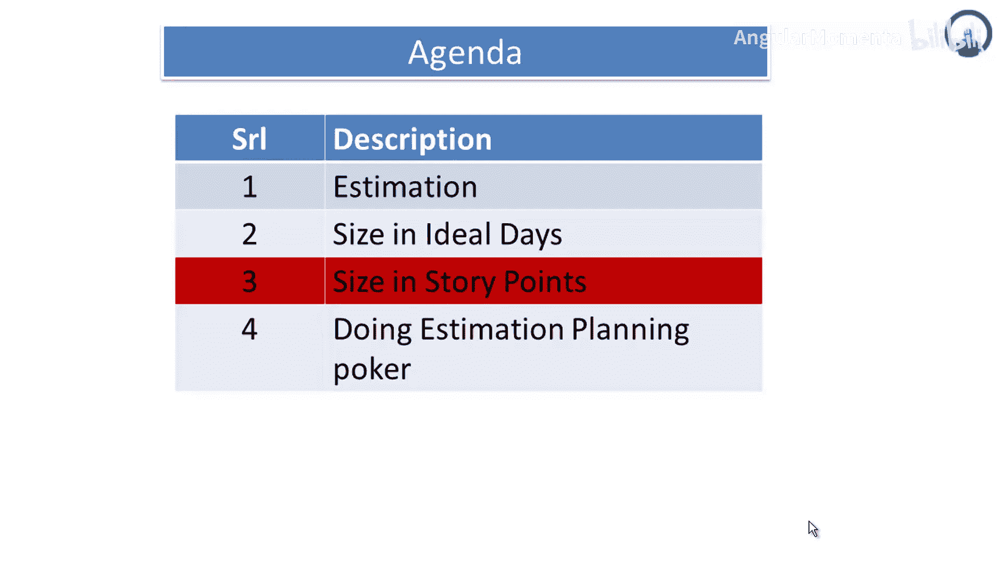
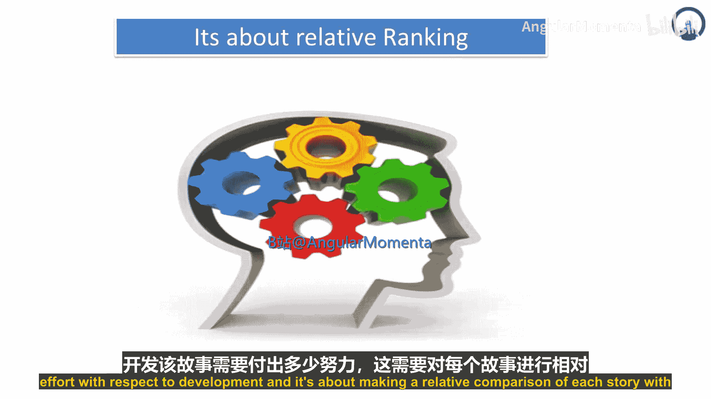
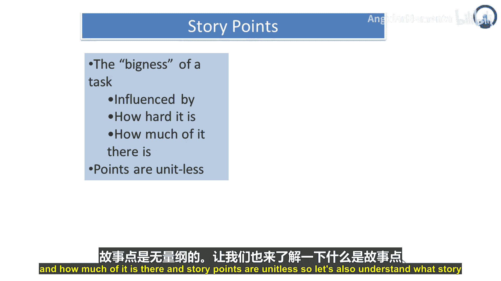
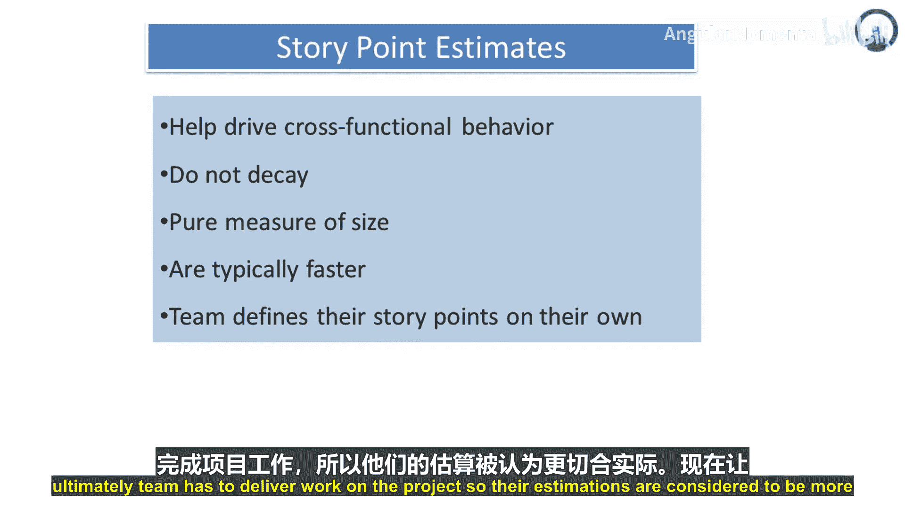
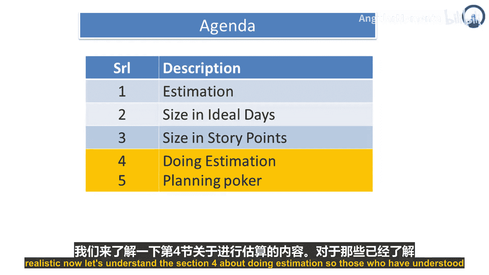
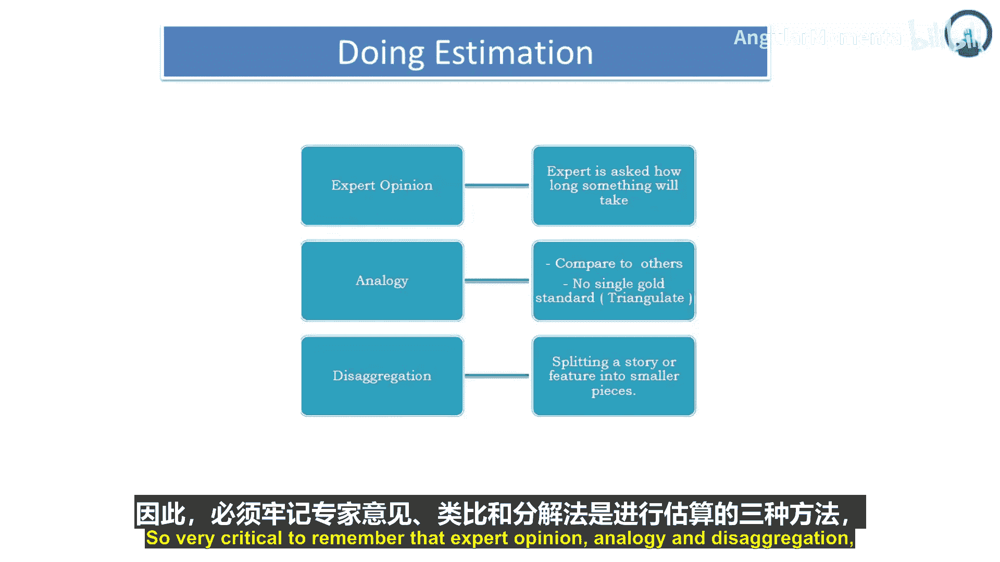

# 031：故事点估算 📊

在本节课中，我们将学习敏捷开发中一个核心的估算概念——故事点。我们将了解什么是故事点，它如何工作，以及几种实用的估算方法。

## 什么是故事点？

上一节我们介绍了用户故事的概念，本节中我们来看看如何衡量这些故事的“大小”。

故事点用于估算用户故事的相对规模。它关注的是**相对思维**，即一个故事相对于其他故事，在开发、测试、发布等环节所需的总工作量是多少。其核心是比较每个故事之间的相对“大小”。

故事点的“大小”受两个因素影响：**任务的复杂度**和**任务的数量**。重要的是，故事点是一个**无单位的纯数字**，它衡量的是规模本身。

## 故事点估算的优势

故事点估算有助于推动跨职能团队的协作行为。因为在进行故事点估算时，你需要综合考虑开发、测试、发布计划、适配等所有方面的努力。

这种估算方式不会因为任务的逐步细化或汇总而“衰减”或失效，故事点总数会持续累加，它是对规模纯粹的衡量。

此外，故事点估算通常更快。因为你使用的是**相对规模估算**，而不是传统的、耗时很长的自底向上估算。它是一种简单、易懂、快速且有效的估算方式。

团队可以自行定义故事点。团队是自我调节、自我管理的，他们定义自己的故事点和估算标准。由于最终是由团队来交付项目工作，因此他们的估算通常被认为更切合实际。

## 主要的估算方法

理解了故事点的概念后，我们来学习几种具体的估算技术。对于那些了解传统项目管理方法的人，会熟悉一种叫做“专家判断”的方法。

项目管理是艺术与科学的结合，涉及技术、人脑的敏锐性，有些任务几秒就能完成，有些则需要很长时间。以下是三种核心的估算方法：

1.  **专家判断**
    当专家被问及某项工作需要多长时间时，他们的意见至关重要。那些在类似项目上有工作经验、具备专业知识的专家，他们的判断是估算的重要依据。

2.  **类比估算**
    这种方法试图与历史数据关联，或与类似项目进行比较来得出估算。虽然没有单一标准，但可以基于经验进行推算。
    *例如：如果上一个项目中开发一个接口需要10天，当前项目有10个类似接口，那么可以合理估算需要 `10天 × 10个接口 = 100天` 的工作量。同样，如果有100个测试脚本，每个脚本测试需要1小时，那么测试总时间可估算为100小时。*

3.  **分解估算**
    “分解”意味着将故事或特性拆分成更小的部分。
    *例如，假设你要开发一款智能手机软件。你可以将开发工作分解为：基础电话系统、互联网功能、智能手机应用程序。然后，应用程序又可以进一步分解为游戏、银行应用等。*
    通过将大型工作逐级分解为层次化的细小工作，你可以为每个最小的“原子”任务分配估算的时间和精力，然后将它们汇总起来，从而得到整个项目的估算。分解估算就是将大工作拆分成小部分，分别估算，再累加得到总估算。

非常关键的是要记住：**专家判断、类比估算和分解估算**是三种主要的估算方法。

## 总结

本节课中，我们一起学习了敏捷估算的核心工具——故事点。我们了解到故事点是一种衡量工作相对规模的无单位方法，它促进跨职能协作，并且估算高效。我们还掌握了三种实用的估算技术：依靠经验的专家判断、参考历史的类比估算，以及化整为零的分解估算。掌握这些方法，能帮助团队更准确、更快速地进行项目规划。