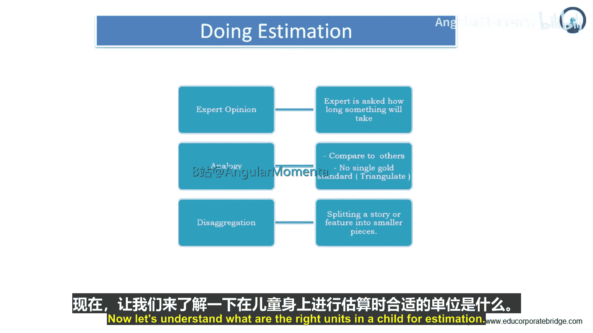
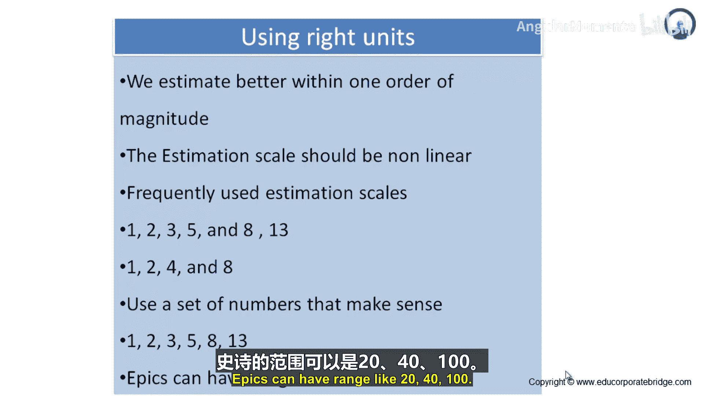
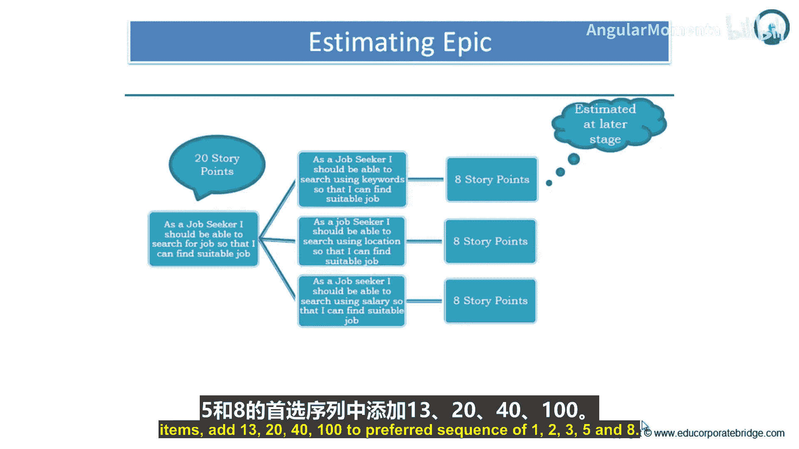

# 032：什么是估算 📊

在本节课中，我们将要学习敏捷项目中的估算方法。我们将探讨三种主要的估算方式，理解最适合的估算单位，并学习如何通过非线性序列和“史诗/主题”来处理不同粒度的需求。掌握这些技巧，可以帮助团队更准确、更高效地进行项目规划。

## 三种估算方法 🧠

上一节我们介绍了估算的重要性，本节中我们来看看具体的估算方法。主要有三种方式，它们根据可用时间、专家资源以及所需精度的不同而有所区别。

以下是三种核心的估算方法：

*   **专家意见**：由经验丰富的团队成员基于个人知识和直觉进行估算。
*   **类比**：将当前待估算的工作项与过去已完成、且规模已知的类似工作项进行比较。
*   **分解**：将大型、复杂的工作项拆分成多个更小、更易于估算的部分，分别估算后再汇总。

## 选择合适的估算单位 📏

理解了基本方法后，我们需要知道如何量化估算值。研究表明，人类最擅长估算处于**一个数量级**范围内的事物。例如，你能较好地估计去最近超市、餐厅和图书馆的相对距离（图书馆可能比餐厅远一倍）。但如果让你估算到月球或邻国首都的距离，准确性就会大大降低。

因此，我们希望大多数估算值都能落在一个合理的数量级范围内。在实践中，有两种常用的非线性估算序列效果很好。

以下是两种推荐的估算标度序列：

*   **斐波那契序列**：`1, 2, 3, 5, 8, 13...`。这个序列的间隔随着数字增大而适当扩大（例如，`1`到`2`的差是`1`，`5`到`8`的差是`3`），这反映了对更大工作项估算时存在的不确定性。
*   **2的幂次序列**：`1, 2, 4, 8...`。这个序列中每个数字都是前一个数字的两倍（`2 = 1*2`, `4 = 2*2`, `8 = 4*2`）。

这两种非线性序列都很好用，我个人略微偏好第一种。关键在于，要预先定义好序列中使用的数字，避免使用像`666`或`67`这样看似精确但实际无法区分的值。我们无法辨别`1.5%`的差异。

## 处理大型工作项：史诗与主题 🗺️

虽然我们希望用户故事的估算规模在一个数量级内，但这并非总能实现。如果我们过早地将所有功能都拆分成精细的故事来估算，可能会在不确定是否要开发的功能上投入过多分析成本。

对于不确定是否近期会开发、或需要先进行粗略成本估算的大型功能，通常可以写成一个更大的用户故事，这被称为**史诗**。史诗的估算范围通常在`20`到`100`或`200`故事点以上。

此外，一组相关的用户故事（例如用回形针夹在一起）也可以被组合起来，作为一个整体进行估算或发布规划，这被称为**主题**。

通过将一些故事聚合为主题，并将一些故事写为史诗，团队可以减少在估算上花费的精力。但必须认识到，对史诗和主题的估算，其不确定性远大于对具体的、小型用户故事的估算。

## 实践指南：何时拆分，何时保留 🔧

那么，在实践中该如何应用呢？对于即将在近期或下一个迭代中开展工作的用户故事，它们需要足够小，以确保能在单个迭代内完成。这类条目应使用`1, 2, 3, 5, 8`这样的序列在一个数量级内进行估算。

对于那些可能距离实现还有好几个迭代的条目，则可以暂时保留为史诗或主题。为了估算这些更大的条目，可以在你偏好的序列（如`1, 2, 3, 5, 8`）基础上，增加`13`, `20`, `40`, `100`等更大的单位。

---

本节课中我们一起学习了敏捷估算的核心知识。我们了解了三种估算方法（专家意见、类比、分解），认识到在一个数量级内进行估算最为准确，并掌握了使用非线性序列（如斐波那契数列）的技巧。最后，我们学会了通过“史诗”和“主题”来管理不同粒度的工作项，从而在估算精度和规划效率之间取得平衡。记住，估算的目的是为了更好的规划和沟通，而非追求虚假的精确。