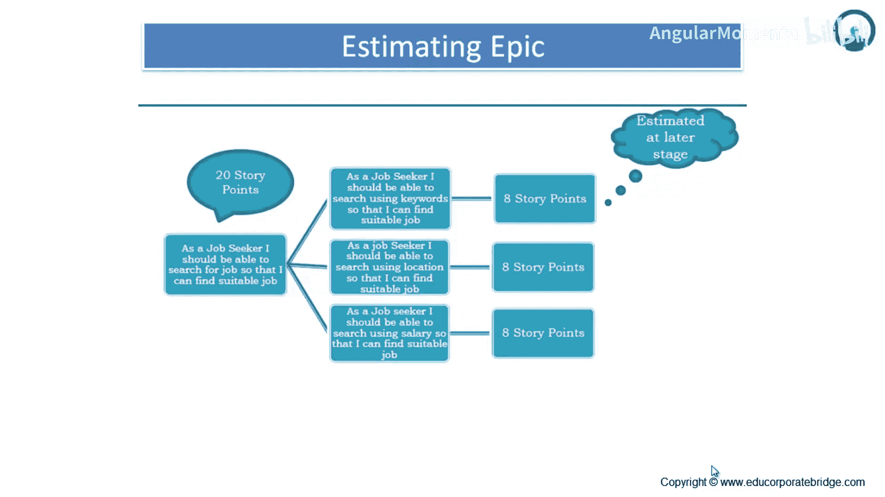
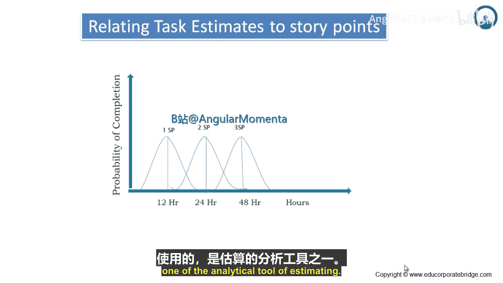
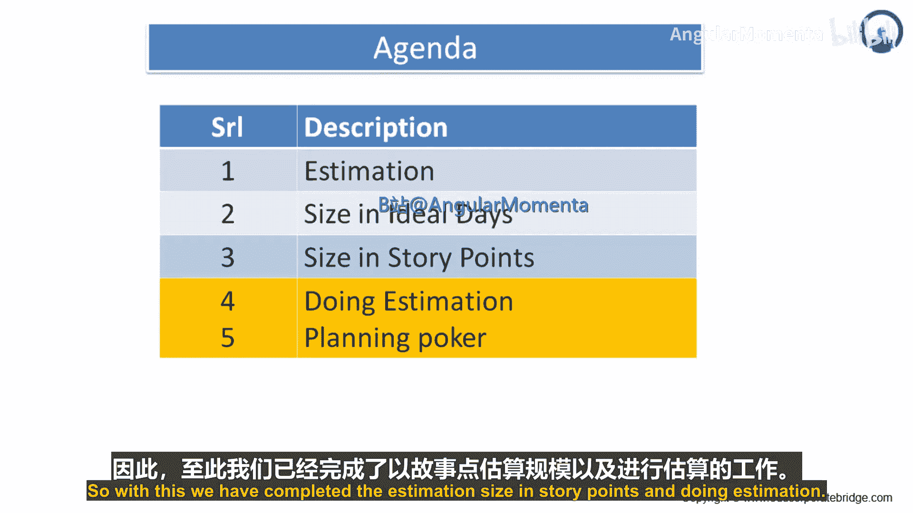

**敏捷实践：章节3.2.1：如何进行估算**

在本节中，我们将学习如何对史诗（Epic）进行估算，并介绍一种将任务估算与故事点相关联的分析方法。

估算大型需求（史诗）时，直接评估其整体复杂度通常很困难。因此，一个有效的方法是将其分解为更小、更易于管理的用户故事。

以下是估算史诗的步骤：

首先，需要将大型的史诗级需求分解为多个独立的用户故事。每个用户故事应代表一个完整且有意义的功能点。

*   **分解示例**：以一个用户故事“作为求职者，我应该能够搜索工作，以便找到合适的工作”为例。这是一个较大的需求（史诗），可以将其分解为三个子需求：
    *   子故事1：作为求职者，我应该能够使用关键词搜索，以便找到合适的工作。
    *   子故事2：作为求职者，我应该能够使用地点搜索，以便找到合适的工作。
    *   子故事3：作为求职者，我应该能够使用薪资范围搜索，以便找到合适的工作。

分解完成后，接下来需要对每一个较小的用户故事进行独立估算，通常使用故事点来评估其相对规模。

*   **独立估算**：在初始估算中，上述三个子故事可能都被赋予了8个故事点。
*   **整体校准**：在后续的校准过程中，团队可能会重新评估整个史诗（E）的总体工作量。例如，经过讨论，整个“搜索工作”史诗最终被估算为20个故事点，而不是简单相加的24点。这体现了估算的协商和调整过程。

**关键点**：务必记住，先对所有用户故事进行分解，然后再对单个用户故事进行估算。故事点的总和不一定等于史诗的最终估算值，团队校准至关重要。

---

上一节我们介绍了通过分解来估算史诗的方法。接下来，我们看看另一种更为分析性的估算方法：将任务估算与故事点相关联。

这种方法基于历史数据统计，通过分析不同故事点所对应任务的实际完成时间分布来进行估算。下图展示了这种关系：

图表说明如下：

*   **Y轴**：表示任务完成的概率。
*   **X轴**：表示任务所需的持续时间（小时）。
*   **估算逻辑**：
    *   一个 **1故事点** 的任务，可能需要 **0到24小时** 完成，其平均时间（均值）约为 **12小时**。
    *   一个 **2故事点** 的任务，可能需要 **12到36小时** 完成，其平均时间约为 **24小时**。
    *   一个 **3故事点** 的任务，可能需要 **24到60小时** 完成，其平均时间约为 **48小时**。

在实际估算中，可以取这些平均时间（12小时、24小时、48小时）作为对应故事点的参考耗时。这是一种基于统计信息的分析工具，有助于建立工作量与故事点之间更量化的关系。

---

**本节总结**

本节课中，我们一起学习了两种主要的估算方法：
1.  **史诗估算**：通过将大型史诗**分解**为较小的用户故事，分别估算后再进行**整体校准**，从而得出史诗的故事点。
2.  **分析估算**：利用**将任务估算与故事点相关联**的统计方法，基于历史数据确定不同故事点所对应的平均完成时间，为估算提供量化参考。

掌握这些方法，可以帮助团队更准确、更一致地评估待办事项的工作量，从而进行有效的迭代规划。

