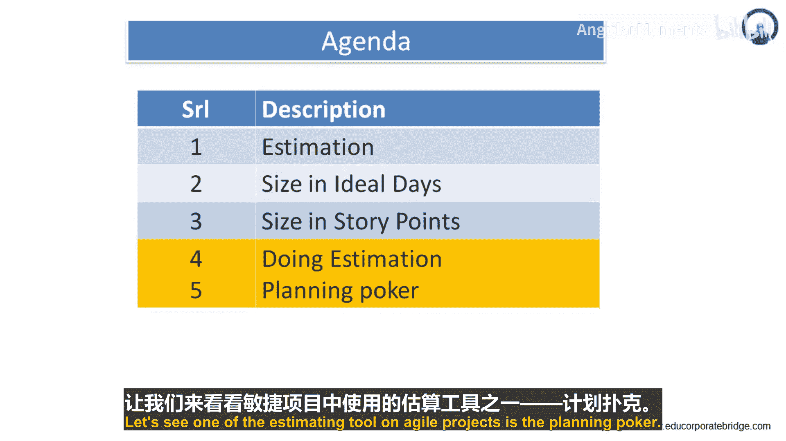
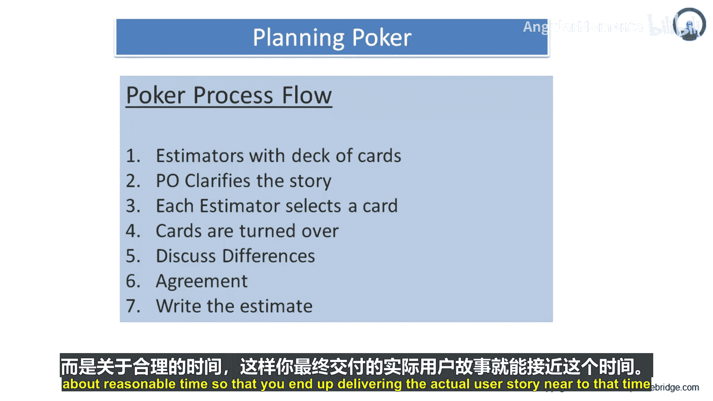

# 034：一种估算技术 🃏

在本节课中，我们将要学习敏捷项目中一种流行的估算工具——计划扑克。这是一种结合了专家意见、类比和分解的快速、可靠且参与度高的估算方法。

## 概述 📋

计划扑克是敏捷团队进行工作估算的最佳方式之一。它将专家意见、类比和分解结合成一种令人愉快的估算方法，旨在快速得出可靠的估算结果。其核心在于**快速**和**参与性**，让团队成员享受估算过程。

## 如何进行计划扑克 🎮

上一节我们介绍了计划扑克的概念，本节中我们来看看具体的操作步骤。

### 参与者与准备

计划扑克会议应包含团队中的所有“开发者”。在敏捷项目中，“开发者”指所有程序员、测试员、数据库工程师、分析师、用户交互设计师等。团队规模通常不超过10人。如果超过，最好分成两个独立估算的小组。

*   **产品负责人**参与会议，但不进行估算。
*   会议开始前，为每位估算者准备一副卡片。
*   每张卡片上印有一个有效的估算数字，例如：`0, 1, 2, 3, 5, 8, 13, 20, 40, 100`。
*   这些卡片可以重复使用。

### 估算流程

以下是计划扑克会议的标准流程：

1.  **陈述故事**：由主持人（通常是产品负责人或分析师）朗读需要估算的用户故事或主题的描述。
2.  **提问与澄清**：团队成员可以就故事细节提问，主持人进行解答。
3.  **私下估算**：所有问题解答完毕后，每位估算者**私下**选择一张代表其估算值的卡片。
4.  **同时亮牌**：待所有人都做出选择后，所有估算者**同时**亮出卡片，展示各自的估算值。
5.  **讨论差异**：此时估算值很可能出现显著差异。这是正常且有益的。估算最高和最低的成员需要解释其理由（例如，高估者可能考虑了额外工作，低估者可能想到了自动化方案）。讨论的目的是理解不同视角，而非攻击他人。
6.  **重新估算**：经过简短讨论后，每位估算者再次私下选择卡片进行重新估算，并同时亮牌。
7.  **达成共识**：目标是通过几轮讨论和估算，让团队的估算值收敛到一个**合理的**、大家都能接受的单一数值上。共识比绝对精确更重要。

### 核心原则与技巧

在了解了基本流程后，我们来看看确保计划扑克成功的一些核心原则。

*   **目标不是绝对精确**：计划扑克的目标并非得出一个能经受住未来一切考验的“完美”估算，而是快速、低成本地得到一个有价值的、合理的估算。
*   **处理差异**：估算差异是好事，它揭示了团队成员对故事复杂度的不同理解。通过讨论这些差异，团队能对需求达成更一致的认识。
*   **达成合理共识**：估算的最终目的是就一个“合理”的时间达成小组共识，而不是执着于“准确”的数字。例如，如果多数人估算是5，而一人估算是3，可以询问低估算者是否同意5这个结果。

## 总结 🎯

本节课中我们一起学习了计划扑克这种敏捷估算技术。我们了解到它是一种快速、参与性强的团队活动，通过结合专家意见、类比和分解，并经过多轮私下估算与公开讨论，最终帮助团队就用户故事的工作量达成一个合理的共识估算。记住，其核心价值在于促进沟通和理解，而非追求数学上的精确。