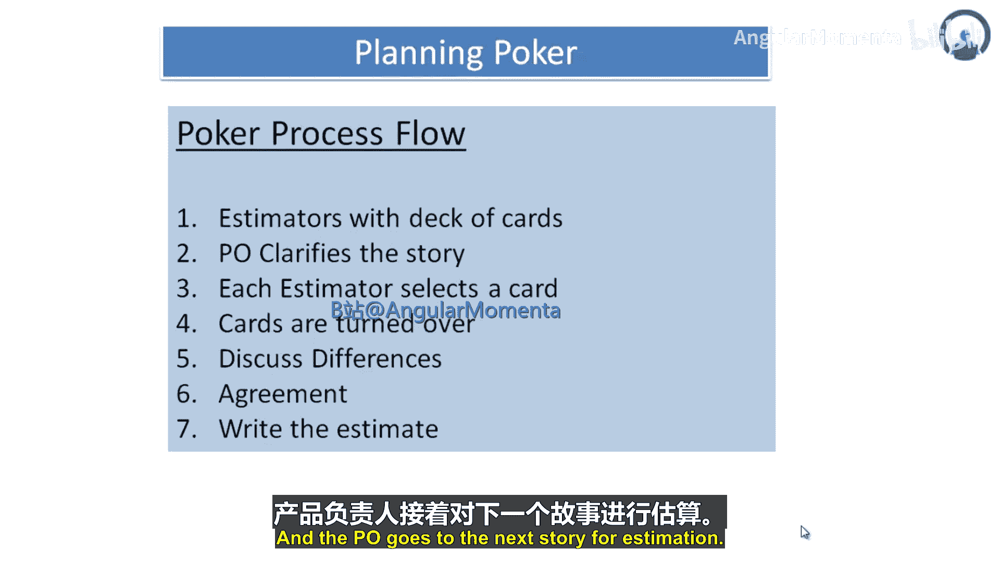
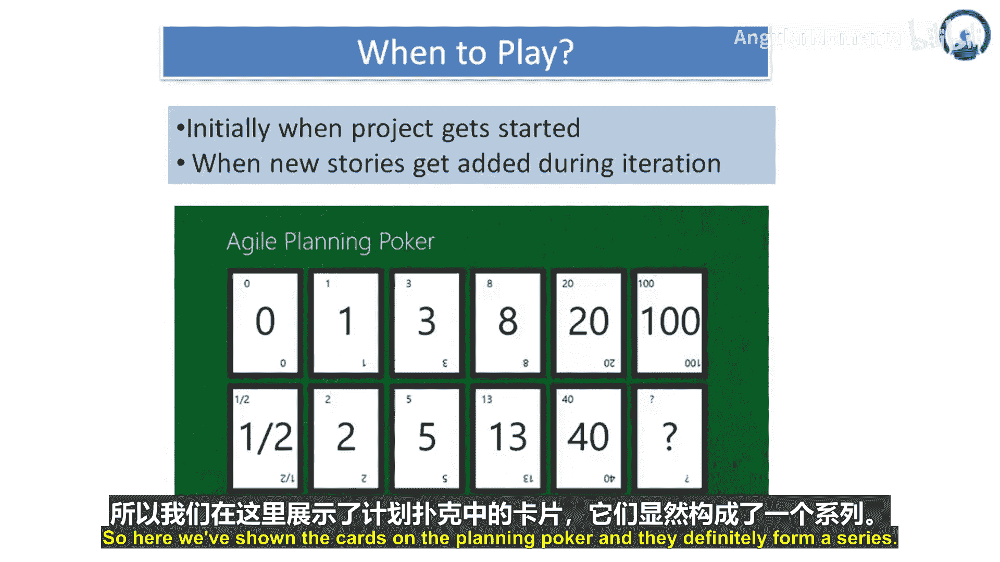

# 035：规划扑克详解 🃏

在本节课中，我们将学习敏捷估算的核心实践——规划扑克。我们将了解其操作流程、关键原则、最佳实践时机以及它为何如此有效。通过掌握这些内容，你将能够带领团队进行高效、准确的用户故事估算。

## 讨论的适度性 ⚖️

上一节我们介绍了规划扑克的基本概念，本节中我们来看看执行过程中的一个关键原则：讨论的适度性。

进行规划扑克时，讨论的适量或适度程度至关重要。在估算时，进行一定程度的初步设计讨论是必要且恰当的。然而，在**设计讨论**上花费过多时间，会使团队陷入“投入-精度曲线”的误区，即投入时间远超精度提升的收益。

## 使用计时器控制讨论 ⏳

为了确保讨论高效且不超时，一个有效的方法是使用一个**两分钟的沙漏计时器**。将其放在进行规划扑克的桌子中央，任何与会者都可以在讨论过长时将其翻转。当沙子在两分钟内流尽时，无论是否达成一致，都必须进行下一轮出牌。如果仍未达成一致，讨论可以继续，但必须有人立即再次翻转计时器，将讨论限制在又一个两分钟内。

在实践中，计时器很少需要被翻转超过两次。这种方法能帮助团队学会更快速地进行估算。

## 处理大规模估算任务 👥

有时，尤其是在新项目开始时，可能需要估算的项目非常多。此时，让所有人参与同一轮规划扑克可能不理想。一个合理的替代方案是使用“**国王的替身**”模式，即只让部分代表参与估算。

更好的做法是将大团队拆分成两到三个小组，每个小组必须至少包含三名估算者。关键在于确保各小组的估算标准一致。例如，当你的团队称一个故事为“3个故事点”时，其工作量最好与我的团队所称的“3个故事点”保持一致。

为实现这种一致性，可以采取以下步骤：
1.  开始时，让所有团队一起进行约一小时的联合规划扑克会议。
2.  共同估算10到20个用户故事。
3.  确保每个团队都获得这些故事及其估算结果的副本。
4.  各团队以此作为基准，来估算分配给他们的其他故事。

## 规划扑克操作步骤 📝

以下是使用规划扑克进行估算的关键步骤：

1.  **准备阶段**：为每位估算者分发一套估算卡。
2.  **讲解故事**：产品负责人（PO）澄清待估算的用户故事细节。
3.  **私下估算**：每位估算者根据所需工作量（小时或天数）私下选择一张估算卡。
4.  **同时亮牌**：所有估算者同时亮出自己选择的卡。
5.  **讨论差异**：重点讨论估算最高和最低的成员，请他们阐述理由。
6.  **达成共识**：团队讨论并寻求对最终估算值的共识。
7.  **记录并继续**：总结估算结果，产品负责人继续下一个故事的估算。

## 何时进行规划扑克 🗓️

了解何时进行规划扑克至关重要。团队通常需要在两个不同时间点进行：

1.  **项目启动或首次迭代时**：在项目正式启动前或在其最初几次迭代中，通常需要估算大量待办事项。估算初始的故事池可能需要团队进行两到三次会议，每次持续一到三小时。具体时长取决于待估算项的数量、团队规模以及产品负责人澄清需求的能力。
2.  **迭代过程中**：团队需要付出持续努力，以估算在迭代期间新识别的任何故事。有两种常见做法：
    *   在每次迭代临近结束时，计划一个非常简短的估算会议。这通常足以估算迭代期间出现的任何新工作，并允许在规划下次迭代时考虑这些工作的优先级。
    *   肯特·贝克（Kent Beck）曾建议在墙上挂一个信封，将所有未估算的故事放在信封上。当个人有几分钟空闲时，可以从信封中取出一两个故事进行估算。团队为自己设定规则，通常是所有故事必须在当天或迭代结束前完成估算。

我个人喜欢在墙上挂一个信封来存放未估算故事的想法。然而，我更倾向于当有人有空进行估算时，他**至少找到另一个人**，然后他们通过规划扑克的方式**共同进行估算**。

## 规划扑克为何有效 ✅

规划扑克之所以效果显著，基于以下几个原因：

1.  **汇聚专家意见**：规划扑克汇集了多位专家的意见进行估算。这些专家来自软件项目的各个职能领域，组成了一个跨职能团队，因此比任何个人都更适合完成估算任务。乔安森（Joensson）在完成对软件估算文献的全面研究后得出结论：**最有能力解决任务的人应该对其进行估算**。
2.  **激发讨论与论证**：规划扑克会引发活跃的对话，估算者需要向同伴论证其估算值的合理性。这已被证明能提高估算的准确性，尤其是在不确定性较高的项目上。被要求论证估算值也被证明能产生**更好补偿缺失信息**的估算结果，这对于用户故事常常故意保持模糊的敏捷项目尤为重要。
3.  **结合群体智慧**：研究表明，对个体估算值进行**平均**以及进行**小组讨论**都能带来更好的结果。规划扑克以小组讨论为基础，这些讨论最终会形成一种对个体估算值的“平均”。
4.  **充满趣味性**：最后，规划扑克行之有效是因为它很有趣。

## 总结 📚

本节课中我们一起学习了规划扑克这一核心敏捷估算实践。我们明确了**适度讨论**的原则，学会了使用**计时器**控制会议节奏，掌握了处理大规模估算的**分组技巧**，并梳理了从准备到共识的完整**操作步骤**。我们还探讨了在**项目启动**和**迭代过程中**进行估算的最佳时机，并深入分析了规划扑克之所以有效的四大原因：汇聚专家智慧、促进深度论证、结合群体判断以及其自带的趣味性。掌握这些知识，你将能有效地运用规划扑克提升团队估算的效率和准确性。