敏捷实践：03_02_04：什么是重估计 📊

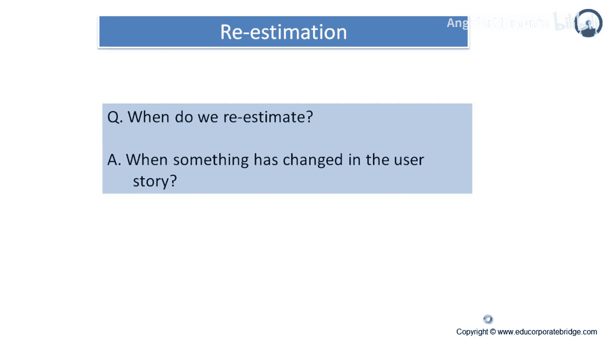

在本节课中，我们将要学习敏捷开发中的一个重要概念——重估计。我们将探讨在什么情况下需要进行重估计，以及如何正确地进行重估计，以确保项目评估的准确性和一致性。

---

### 概述

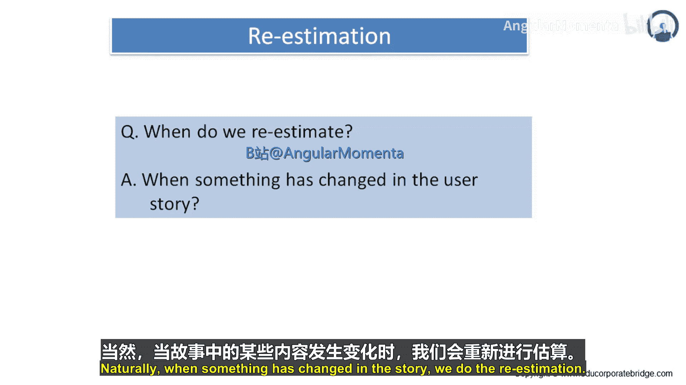

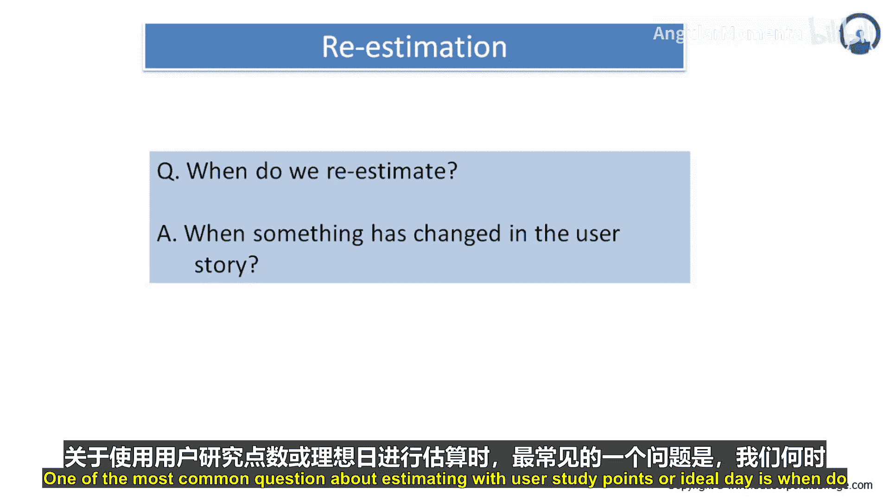

我们已经了解了估算的基本概念。在实际项目中，存在一些特定的场景和情况，在这些时候，我们需要对已经估算过的用户故事进行重新估算，这就是重估计。

### 何时进行重估计？

重估计是指对之前已经估算过的某些用户故事再次进行估算。一个很自然的问题是：我们何时需要进行重估计？

答案是：当用户故事的内容发生变化时，我们就需要进行重估计。

关于使用故事点或理想天数进行估算，一个最常见的问题是：我们何时进行重估计？要回答这个问题，关键在于记住：故事点和理想天数是对待实现功能的整体规模和复杂性的估算。

故事点尤其不是对实现该功能所需时间的估算，尽管我们常常会陷入这种思维误区。实现一个功能所需的时间是其规模（以理想天数或故事点估算）和团队速度（反映其进展速率）的函数。

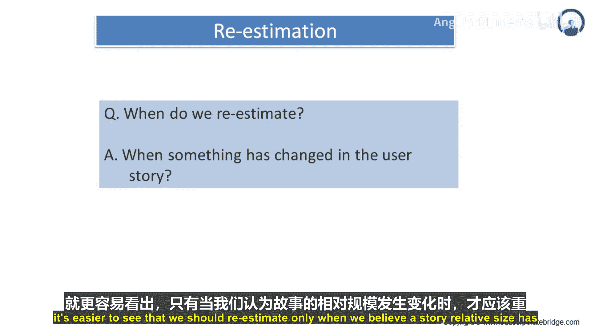

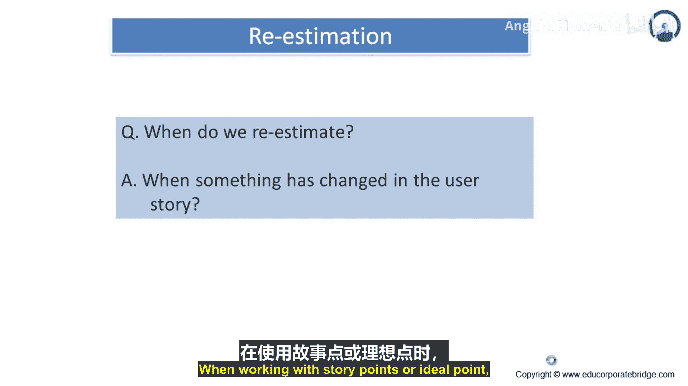

如果我们记住故事点和理想时间估算的是规模，那么就更容易理解：我们只应在认为一个故事的相对规模发生变化时，才进行重估计。在使用故事点或理想点数时，我们不会仅仅因为一个故事的实际实现时间比预想的要长就进行重估计。

### 速度是平衡器

理解这一点最好的方式是通过一些例子。速度是一个强大的平衡器，因为每个功能的估算是相对于其他功能的估算来进行的。我们的估算是完全正确、稍有偏差还是完全不正确，这并不重要。重要的是它们要保持一致。我们不能简单地掷骰子来决定估算值。

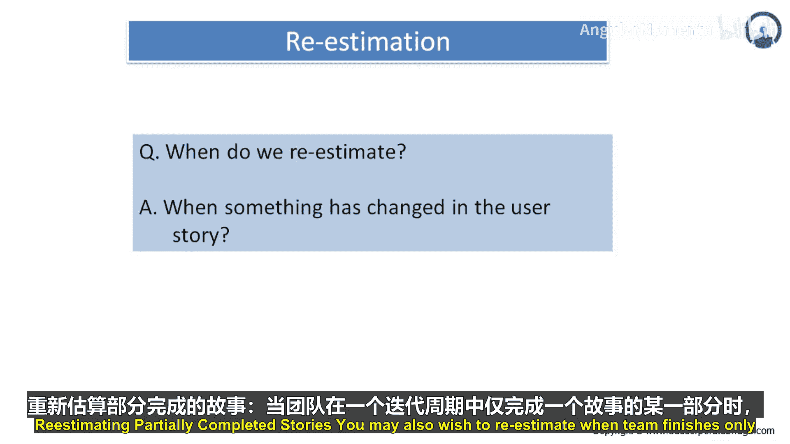

然而，只要我们的估算保持一致，通过最初几个迭代来衡量速度，就能让我们逐渐掌握一个可靠的进度计划。

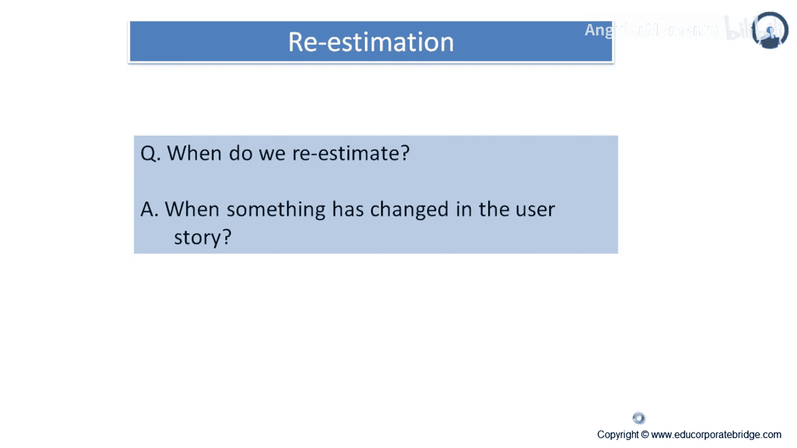

### 对部分完成的故事进行重估计

当团队在一个迭代中只完成了某个故事的一部分时，你可能也希望进行重估计。

假设团队正在处理一个故事：“作为教练，我希望系统能推荐每个项目中应该由谁游泳。” 这个故事最初被估算为5个故事点，但它实际上比预想的要复杂。

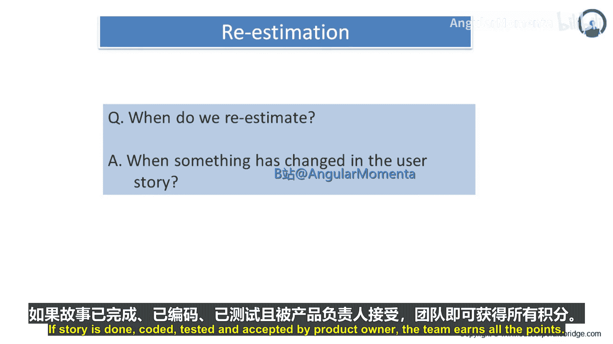

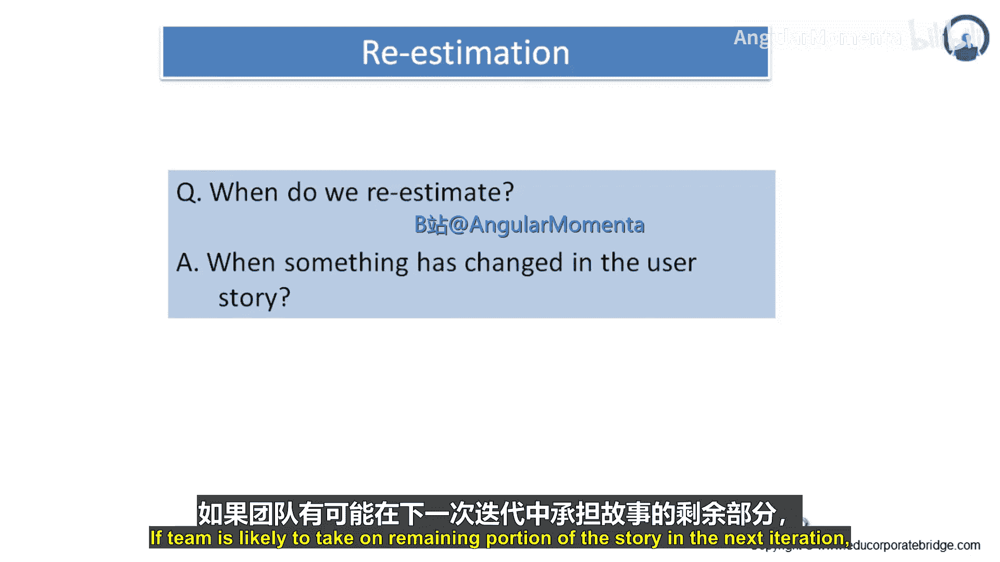

如果故事被完成、测试并被产品负责人接受，团队将获得全部点数。但如果故事有任何部分未完成，他们在迭代结束时将得不到任何点数。这是最容易评估的情况：如果一切都完成了，他们将获得全部点数；如果有任何缺失，他们将得不到点数。

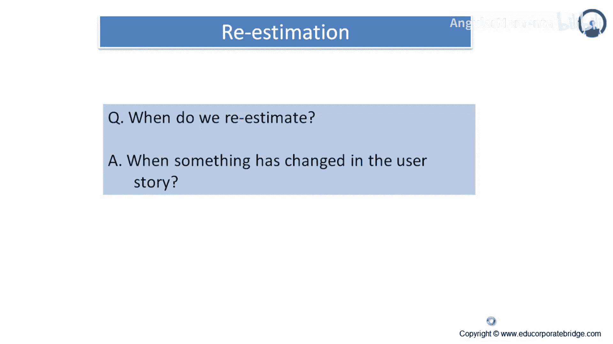

如果团队很可能在下一个迭代中完成故事的剩余部分，这种方法效果很好。他们在第一个迭代中的速度会略低于预期，因为他们没有因部分完成故事而获得点数。

然而，在第二个迭代中，速度将高于预期，因为他们将获得全部点数，尽管部分困难的工作在迭代开始前已经完成。只要每个人都记住，我们主要关注的是团队长期的平均速度，而不是某个特定迭代中速度的起伏，这种方法就很好。

然而，在某些情况下，故事的未完成部分可能不会在下一个迭代中完成。在这些情况下，允许团队为已完成的故事部分获得部分点数可能是合适的。剩余的故事（原始故事的一个子集）会根据团队当前的知识进行重新估算。

在这种情况下，原始故事被估算为5点。如果团队认为他们完成的子集相当于3个故事点或理想天数，他们将给自己记上相应的点数。原始故事的未完成部分可以被重写为一个更小的故事（例如，“作为教练，我希望系统能推荐每个接力项目中应该由谁游泳”），然后团队可以相对于所有其他故事来估算这个更小的故事。合并后的估算值不一定需要等于原始的5点估算。

以下是处理未完成故事点数分配的两个最佳解决方案：
1.  避免有任何未完成的故事。
2.  使用足够小的故事，这样部分完成就不再是一个问题。

### 重估计的目的

现在让我们来理解重估计的目的。需要记住的一点是：不要过度担心是否需要重估计。

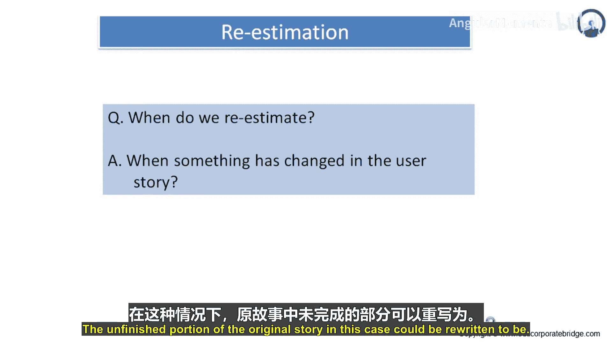

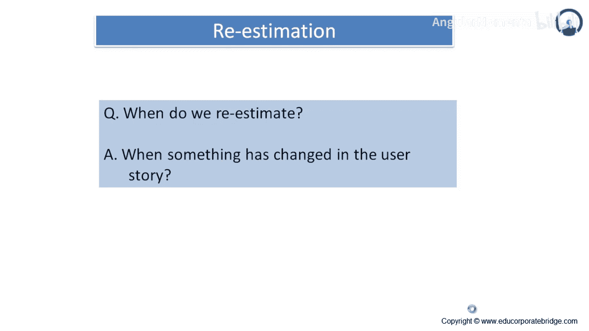

重估计更像是一种精炼，是基于迄今为止的旅程进行微调。

每当团队感觉一个或多个故事相对于其他故事被错误估算时，就应进行重估计。尽可能少地重估故事，以使相对估算重新回到正轨。将重估计作为估算未来用户故事的学习经验。未能从中学习是唯一的真正失败。

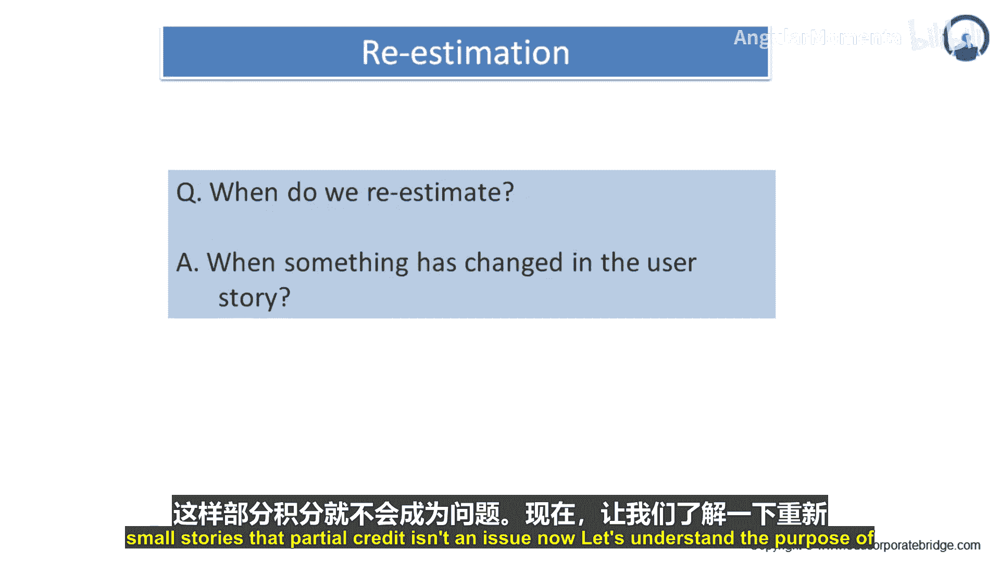

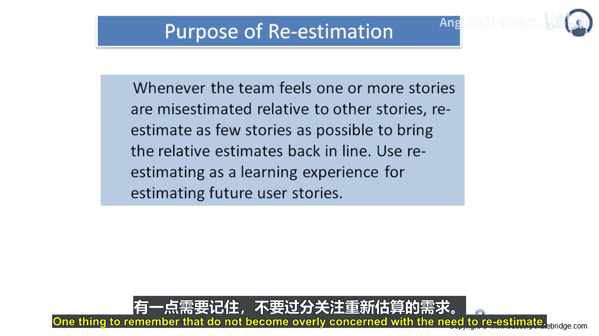

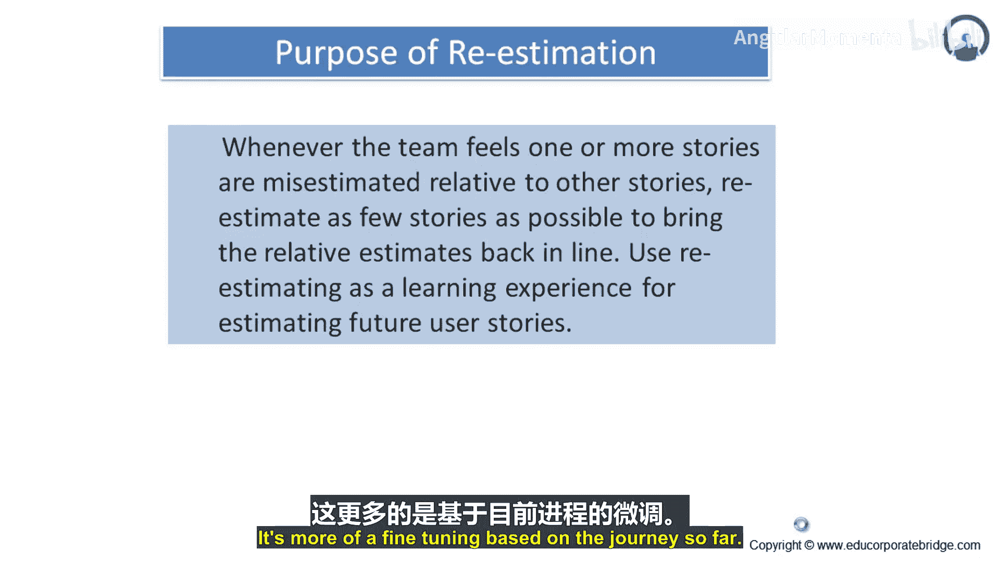

从每个重估计的故事中学习，并将经验转化为成功。

---

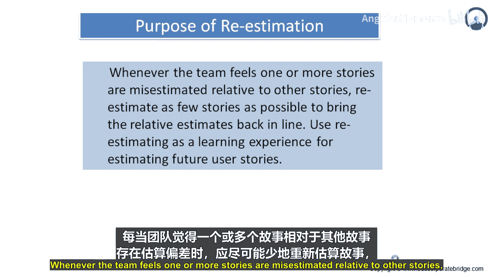

### 总结

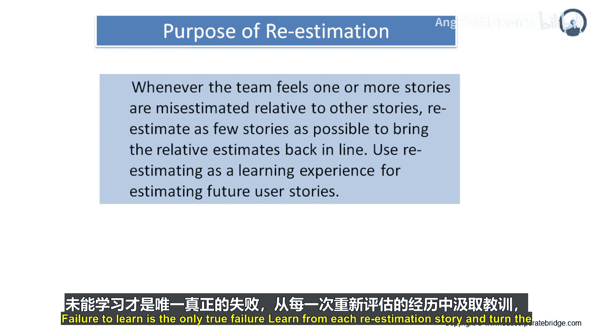

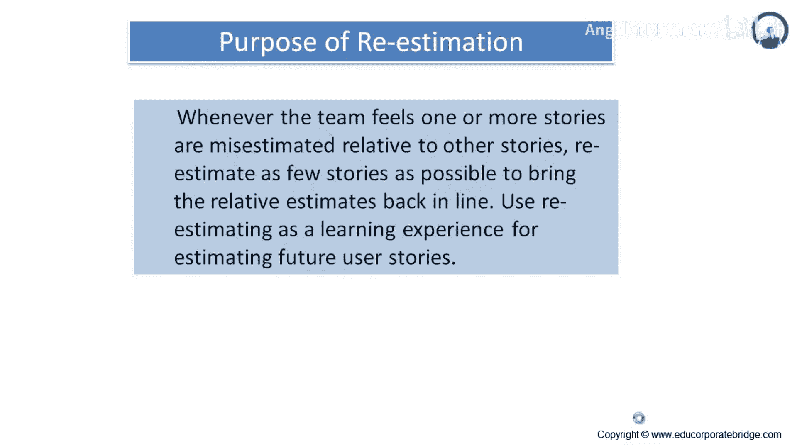

本节课中，我们一起学习了敏捷开发中的重估计概念。我们明确了重估计是指在用户故事内容发生变化时，对其规模进行重新评估。关键在于理解故事点估算的是相对规模和复杂性，而非绝对时间。我们探讨了在故事部分完成时进行重估计的策略，并强调了速度作为长期平衡器的作用。最后，我们指出重估计的核心目的是学习和持续改进，应将其视为微调和精炼过程，而非对失败的指责。