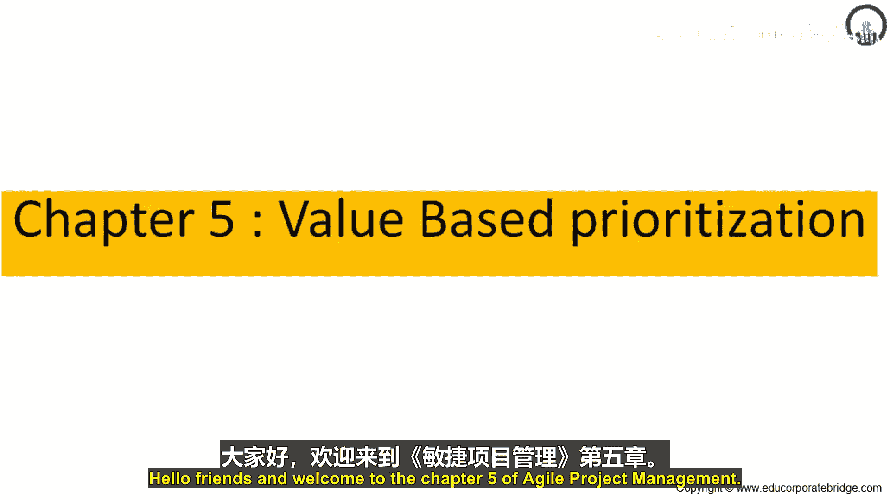
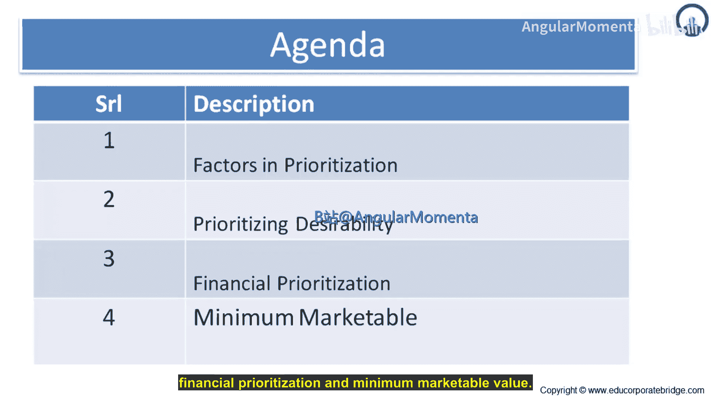
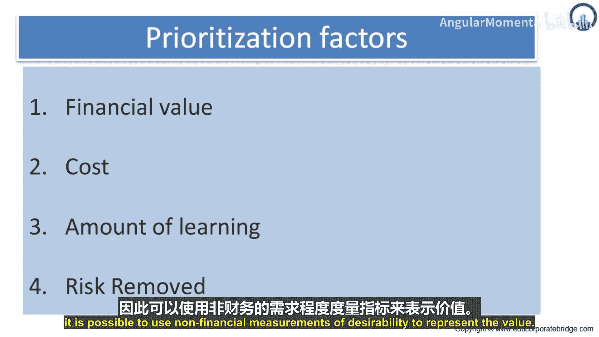

敏捷项目管理：第5章：基于价值的优先级排序 📊

在本章中，我们将学习如何为敏捷项目中的工作项进行优先级排序。我们将探讨影响优先级决策的关键因素，包括财务价值、开发成本、学习价值和风险降低价值，并介绍最小可市场化价值的概念。

上一节我们介绍了本章的学习目标，本节中我们来看看优先级排序中的关键因素。

确定一个主题的价值是困难的。敏捷项目中的产品负责人经常收到模糊且大多无用的建议：“根据业务价值确定优先级”。因此，我们需要更具体的考量因素。

以下是影响优先级排序的四个关键因素：

1.  **财务价值**：拥有该功能能为组织带来或节省多少资金。
2.  **开发成本**：开发和可能支持新功能所需的成本，这通常来自故事点估算。
3.  **学习价值**：通过开发功能所创造的新知识的数量与重要性。
4.  **风险降低价值**：通过开发功能所消除的风险量。

由于大多数项目旨在节省或赚取资金，前两个因素通常在优先级讨论中占主导地位。然而，为了进行最优排序，充分考虑学习和风险对项目的影响至关重要。

接下来，让我们深入了解第一个因素：财务价值。

优先级排序的第一个因素是主题的财务价值，即组织因包含该主题的新功能而将赚取或节省的资金。

确定主题价值的一个理想方法是估算其在未来一段时间（通常是接下来的几个月、季度或几年）内的财务影响。如果产品将进行商业销售，这可以做到。

例如，一个新的文字处理器或带有嵌入式软件的计算机器。估算主题的财务回报可能很困难，这通常涉及估算新增销售额、平均销售额（包括后续销售和维护协议）、销售增长的时间点等。

由于这种估算的复杂性，通常需要一个替代方法来估算价值。因为主题的价值与其对新用户和现有用户的吸引力相关，所以可以使用非财务的吸引力衡量标准来代表价值。

---

本节课中我们一起学习了基于价值的优先级排序。我们探讨了财务价值、开发成本、学习价值和风险降低这四大关键因素，并理解了在商业目标主导下，仍需全面考量学习与风险以做出最优决策。我们还了解到，在直接财务估算困难时，可以通过衡量功能吸引力来间接评估价值。