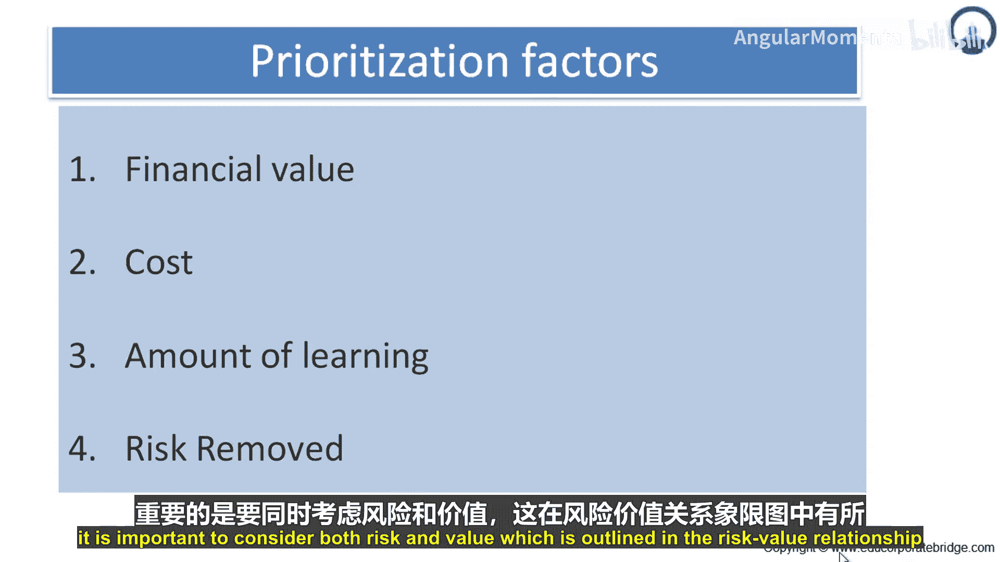
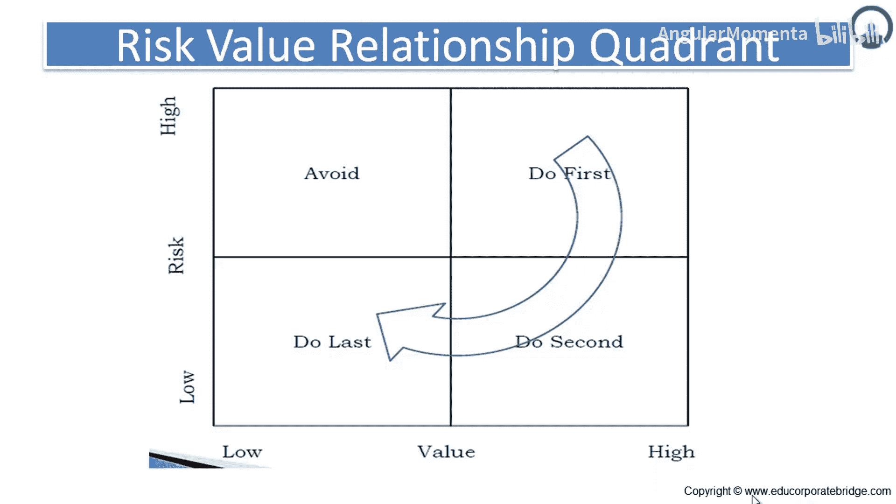

# 038：什么是风险优先级 📊

在本节课中，我们将学习如何评估和优化产品待办事项列表的优先级。我们将深入探讨决定优先级的关键因素，特别是成本、学习量和风险，并学习如何综合这些因素做出最优决策。

上一节我们介绍了价值在优先级排序中的核心作用，本节中我们来看看其他几个同样重要的决定因素。

## 成本 💰

成本是决定功能整体优先级的巨大决定因素。许多功能在了解其成本之前看似美好。成本的一个重要但常被忽视的方面是，成本会随时间变化。例如，今天添加国际化支持可能需要四周的工作量，但六个月后再添加可能需要六周。因此，在优先级排序时，最佳做法通常是进行粗略的估算转换。

以下是常见的成本估算方法：
*   将故事点或理想人日转换为货币价值。

## 学习量 📚

在许多项目中，大量总体努力是为了追求新知识，或通过承担项目来投资开发技能集和能力。承认并考虑这种努力对项目至关重要。获取新知识很重要，因为在项目开始时，我们永远无法预知项目结束时需要知道的一切。

团队发展的知识可分为两个领域：
*   **产品知识**：关于将要开发什么的知识，包括哪些功能会被包含，哪些不会。团队拥有的产品知识越多，就越能更好地决定产品的性质和功能。
*   **项目知识**：关于产品将如何被创造的知识。例如，关于将使用的技术、开发人员的技能、团队如何协同工作等知识。

## 风险 ⚠️

与“新知识”概念紧密相关的是优先级排序的最后一个因素：风险。几乎所有项目都包含大量风险。就我们的目的而言，**风险**是任何尚未发生但可能发生，并且会危及或限制项目成功的事情。

项目中有许多不同类型的风险，包括：
*   **进度风险**：我们可能无法在十月前完成。
*   **成本风险**：我们可能无法以合适的价格购买。
*   **功能风险**：我们可能无法完成工作。

此外，风险可分为**技术风险**或**业务风险**。一个经典的矛盾存在于项目的高风险、高价值功能之间：项目团队应该首先关注可能破坏整个项目的高风险功能，还是应该首先关注Tom Gilb所说的“多汁部分”——那些能带来最直接项目回报的高价值功能？

为了在两者之间做出选择，让我们考虑每种方法的缺点：
*   **风险驱动型团队**接受他们执行的工作可能最终被证明是不需要或低价值的可能性。他们可能会为最终被证明不必要的功能开发基础设施支持，因为产品负责人根据从用户那里学到的东西，在项目进展中不断细化她对项目的愿景。
*   **另一方面，只关注价值而排除风险的团队**可能会在开发大量应用程序后，遇到危及产品交付的风险。

当然，解决方案是在确定优先级时，既不给予风险也不给予价值绝对的至高地位。为了最优地确定工作优先级，必须同时考虑风险和**价值**。

## 风险-价值关系象限 📈

这体现在风险-价值关系象限中。在Y轴上我们有**风险**，在X轴上我们有**价值**，我们得到四个象限。

为了结合这四个优先级因素，首先考虑功能的**价值**相对于其**成本**。这为你提供了主题的初始优先级顺序。那些具有高价值成本比的主题应该首先完成。

接下来，考虑其他优先级因素，将主题向前或向后移动。假设一个主题基于其价值和成本处于中等优先级。因此，该主题倾向于在当前发布周期的中期进行。然而，开发这个故事所需的技术风险很高。这将使该主题在日程安排上的优先级向前移动。

这种初始排序，然后进行前后调整，不一定是一项正式活动。每一步都可以，并且经常完全发生在产品负责人的脑海中。然后，产品负责人通常会向团队展示她的优先级，团队可能会根据他们的评估，促使产品负责人稍微改变优先级。

因此，一个高价值、高风险的事项应该首先完成，其次是高价值、低风险的事项，然后是低价值、低风险的事项，而高风险、低价值的事项应该完全避免。

本节课中我们一起学习了优先级排序的四个关键因素：价值、成本、学习量和风险。我们了解到，最优的优先级决策需要平衡这些因素，特别是利用风险-价值象限来指导决策，确保团队首先处理高价值且高风险的事项，以最大化项目成功的机会并降低总体不确定性。