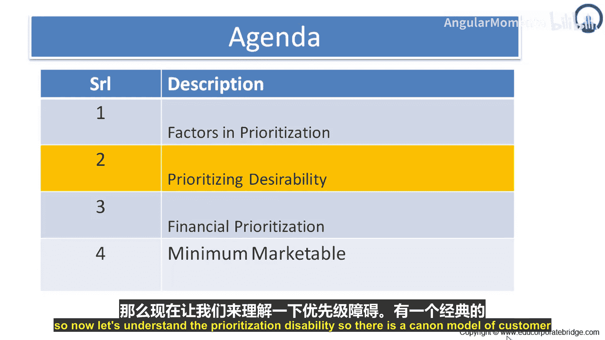
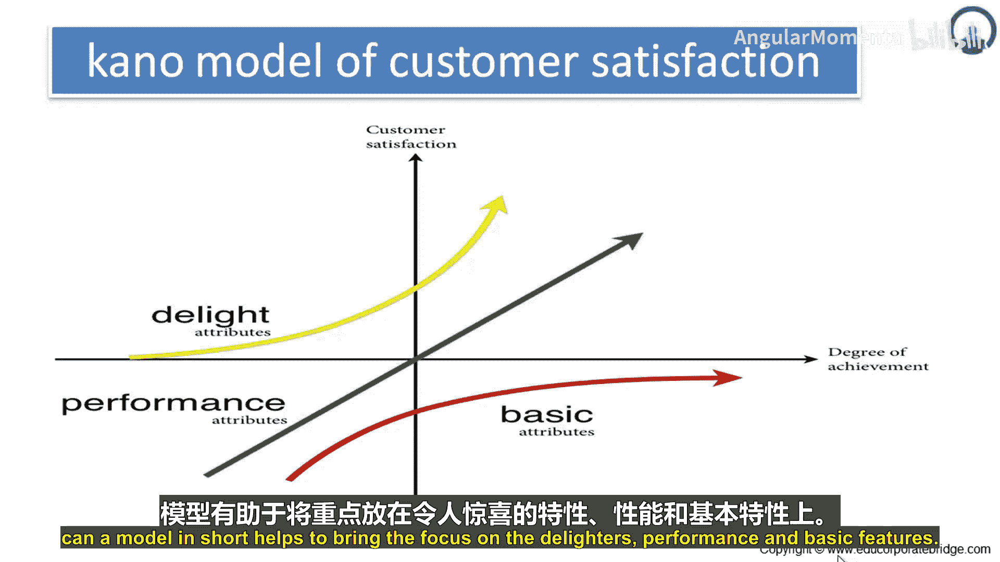

# 040：卡诺模型 📊

在本节课中，我们将学习一个重要的需求优先级排序工具——卡诺模型。该模型通过分析客户满意度与功能实现程度之间的关系，帮助我们有效区分和优先处理产品功能。

## 概述 📋

卡诺模型是一种用于理解和分类客户需求、以指导产品功能优先级排序的框架。它将产品功能分为三类：基本型需求、期望型需求和兴奋型需求。理解这三类需求有助于团队集中精力开发最能提升客户满意度的功能。

## 卡诺模型详解 📈

上一节我们介绍了优先级排序的重要性，本节中我们来看看卡诺模型的具体构成。该模型通过一个坐标图来展示三类需求与客户满意度的关系。纵轴（Y轴）代表**客户满意度**，横轴（X轴）代表**功能实现程度**。图中有三条不同颜色的曲线，分别代表三类属性。

*   **基本型需求**：图中红色曲线。这是产品“必须有”的属性。即使这些功能实现得再好，客户满意度也不会显著提升；但若缺失，客户会极度不满。其满意度曲线相对平缓。
    *   **公式/概念**：`满意度 = f(实现度)`，当实现度达到基础阈值后，函数增长近乎为零。
*   **期望型需求**：图中绿色曲线。这类需求是“越多越好”。客户满意度与功能的实现数量或质量成正比增长。其满意度曲线呈线性。
    *   **公式/概念**：`满意度 ∝ 实现度`（正比例关系）。
*   **兴奋型需求**：图中黄色曲线。这是超出客户预期的功能，能带来极大的满意度提升。即使只实现一部分，也能显著提高客户满意度；但若没有，客户也不会感到不满。其满意度曲线呈指数增长。
    *   **公式/概念**：`满意度 ∝ e^(实现度)`（指数关系）。

## 三类功能特征与应用 🎯

基于卡诺模型的理论，我们可以将产品功能具体划分为三类。以下是每类功能的详细说明及其在优先级排序中的应用。

**1. 阈值功能（基本型需求）**
这类功能是产品成功的必要条件，常被称为“必须有”的功能。
*   **示例**：酒店房间的床、浴室、书桌和清洁程度。
*   **特点**：提升这类功能的性能对客户满意度影响甚微。但只要满足基本需求，客户就不会不满意。
*   **优先级策略**：必须全部开发，并在产品发布前可用。它们不需要在每次迭代中都开发，但必须在发布时具备。

**2. 线性功能（期望型需求）**
这类功能遵循“越多越好”的原则。
*   **示例**：酒店房间的面积、健身房的设备和种类。
*   **特点**：客户满意度与功能的数量或质量线性相关。产品价格常与这类属性挂钩。
*   **优先级策略**：应尽可能多地完成这类功能，因为每一个都能直接带来更高的客户满意度。当然，需避免产品因功能过多而变得臃肿。

**3. 兴奋点与惊喜功能（兴奋型需求）**
这类功能能带来极大的满足感，常能为产品增加溢价。
*   **示例**：酒店房间内置的蒸汽浴室。
*   **特点**：缺少它们不会降低客户满意度（因为客户原本不知道），但拥有它们会极大提升满意度。因此常被称为“未知需求”。
*   **优先级策略**：在时间允许的情况下，应优先考虑纳入至少几个这样的功能到发布计划中。

## 总结 ✨

本节课中，我们一起学习了卡诺模型。该模型由狩野纪昭博士提出，它将功能分为**基本型（必须有）**、**期望型（线性相关）**和**兴奋型（惊喜）**三类。通过应用这个模型，团队可以清晰地聚焦于：首先确保所有**基本功能**就位；然后尽力实现更多的**期望功能**以线性提升满意度；最后，在资源允许时纳入**兴奋功能**，为产品创造惊喜和差异化优势。这为新产品发布过程中的功能优先级排序提供了清晰、有效的指导。