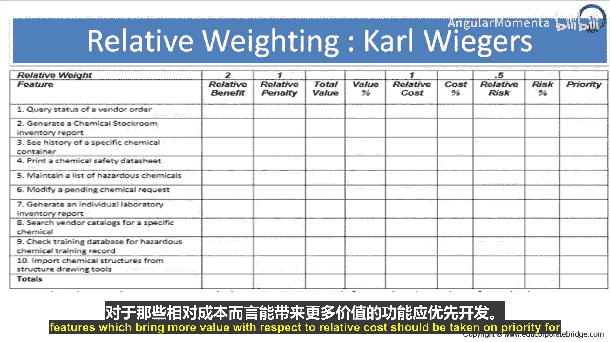
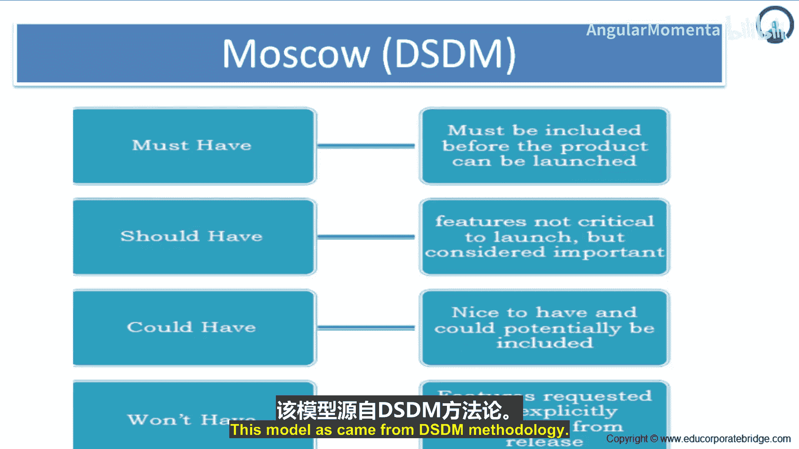
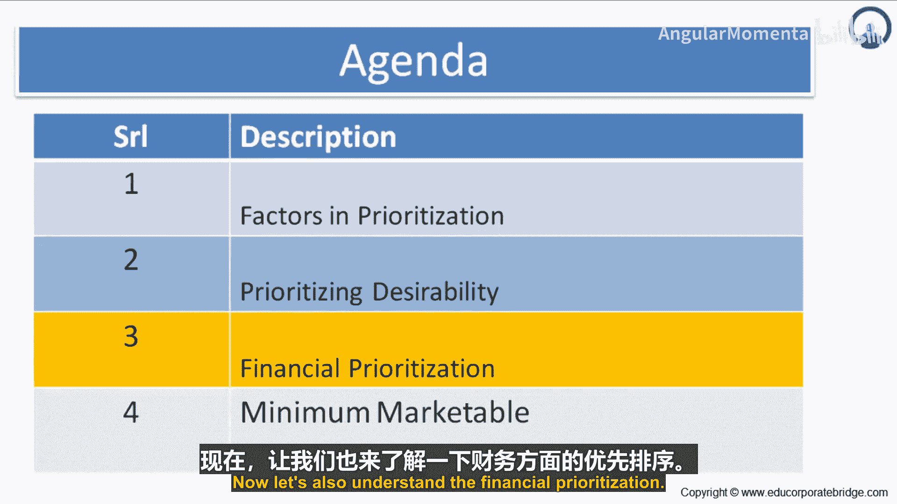
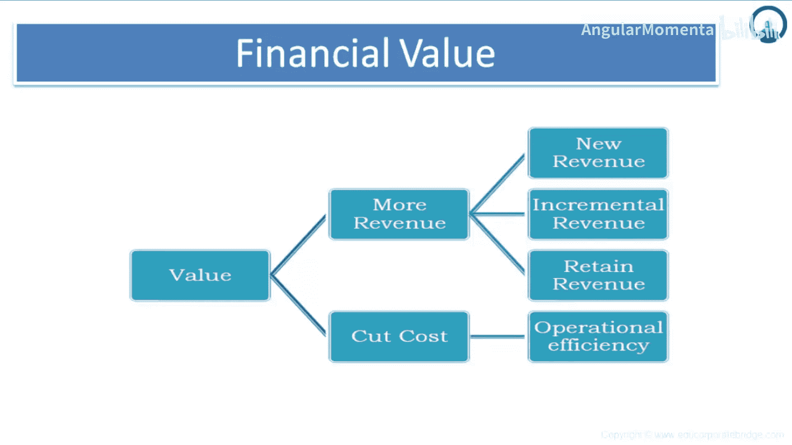

# 041：财务价值 💰

在本节课中，我们将学习如何从财务角度评估和优化敏捷项目中的功能优先级。我们将探讨几种量化功能价值的方法，包括相对权重法、MoSCoW分类法以及基于财务收益（如增加收入或节约成本）的优先级排序策略。

---

## 相对权重法 ⚖️

上一节我们介绍了多种优先级排序思路，本节中我们来看看一种更细致的量化方法——相对权重法。这种方法不仅考虑功能存在时带来的正面收益，也考虑其缺失时造成的负面惩罚。

该方法主要依赖产品负责人引导下的专家集体判断。团队对下一个版本中考虑的功能进行评估。每个功能都会从两个维度打分：
*   **相对收益**：如果实现该功能，会带来多少好处。
*   **相对惩罚**：如果不实现该功能，会招致多少损失。

收益和惩罚的估算与故事点估算类似，采用相对尺度。通常使用1到9的标度进行评分。

以下是具体的计算步骤：

1.  **列出功能**：在第一列列出所有待评估的功能。
2.  **评分**：为每个功能评定相对收益（1-9分）和相对惩罚（1-9分）。
3.  **计算总值**：将每个功能的收益分与惩罚分相加，得到该功能的“总值”。
4.  **计算价值百分比**：将所有功能的“总值”求和，然后计算每个功能的“总值”占总和的百分比，此即该功能的“价值百分比”。
5.  **评估成本与风险**：类似地，为每个功能评定相对成本（1-9分）并计算“成本百分比”；评定相对风险（1-9分）并计算“风险百分比”。
6.  **计算优先级**：优先级相对于价值和成本而定。计算 **`优先级 = 价值百分比 / 成本百分比`**。比值越高，优先级越高，因为这意味着投入单位成本能创造更高的价值。

通过这种方法，我们可以得到所有功能的绝对价值与成本评级，那些相对于成本能带来更高价值的功能应优先开发。

---

## MoSCoW 分类法 🗂️

理解了量化的相对权重法后，我们再来看看一种基于分类的经典优先级框架——MoSCoW法。此方法将功能分为以下四个类别：

*   **必须有**：这些功能是产品发布前必须包含的，缺少它们产品无法上市。
*   **应该有**：这些功能对发布并非关键，但对用户具有高价值，应尽可能包含。
*   **可以有**：这些功能是“锦上添花”的，如果不需要太多努力或成本就可以实现。当项目进度面临风险时，这些功能将首先被移出范围。
*    **不会有**：这些是已提出的功能，但在当前计划周期内被明确排除在范围之外，可能会在未来的开发阶段考虑。

MoSCoW模型源自DSDM（动态系统开发方法）方法论，它通过清晰的分类帮助团队聚焦于核心价值。

---

## 财务价值优先排序 💵

无论是相对权重法还是MoSCoW法，其核心都在于衡量“价值”。从财务角度看，价值创造主要源于两个方向：为企业带来更多收入，或通过提升运营效率来节约成本。

### 增加收入

预测功能的财务价值是产品负责人的职责，但也需要与团队成员及其他部门（如销售、市场）协作。收入增长可以来自以下三个方面：

1.  **新收入**：通过吸引全新客户群体或开拓全新业务领域带来的收入。例如，为医院开发的软件经过增强后，成功销售给健康保险公司，开辟了全新的收入来源。
2.  **增量收入**：促使现有客户购买更多、升级或购买附加服务带来的额外收入。例如，软件新增可选模块，或支持与第三方应用集成而收取的咨询费。
3.  **保留收入**：为防止因功能缺失而导致现有客户流失所必须保护的收入。例如，若不升级软件以支持多医生诊所的排班功能，就可能失去那些正在发展的客户。

### 节约成本

任何组织都有提升运营效率的空间。开发软件，无论是内部使用还是对外销售，都可能通过以下方式实现成本节约：

*   自动化或简化耗时长的任务。
*   改善部门间的集成与沟通。
*   降低员工流失率，缩短新员工培训时间。
*   提高流程准确性，减少返工和废品。
*   合并多个流程，进行业务流程重组。

通过关注这些方面，敏捷项目可以为企业创造显著的财务价值。

---

**本节课中我们一起学习了**：如何运用**相对权重法**（通过公式 **`优先级 = 价值百分比 / 成本百分比`**）对功能进行量化排序；如何使用**MoSCoW分类法**（必须有、应该有、可以有、不会有）对功能进行定性分类；以及如何从**财务角度**（增加新收入、增量收入、保留收入，以及提升运营效率节约成本）来理解和优先排序功能价值，从而确保开发工作始终聚焦于为企业和用户带来最大效益。